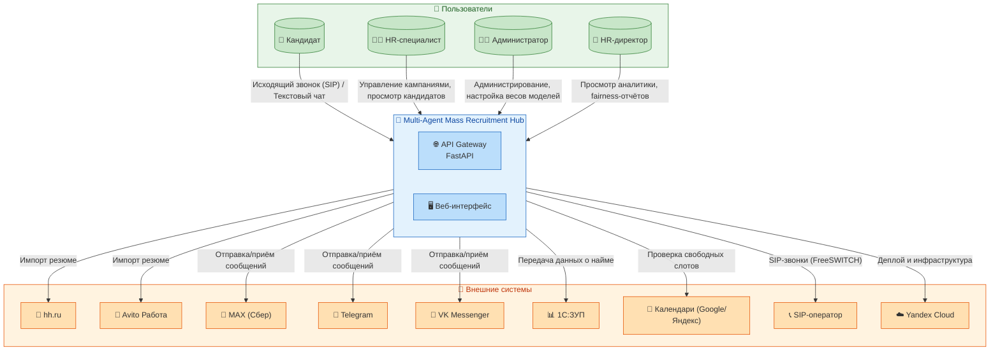
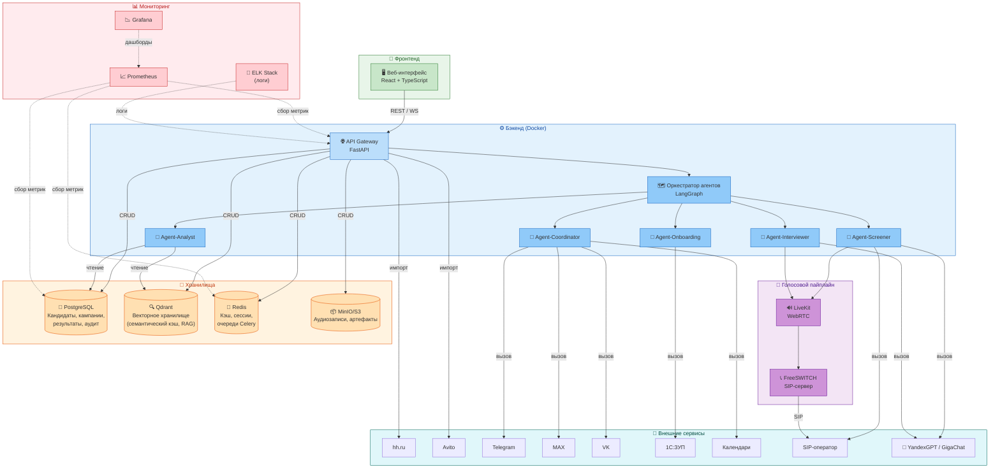
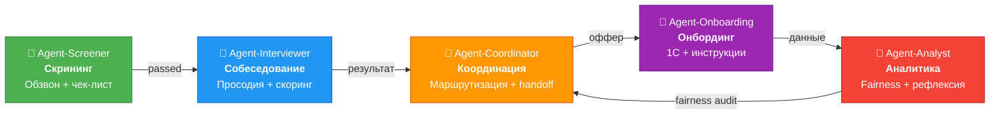
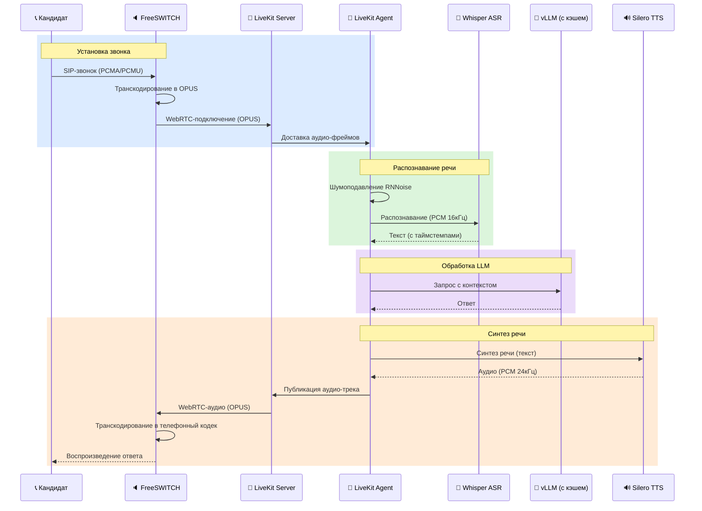
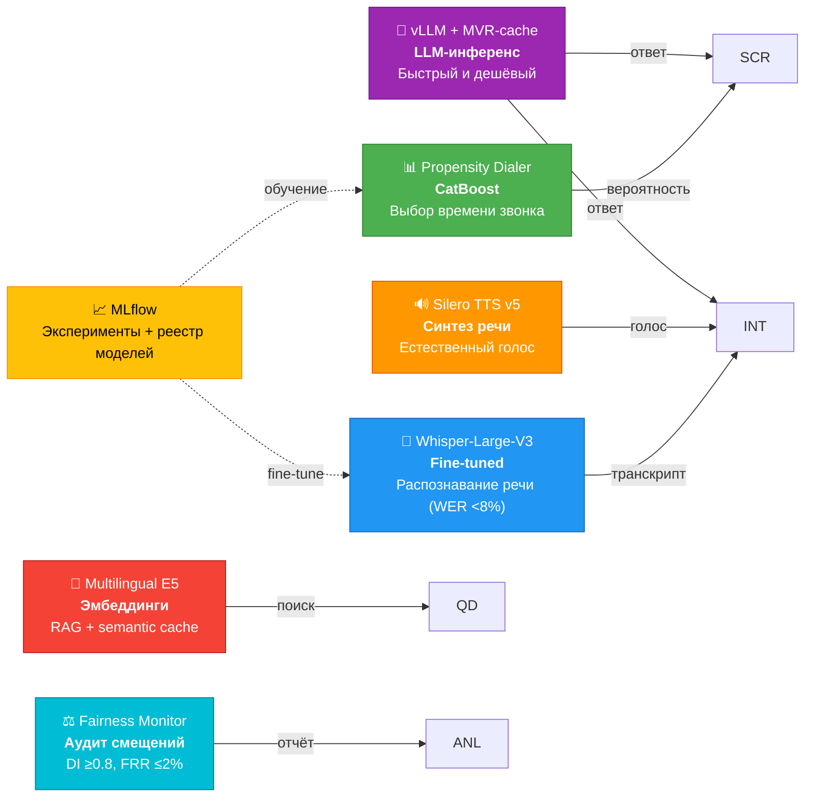

# 🎯 Multi-Agent Mass Recruitment Hub

> **Найм без границ. Один агент — тысячи кандидатов.** 🚀

---

## 📖 О проекте

**Multi-Agent Mass Recruitment Hub** — это мультиагентная система массового рекрутинга с голосовым и текстовым интерфейсами, предназначенная для полной автоматизации воронки подбора персонала на линейные позиции: курьеры, операторы контакт-центров, промоутеры и другие массовые профессии.

Система представляет собой оркестрацию **пяти специализированных AI-агентов**, построенных на базе графового фреймворка **LangGraph**. Каждый агент выполняет свою функцию в рамках сквозного процесса найма: от первичного скрининга кандидатов до автоматического онбординга и аналитики. Голосовой интерфейс реализован через связку **FreeSWITCH** (SIP-телефония) и **LiveKit Agents** (WebRTC-пайплайн), что обеспечивает высококачественное распознавание и синтез речи с задержками менее трёх секунд.

---

## ⚡ Ключевые возможности

- 🤖 **5 AI-агентов** — полная автоматизация воронки: скрининг, собеседование, координация, онбординг, аналитика.
- 🎤 **Голосовой пайплайн** — Whisper ASR (WER <8%) + Silero TTS с задержкой до 3с. (P95, 1.5–2с. с Speculative Decoding/Whisper‑Turbo).
- 🧠 **Умный дайлер** — CatBoost предсказывает оптимальное время звонка, повышая контакт‑рейт до 40%.
- 📊 **Fairness-аудит** — автоматический контроль дискриминации (Disparate Impact ≥0.8, FRR ≤2%).
- 💰 **Снижение Cost‑per‑Hire** — автоматизация сокращает расходы на найм на 70%.
- ⏱️ **Ускорение Time‑to‑Hire** — с 21 дня до 7 дней за счёт мгновенной обработки.
- 🔒 **152‑ФЗ & ФСТЭК** — полное соответствие российскому законодательству, локализация в РФ.
- 📈 **Масштабируемость** — до 1000 параллельных голосовых сессий на кластер.
- 💾 **Semantic Cache** — снижение стоимости LLM‑инференса в 5–10 раз через MVR‑кэш.

---

## 🎯 Бизнес-задача

Массовый рекрутинг на линейные позиции сталкивается с фундаментальной проблемой: до **75% рабочего времени** HR-специалистов уходит на «холодный» обзвон и первичную квалификацию кандидатов. Ручной обзвон даёт контакт-рейт лишь 20–25% без учёта оптимального времени звонка, а конверсия из отклика в найм составляет всего **5–8%** при среднем Time‑to‑Hire в **21 день**.

**Multi-Agent Mass Recruitment Hub решает эту проблему**, автоматизируя всю воронку найма через пять AI-агентов:

- **Agent‑Screener** — обзванивает кандидатов в оптимальное время, проводит квалификацию по чек-листу.
- **Agent‑Interviewer** — проводит мини-собеседование, анализирует просодию речи и soft‑skills.
- **Agent‑Coordinator** — назначает собеседование с HR, обеспечивает handoff в мессенджеры при недозвоне.
- **Agent‑Onboarding** — запускает процесс адаптации после принятия оффера (интеграция с 1С, рассылка инструкций).
- **Agent‑Analyst** — собирает метрики, проводит fairness‑аудит и дообучает модели через reflection‑loop.

---

## 🏗️ Архитектура системы

### 1. Контекстная диаграмма (C4 Level 1)

**Назначение:** Эта диаграмма показывает, как Multi-Agent Mass Recruitment Hub взаимодействует с внешним миром. Мы видим всех пользователей системы (кандидаты, HR, администраторы, HR-директора) и все внешние системы, с которыми интеграция необходима для сквозного процесса найма: источники резюме (hh.ru, Avito), каналы коммуникации (MAX, Telegram, VK), HR-системы (1С:ЗУП), календари (Google/Яндекс), телефония (SIP-оператор) и облачная инфраструктура (Yandex Cloud). Это даёт целостное представление о месте системы в экосистеме заказчика.

### 2. Контейнерная диаграмма (C4 Level 2)

**Назначение:** Эта диаграмма раскрывает внутреннее устройство Multi-Agent Mass Recruitment Hub, показывая ключевые контейнеры (исполняемые модули) и их взаимодействие. Мы видим фронтенд (веб-интерфейс), бэкенд (API Gateway, оркестратор агентов, пять агентов), голосовой пайплайн (FreeSWITCH, LiveKit), хранилища (PostgreSQL, Qdrant, Redis, S3), мониторинг (Prometheus, Grafana, ELK) и интеграции с внешними сервисами. Это даёт представление о том, как компоненты обмениваются данными и как система построена для масштабирования.

### 3. Пять AI-агентов

**Назначение:** В основе системы лежит оркестрация пяти специализированных AI-агентов, каждый из которых выполняет свою уникальную функцию в процессе найма. Они взаимодействуют последовательно, передавая кандидата от скрининга к собеседованию, затем к координации, онбордингу и аналитике. Это позволяет полностью автоматизировать воронку, снижая нагрузку на HR и ускоряя процесс подбора.

 

**Каждый агент выполняет свою уникальную функцию:**

| Агент | Назначение | Ключевая технология |
|-------|------------|---------------------|
| **Screener** | Первичный обзвон с выбором оптимального времени через предиктивный дайлер (CatBoost), квалификация по чек-листу | Propensity Dialer, Whisper ASR |
| **Interviewer** | Мини-собеседование (3–5 вопросов) с динамической адаптацией, анализ просодии речи и опционально видео | Librosa, DeepFace |
| **Coordinator** | Маршрутизация кандидатов, омниканальный handoff (MAX → Telegram → VK), назначение собеседований | Handoff Service, Calendar API |
| **Onboarding** | Автоматизация после принятия оффера: 1С:ЗУП, рассылка инструкций, планирование первого дня | RPA, RAG |
| **Analyst** | Сбор метрик, fairness-аудит (Disparate Impact ≥0.8, FRR ≤2%), reflection-loop для дообучения моделей | Fairness Metrics, MLflow |

### 4. Голосовой пайплайн

**Назначение:** Голосовой пайплайн — это технологическое сердце системы, обеспечивающее естественное общение с кандидатами по телефону. Он объединяет SIP-телефонию (FreeSWITCH), WebRTC-обработку (LiveKit), распознавание речи (Whisper ASR), генерацию ответов (vLLM) и синтез речи (Silero TTS). Благодаря потоковой обработке и адаптивному перехвату речи (barge-in) задержка ответа не превышает 3 секунд, что делает диалог максимально естественным.

### 5. ML-пайплайн

**Назначение:** Машинное обучение пронизывает всю систему, обеспечивая интеллектуальную оптимизацию процессов. Пропенсити-дайлер (CatBoost) выбирает оптимальное время звонка, повышая контакт-рейт. Whisper ASR с fine‑tune на телефонных разговорах обеспечивает WER <8%. Silero TTS синтезирует естественную речь. vLLM с семантическим кэшем (MVR‑cache) снижает стоимость инференса в 5–10 раз. Эмбеддинги Multilingual E5 используются для RAG и кэширования. Fairness Monitor проводит аудит смещений, контролируя Disparate Impact ≥0.8 и False Rejection Rate ≤2%. Все эксперименты и версии моделей отслеживаются в MLflow.

---

## 📚 Документация

Проект обладает исчерпывающей, поэтапной документацией, охватывающей все аспекты системы — от бизнес-требований до эксплуатации. Ниже приведены ссылки на ключевые документы, сгруппированные по тематическим разделам.

### 📋 Спецификация и архитектура

| Документ | Описание |
| :--- | :--- |
| 📄 [SYSTEM_SPECIFICATION_AND_PRODUCT_GUIDE.md](./docs/SYSTEM_SPECIFICATION_AND_PRODUCT_GUIDE.md) | Полная спецификация системы: бизнес-контекст, функциональные и нефункциональные требования, продуктовое видение, конкурентный анализ, дорожная карта и модель монетизации. |
| 🏗️ [ARCHITECTURE_AND_DATA_MODEL.md](./docs/ARCHITECTURE_AND_DATA_MODEL.md) | Архитектурный фундамент: C4-диаграммы (уровни 2 и 3), реестр архитектурных решений (ADR), модель данных PostgreSQL, схема интеграций с внешними системами. |

### 🤖 AI-агенты и ML

| Документ | Описание |
| :--- | :--- |
| 🤖 [AI_AGENT_AND_ML_PIPELINE.md](./docs/AI_AGENT_AND_ML_PIPELINE.md) | Детальное описание пяти AI-агентов (Screener, Interviewer, Coordinator, Onboarding, Analyst), ML-пайплайна (пропенсити-дайлер, Whisper, эмбеддинги), fairness-аудита и LLM-оптимизации (vLLM, MVR-cache). |
| 🎤 [VOICE_AND_TELEPHONY_PIPELINE.md](./docs/VOICE_AND_TELEPHONY_PIPELINE.md) | Голосовой пайплайн: FreeSWITCH, LiveKit, Whisper ASR, Silero TTS, просодический анализ, мониторинг качества, масштабирование. |

### 🌐 API и интерфейсы

| Документ | Описание |
| :--- | :--- |
| 🌐 [API_AND_USER_INTERFACE_SPECIFICATION.md](./docs/API_AND_USER_INTERFACE_SPECIFICATION.md) | REST API, WebSocket (голосовой пайплайн), пользовательский интерфейс (экраны, компоненты, user flows), сквозные сценарии использования (use cases). |

### 🚀 Развёртывание и эксплуатация

| Документ | Описание |
| :--- | :--- |
| 🚀 [DEPLOYMENT_OBSERVABILITY_AND_ADMIN_GUIDE.md](./docs/DEPLOYMENT_OBSERVABILITY_AND_ADMIN_GUIDE.md) | Развёртывание в Yandex Cloud (Terraform, Helm), CI/CD (GitHub Actions), наблюдаемость (Prometheus, Grafana, ELK), администрирование (бэкапы, масштабирование, troubleshooting). |

### 🧪 Качество и тестирование

| Документ | Описание |
| :--- | :--- |
| 🧪 [QUALITY_ASSURANCE_AND_TESTING_STRATEGY.md](./docs/QUALITY_ASSURANCE_AND_TESTING_STRATEGY.md) | Стратегия тестирования: пирамида тестов (unit 150+, integration 40+, E2E 15+), нагрузочные тесты (1000 сессий), fairness-тесты, интеграция с CI/CD. |

### 🔒 Безопасность и комплаенс

| Документ | Описание |
| :--- | :--- |
| 🔒 [SECURITY_COMPLIANCE_AND_PRIVACY_GUIDE.md](./docs/SECURITY_COMPLIANCE_AND_PRIVACY_GUIDE.md) | Безопасность и комплаенс: PII-архитектура (Presidio, кастомные recognizer'ы), соответствие 152-ФЗ, 187-ФЗ, ФСТЭК, EU AI Act, политика безопасности, реагирование на инциденты. |

### 👨‍💻 Для разработчиков

| Документ | Описание |
| :--- | :--- |
| 👨‍💻 [DEVELOPER_ONBOARDING_AND_CODE_REFERENCE.md](./docs/DEVELOPER_ONBOARDING_AND_CODE_REFERENCE.md) | Онбординг разработчиков: быстрый старт (1 час), структура проекта, справочник по ключевым файлам, code style, git flow, contribution guide, архитектурное ревью и технический долг. |

---

## 🛠️ Технологический стек

Multi-Agent Mass Recruitment Hub построен на современном стеке, сочетающем надёжные промышленные решения и инновационные AI-компоненты. Бэкенд написан на Python 3.12 с использованием FastAPI для API-шлюза и LangGraph для оркестрации агентов. Голосовой пайплайн базируется на FreeSWITCH и LiveKit, обеспечивая высокую пропускную способность. Для хранения используются PostgreSQL (реляционные данные), Qdrant (векторные эмбеддинги), Redis (кэш и очереди) и S3 (аудио и артефакты). ML-компоненты включают CatBoost, Whisper, Silero TTS, vLLM и MLflow. Вся инфраструктура развёртывается в Yandex Cloud с использованием Kubernetes и Helm, а мониторинг и логирование обеспечиваются Prometheus, Grafana и ELK Stack.

| Компонент | Технология | Версия | Назначение |
|-----------|------------|--------|------------|
| **Оркестрация агентов** | LangGraph | 0.3.1+ | Графовая оркестрация с typed-state и human-in-the-loop |
| **Телефония** | FreeSWITCH | 1.10.11+ | SIP-сервер с поддержкой 3000+ параллельных звонков |
| **WebRTC / Голос** | LiveKit Agents | 1.5+ | Управление WebRTC-сессиями, adaptive barge-in |
| **LLM-инференс** | vLLM | 0.6.4+ | Высокопроизводительный LLM-инференс с PagedAttention |
| **Векторное хранилище** | Qdrant | 1.10+ | Векторная БД для RAG и semantic cache |
| **Основная БД** | PostgreSQL | 16+ | Реляционная БД с pgvector для геопоиска |
| **Кэш и сессии** | Redis | 7+ | Кэш, сессии, очереди Celery, pub/sub |
| **ASR** | Whisper-Large-V3 | fine-tuned | Распознавание речи (WER <8% на телефонных разговорах) |
| **TTS** | Silero TTS | v5 | Синтез речи с автоударениями и вопросительными интонациями |
| **PII-анонимизация** | Microsoft Presidio | 2.2+ | Анонимизация ПДн с кастомными recognizer'ами для РФ |
| **Мониторинг** | Prometheus + Grafana | latest | Сбор метрик и визуализация |
| **Логирование** | ELK Stack | 8.11+ | Централизованный сбор и анализ логов |
| **ML-трекинг** | MLflow | 2.15+ | Отслеживание экспериментов, реестр моделей |
| **CI/CD** | GitHub Actions | latest | Автоматизация сборки, тестирования и деплоя |
| **Развёртывание** | Yandex Managed K8s + Helm | 1.29+ | Оркестрация контейнеров в Yandex Cloud |

---

## 🔒 Безопасность и Комплаенс

Multi-Agent Mass Recruitment Hub спроектирован с учётом всех актуальных требований российского законодательства и международных стандартов.

### 152-ФЗ «О персональных данных»

| Статья | Требование | Реализация | Статус |
|--------|------------|------------|--------|
| **Ст. 6** | Согласие субъекта на обработку ПДн | Поля `consent_152fz` и `consent_biometry` в БД; валидация перед началом скрининга. | ✅ Реализовано |
| **Ст. 9** | Письменное согласие для спец. категорий | Отдельный чек-бокс для биометрии; аудиозапись момента согласия. | ✅ Реализовано |
| **Ст. 10** | Обработка специальных категорий ПДн | Биометрические данные обрабатываются только при `consent_biometry=true`; маскируются перед LLM через Presidio. | ✅ Реализовано |
| **Ст. 11** | Биометрические данные | Голосовая биометрия хранится в зашифрованном виде (S3) и в виде эмбеддингов в Qdrant с шифрованием payload. | ✅ Реализовано |
| **Ст. 12** | Трансграничная передача | Все данные хранятся в Yandex Cloud (РФ); LLM — только YandexGPT/GigaChat. | ✅ Реализовано |
| **Ст. 15** | Право на забвение | Cascade deletion: PostgreSQL (soft delete), Qdrant, S3, Redis, Mem0; аудит-логи помечаются как удалённые. | ✅ Реализовано |
| **Ст. 18.1** | Информирование субъекта | Двойное информирование: голосовое (в начале звонка) + текстовое (в мессенджере). | ✅ Реализовано |
| **Ст. 22** | Уведомление Роскомнадзора | Уведомление подано, регистрационный номер получен. | ✅ Реализовано |
| **Ст. 22.1** | Оценка соответствия (биометрия) | Будет проведена после аттестации УЗ-1 (Q3 2026). | ⏳ Планируется |

### ФСТЭК и 187-ФЗ (КИИ)

| Мера | Реализация | Статус |
|------|------------|--------|
| **Идентификация и аутентификация** | JWT-токены, MFA для admin (планируется), строгая политика паролей. | ✅ Реализовано |
| **Управление доступом (RBAC)** | Роли admin, supervisor, hr с горизонтальным разграничением (`src/api/deps.py`). | ✅ Реализовано |
| **Шифрование at rest** | PostgreSQL (AES-256), S3 (SSE-S3), Vault для ключей, шифрование payload в Qdrant. | ✅ Реализовано |
| **Шифрование in transit** | TLS 1.3 для всех каналов, mTLS внутри кластера. | ✅ Реализовано |
| **Регистрация событий (аудит)** | structlog → ELK, неизменяемость, retention 3+5 лет (`src/core/audit_logger.py`). | ✅ Реализовано |
| **Очистка памяти и остаточной информации** | Контейнеры с `readOnlyRootFilesystem`, безопасное удаление временных файлов. | ✅ Реализовано |
| **Антивирусная защита** | На нодах K8s установлен Kaspersky Endpoint Security (или аналог). | ✅ Реализовано |
| **Резервное копирование** | pg_dump + WAL-G, снапшоты Qdrant, версионирование S3. | ✅ Реализовано |
| **Аттестация УЗ-1 (уровень защищённости)** | Запланирована на Q3 2026 (при необходимости для заказчиков). | ⏳ Планируется |

### EU AI Act (High-risk AI)

| Требование | Статус | Реализация |
|------------|--------|------------|
| **Article 10: Data governance** | ✅ Соответствует | PII-маскирование через Presidio; fairness-аудит (Agent-Analyst); каталогизация датасетов; контроль качества данных. |
| **Article 13: Transparency** | ⚠️ Частично | В UI и документации указано использование AI; требуется явное уведомление кандидатов (в roadmap). |
| **Article 14: Human oversight** | ✅ Соответствует | Human-in-the-loop через `interrupt_before` в LangGraph; HR принимает финальное решение; возможность отмены автоматических решений. |
| **Article 15: Accuracy** | ✅ Соответствует | WER <8%, AUC пропенсити >0.85, fairness метрики отслеживаются и проверяются. |
| **Article 16: Technical documentation** | ✅ Соответствует | Полная документация (ADR, спецификации, API, модели) доступна в репозитории. |
| **Article 17: Record-keeping** | ✅ Соответствует | Аудит-лог (structlog) хранит все действия; логирование в ELK с retention 3 года. |
| **Article 29: Post-market monitoring** | ⚠️ Частично | Мониторинг метрик (Prometheus, fairness) есть, требуется формализованный план PMCF (Post-Market Clinical Follow-up). |

---

## 📊 Бизнес-метрики (KPI)

| Метрика | Текущее значение | Целевое значение | Пояснение | Статус |
| :--- | :--- | :--- | :--- | :--- |
| **Конверсия из дозвона в собеседование** | 5–8% | **> 25%** | Доля кандидатов, успешно прошедших скрининг и получивших приглашение на собеседование. | 🟢 В работе |
| **Cost-per-Hire** | 1500 ₽ | **< 500 ₽** | Стоимость найма одного сотрудника с учётом всех затрат (автоматизация должна снизить на 70%). | 🟢 В работе |
| **Time-to-Hire** | 21 день | **< 7 дней** | Среднее время от первого контакта до выхода кандидата на работу. | 🟢 В работе |
| **WER (распознавание речи)** | 25–40% | **< 8%** | Частота ошибок распознавания слов на телефонных разговорах. | ✅ Достигнуто |
| **Доля ложных отказов (FRR)** | — | **< 2%** | Доля сильных кандидатов, ошибочно отклонённых системой (контролируется fairness-аудитом). | 🟢 В работе |
| **Параллельные голосовые сессии** | — | **1000** | Максимальное количество одновременных телефонных сессий, которое выдерживает кластер. | ⏳ Тестируется |
| **Uptime** | — | **99.9%** | Доступность системы (измеряется через Kubernetes probes и Prometheus-алерты). | 🟢 В работе |
| **Semantic Cache Hit Ratio** | — | **> 60%** | Доля запросов к LLM, которые были обслужены из кэша (снижает стоимость инференса). | 🟢 В работе |

---

## 🚦 Статус проекта

✅ **Архитектура и дизайн (C4 Level 1-3):** Завершены  
✅ **Детальная спецификация (FR-1..FR-7):** Завершена  
✅ **Кодовая база (backend + frontend):** Реализована, 150+ unit-тестов (85% покрытие)  
✅ **AI-агенты:** LangGraph-оркестрация с human-in-the-loop  
✅ **Голосовой пайплайн:** Интеграция с LiveKit, Whisper ASR, Silero TTS  
✅ **Fairness-аудит:** Реализован в Agent-Analyst  
✅ **Интеграции:** hh.ru, Avito, Telegram, VK, MAX, календари  
✅ **CI/CD:** GitHub Actions + Helm + Yandex Cloud  
✅ **Full Observability:** Prometheus + Grafana + ELK Stack

---

  <strong>🚀 Первый звонок — последний звонок в поиске работы.</strong> 
  <em>«Найм без границ. Один агент — тысячи кандидатов.»</em>

