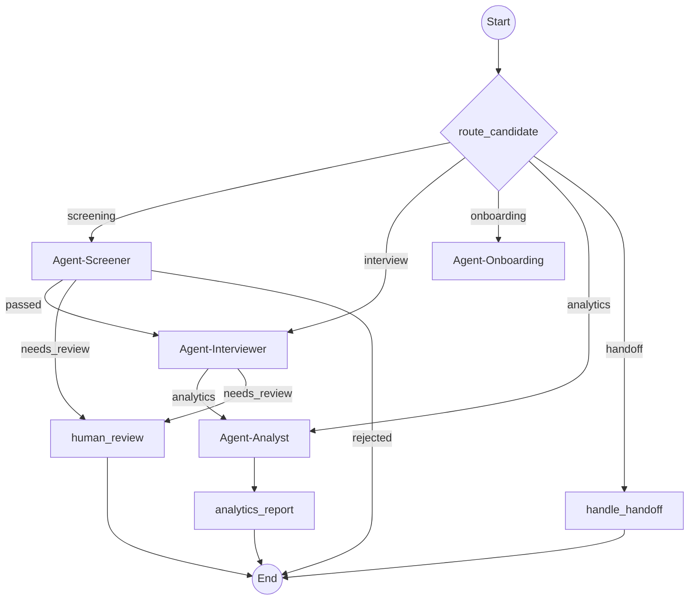
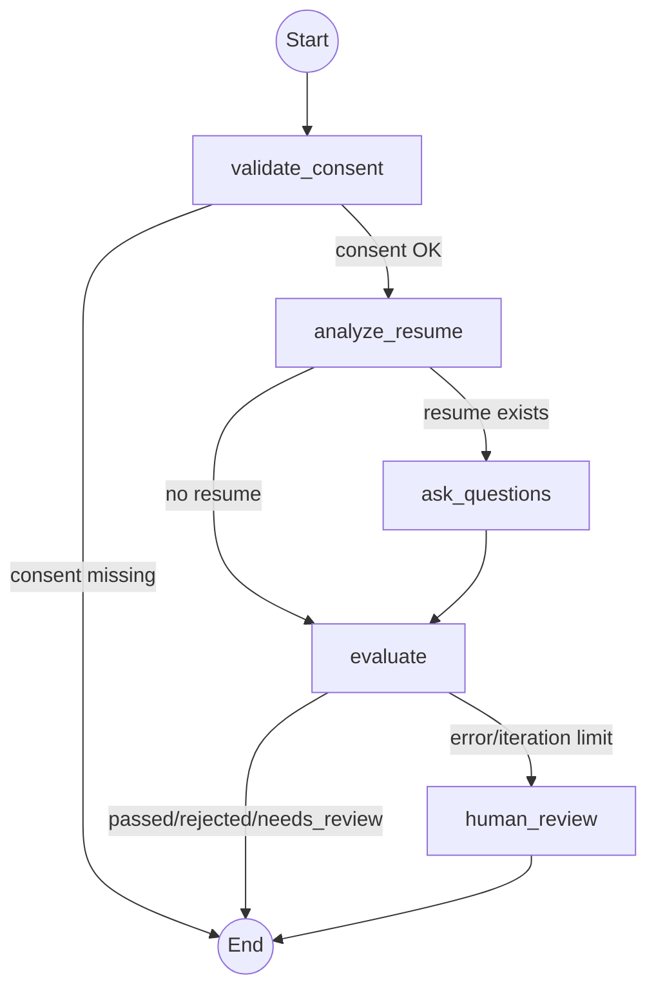
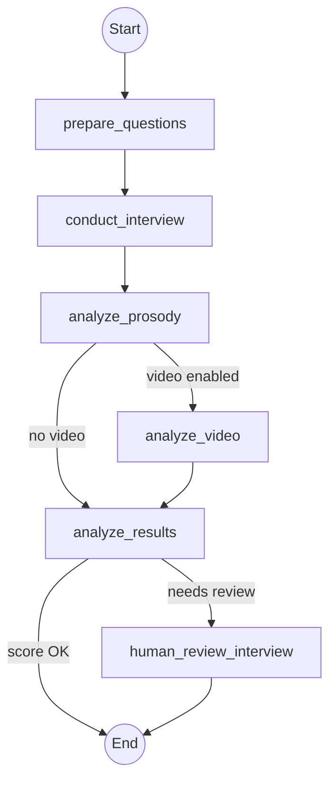
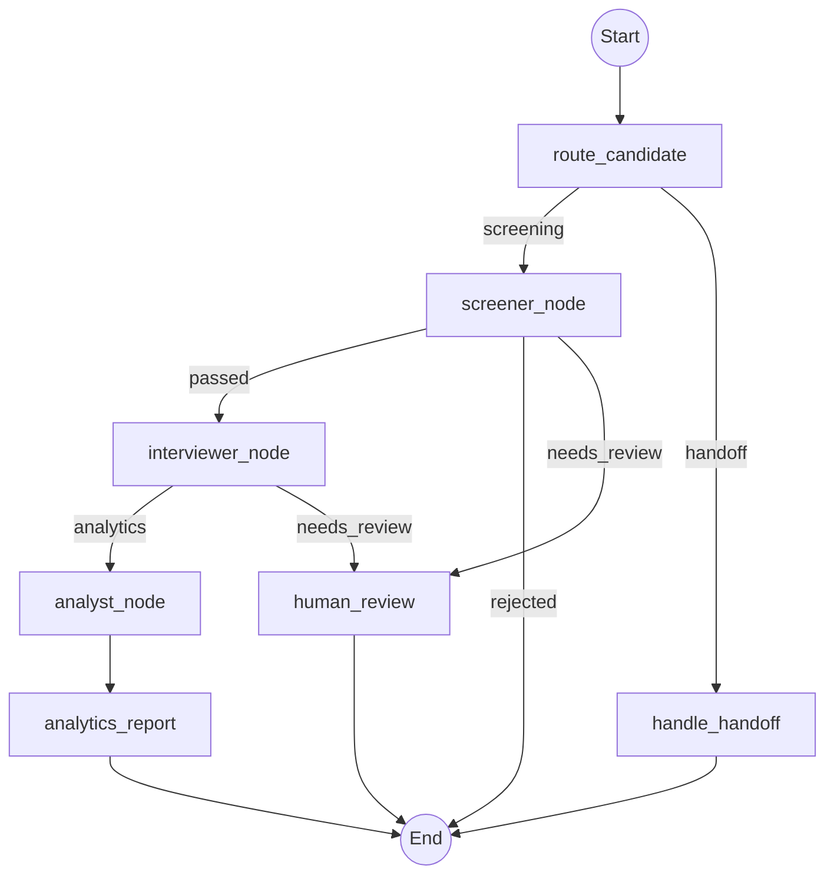
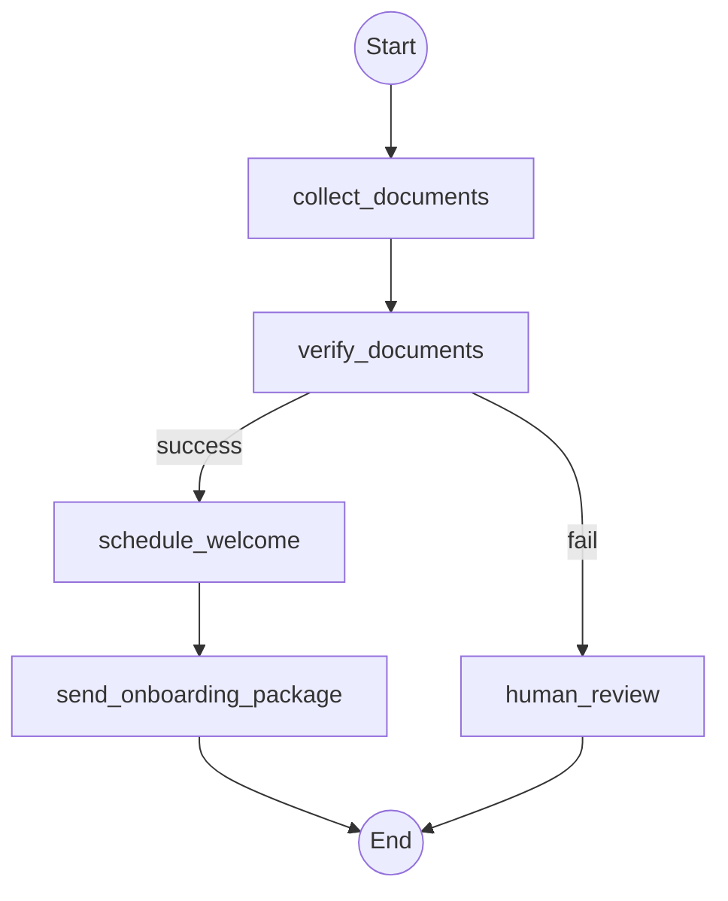
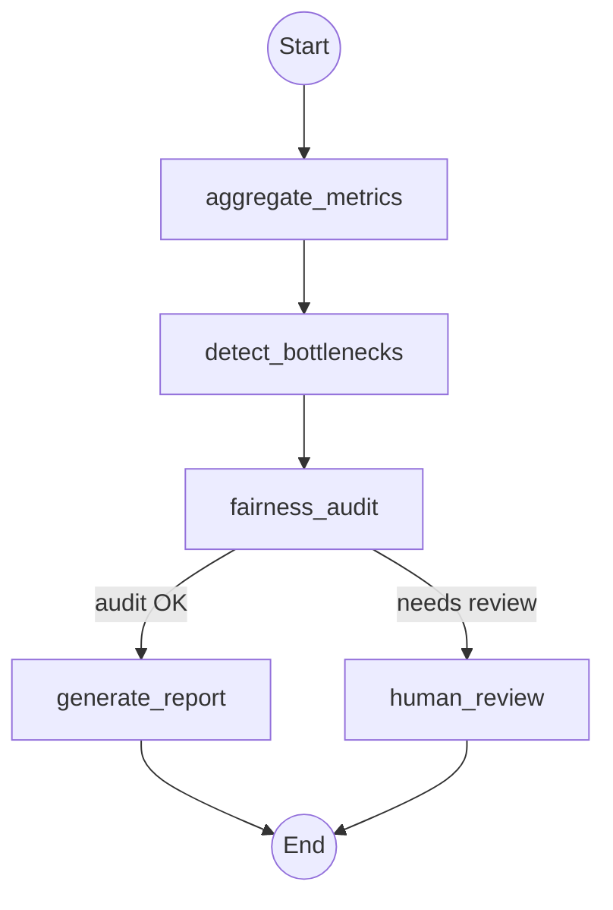

# Искусственный интеллект, агенты и ML-пайплайн Multi-Agent Mass Recruitment Hub

---

# 1. Введение в AI-агентов и ML-пайплайн

## 1.1. Обзор AI-архитектуры

Интеллектуальное ядро Multi-Agent Mass Recruitment Hub построено на **мультиагентной оркестрации** с использованием графового фреймворка **LangGraph**. Данный подход был выбран для обеспечения **детерминированности** выполнения многостадийных рекрутинговых процессов, что критически важно для юридической чистоты отбора кандидатов. LangGraph позволяет строго контролировать поток данных между агентами через typed‑state, conditional edges и механизм чекпоинтов, а также предоставляет встроенную поддержку human‑in‑the‑loop (приостановка выполнения для ручного утверждения).

Пять специализированных агентов (Screener, Interviewer, Coordinator, Onboarding, Analyst) выполняют свои функции в рамках сквозного процесса найма — от первичного обзвона до аналитики и дообучения моделей. Каждый агент реализован как отдельный граф состояний, который может быть вызван координатором и при необходимости прерван для вмешательства HR-специалиста. Вся логика агентов тесно интегрирована с ML-моделями: пропенсити-дайлер выбирает время звонка, Whisper распознаёт речь, LLM генерирует диалоговые ответы, а fairness-монитор отслеживает смещения.

## 1.2. Связь с бизнес-требованиями

Совместная работа агентов и ML-моделей обеспечивает достижение ключевых бизнес-целей, зафиксированных в [SYSTEM_SPECIFICATION_AND_PRODUCT_GUIDE.md](./SYSTEM_SPECIFICATION_AND_PRODUCT_GUIDE.md):

- **Конверсия из дозвона в собеседование >25%** — достигается за счёт предиктивного дайлера (выбор оптимального времени) и адаптивного голосового диалога.
- **Снижение Cost-per-Hire на 70%** — обеспечивается автоматизацией скрининга и собеседований, сокращением ручного труда HR.
- **WER <8%** — достигается благодаря fine‑tune Whisper-Large-V3 на 500+ часах телефонных разговоров.
- **Доля ложных отказов <2%** — контролируется через fairness-аудит и reflection-loop.

## 1.3. Структура текущего документа

Данный документ детально описывает:

- Оркестрацию пяти агентов на LangGraph (раздел 2).
- ML-пайплайн: пропенсити-дайлер, Whisper, эмбеддинги, MLflow и дрифт-мониторинг (раздел 3).
- Fairness-аудит: метрики, данные, алгоритм, reflection-loop и тесты (раздел 4).
- Оптимизацию LLM-инференса: vLLM, multi-LLM router и MVR-cache (раздел 5).
- Векторное хранилище Qdrant: коллекции, RAG-пайплайн, каскадное удаление и мониторинг (раздел 6).

---

# 2. Оркестрация AI-агентов на LangGraph

## 2.1. Общая архитектура графа-оркестратора

Главным управляющим элементом является **Agent-Coordinator**, который реализован в [src/agents/coordinator/graph.py](../src/agents/coordinator/graph.py). Он содержит стартовый узел `route_candidate`, который определяет, какому агенту передать управление на основе статуса кандидата. В случае неудачных звонков (две попытки без ответа) срабатывает узел `handle_handoff`, который сохраняет состояние диалога в Redis и отправляет сообщение в мессенджер.

**Реализация в коде:**
- Координатор: [src/agents/coordinator/graph.py](../src/agents/coordinator/graph.py) и [src/agents/coordinator/nodes.py](../src/agents/coordinator/nodes.py).
- Conditional edges используют функцию `should_continue()` из [src/core/state.py](../src/core/state.py) (глобальный счётчик итераций и проверка статуса).

## 2.2. Agent-Screener (Скринер)

**Назначение:** массовый скрининг кандидатов по чек-листу (график, локация, опыт) с использованием предиктивного дайлера для выбора времени звонка.

**Граф:**

**Узлы и их функции:**

- `validate_consent` ([src/agents/screener/nodes.py](../src/agents/screener/nodes.py)) — проверяет `consent_152fz`; при отсутствии завершает граф с ошибкой.
- `analyze_resume` — анализирует текст резюме, извлекает ключевые навыки с использованием RAG (поиск похожих вакансий в Qdrant).
- `ask_questions` — задаёт вопросы из чек-листа через голосовой пайплайн (Whisper → LLM → TTS) с семантическим кэшированием (MVR-cache) для снижения стоимости инференса.
- `evaluate` — оценивает ответы, принимает решение (`passed`/`rejected`/`needs_human_review`). Использует `predict_propensity` для выбора времени звонка и `make_call` для инициации звонка (если вероятность >0.6).
- `human_review` — приостанавливает граф для ручного утверждения (`interrupt_before`).

**Conditional edges:** определяются функцией `should_continue()`:
- Если есть ошибка или превышен лимит итераций (`MAX_ITERATIONS = 5`) → переход в `human_review`.
- Если статус кандидата терминальный (`passed`, `rejected`, `needs_human_review`) → завершение.
- Иначе — продолжение (обычно переход к `evaluate`).

**Инструменты:** FreeSWITCH (звонок), Whisper (ASR), LLM (анализ ответов), Qdrant (RAG), Semantic Cache (MVR-cache).

**Реализация:** [src/agents/screener/graph.py](../src/agents/screener/graph.py), [src/agents/screener/nodes.py](../src/agents/screener/nodes.py).

## 2.3. Agent-Interviewer (Собеседник)

**Назначение:** проведение мини-собеседования (3–5 вопросов) с динамической адаптацией, анализ просодии речи и опционально видео.

**Граф:**

**Узлы и их функции:**

- `prepare_questions` ([src/agents/interviewer/nodes.py](../src/agents/interviewer/nodes.py)) — генерирует персонализированные вопросы на основе резюме и вакансии, используя шаблоны из [prompts.py](../src/agents/interviewer/prompts.py).
- `conduct_interview` — запускает голосовой диалог через LiveKit; аудио передаётся в ASR-пайплайн (Whisper), ответы обрабатываются.
- `analyze_prosody` — извлекает просодические признаки из аудиозаписи через `librosa`: тон (f0), темп речи, средняя длина пауз, количество перебиваний. Результат упаковывается в `ProsodyAnalysis` ([src/core/models.py](../src/core/models.py)).
- `analyze_video` (опционально) — выполняет анализ видео с помощью OpenCV и DeepFace ([src/agents/interviewer/video_analyzer.py](../src/agents/interviewer/video_analyzer.py), [face_utils.py](../src/agents/interviewer/face_utils.py)): распознаёт эмоции, оценивает внимание и лидерский потенциал.
- `analyze_results` — рассчитывает итоговый скор (мотивация, коммуникация, консистентность) и формирует рекомендацию (`pass`/`review`/`reject`).
- `human_review_interview` — приостановка для ручного пересмотра результатов.

**Просодический анализ:** реализован в [prosody.py](../src/agents/interviewer/prosody.py) (функции `analyze_audio` и `estimate_confidence`).

**Реализация:** [src/agents/interviewer/graph.py](../src/agents/interviewer/graph.py), [src/agents/interviewer/nodes.py](../src/agents/interviewer/nodes.py), [src/agents/interviewer/prompts.py](../src/agents/interviewer/prompts.py).

## 2.4. Agent-Coordinator (Координатор)

**Назначение:** оркестрация маршрутизации кандидатов между агентами, назначение собеседования, омниканальный handoff.

**Граф:**

**Узлы и их функции:**

- `route_candidate` — определяет следующий шаг на основе статуса кандидата.
- `screener_node` — вызывает Agent-Screener (инкапсулирует его граф).
- `interviewer_node` — вызывает Agent-Interviewer.
- `analyst_node` — вызывает Agent-Analyst для постобработки.
- `analytics_report` — генерирует финальный отчёт и логирует завершение.
- `handle_handoff` — при двух неудачных звонках сохраняет состояние в Redis и отправляет сообщение в мессенджер (MAX → Telegram → VK) через `send_omnichannel_message()`.
- `human_review` — приостановка для ручного вмешательства.

**Handoff-сервис:** [src/services/handoff_service.py](../src/services/handoff_service.py) — методы `save_state`, `load_state`, `delete_state`, `increment_attempts`.

**Реализация:** [src/agents/coordinator/graph.py](../src/agents/coordinator/graph.py), [src/agents/coordinator/nodes.py](../src/agents/coordinator/nodes.py).

## 2.5. Agent-Onboarding (Онбординг)

**Назначение:** автоматизация процессов после принятия оффера: создание записи в 1С, отправка документов и инструкций, планирование первого рабочего дня.

**Граф:**

**Узлы и их функции:**

- `collect_documents` — запрашивает у кандидата необходимые документы через мессенджер.
- `verify_documents` — проверяет документы (внешняя система или ручная проверка); при ошибке — переход в `human_review`.
- `schedule_welcome` — планирует первый рабочий день и приветственный звонок.
- `send_onboarding_package` — отправляет инструкции, регламенты и доступы через выбранный канал.
- `human_review` — приостановка для ручного решения проблем с документами или интеграцией.

**Реализация:** [src/agents/onboarding/graph.py](../src/agents/onboarding/graph.py), [src/agents/onboarding/nodes.py](../src/agents/onboarding/nodes.py).

## 2.6. Agent-Analyst (Аналитик)

**Назначение:** сбор метрик, fairness-аудит, выявление аномалий, reflection-loop.

**Граф:**

**Узлы и их функции:**

- `aggregate_metrics` — собирает агрегированные данные из PostgreSQL (количество кандидатов, конверсии, длительности).
- `detect_bottlenecks` — выявляет этапы с аномальным падением конверсии.
- `fairness_audit` — рассчитывает fairness-метрики (disparate impact, demographic parity, false rejection rate) по группам (пол, возраст, регион). Пороги: DI ≥0.8, FRR ≤2%.
- `generate_report` — формирует отчёт в JSON и обновляет дашборд Grafana.
- `human_review` — при превышении порогов приостанавливает граф для ручной корректировки весов модели.

**Fairness-метрики:** [src/agents/analyst/fairness_metrics.py](../src/agents/analyst/fairness_metrics.py) — функции `demographic_parity`, `disparate_impact`, `false_rejection_rate`, `calculate_metrics_from_data`.

**Reflection-loop:** после каждого цикла найма агент анализирует успешные и неуспешные диалоги, дообучает пропенсити-модель (incremental learning через MLflow) и пополняет базу знаний.

**Реализация:** [src/agents/analyst/graph.py](../src/agents/analyst/graph.py), [src/agents/analyst/nodes.py](../src/agents/analyst/nodes.py), [src/agents/analyst/fairness_metrics.py](../src/agents/analyst/fairness_metrics.py).

## 2.7. Human-in-the-loop

Механизм приостановки реализован через встроенную возможность LangGraph — `interrupt_before`. Во всех графах предусмотрены узлы с префиксом `human_review`, перед которыми установлен `interrupt_before`. При переходе в такой узел система отправляет уведомление в Telegram-бота ([src/bot/telegram.py](../src/bot/telegram.py)) с кнопками "Approve", "Reject", "Request changes". Если HR не ответил в течение 24 часов, граф автоматически принимает решение: при уверенности модели >95% применяется решение модели, иначе кандидат помечается как `needs_human_review` и откладывается для ручного разбора. Защита от зацикливания обеспечивается глобальным счётчиком итераций (`MAX_ITERATIONS = 5` в [src/core/state.py](../src/core/state.py)).

## 2.8. Безопасность агентов

- **Анонимизация PII:** перед каждым вызовом LLM (в узлах `ask_questions`, `analyze_resume`, `prepare_questions`, `evaluate`) все персональные данные маскируются через Presidio ([src/pii/anonymizer.py](../src/pii/anonymizer.py)). LLM никогда не получает raw PII.
- **Аудит действий:** каждый узел логирует свои действия через `structlog` с обязательными полями: `candidate_id`, `action`, `timestamp`, `decision`, `user_id` (соответствует 152-ФЗ).
- **Защита от зацикливания:** глобальный счётчик итераций (MAX_ITERATIONS) предотвращает бесконечные циклы; при превышении лимита граф принудительно переходит в `human_review`.

---

# 3. ML-пайплайн

## 3.1. Обзор ML-моделей в системе

В Multi-Agent Mass Recruitment Hub используется комплекс ML-моделей, каждая из которых решает свою задачу в рамках процесса найма:

| Модель | Назначение | Технология | Вход | Выход | Обновление |
|--------|------------|------------|------|-------|------------|
| **Propensity Dialer** | Выбор оптимального времени звонка | CatBoost | Профиль кандидата, история звонков, время, день недели | Вероятность дозвона (0–1) | Еженедельно (инкрементальное обучение) |
| **Whisper ASR** | Распознавание речи в телефонных разговорах | Whisper-Large-V3 (fine-tuned) | Аудио (16 кГц, моно) | Текст (транскрипция) | Раз в 2 месяца (или при накоплении данных) |
| **Silero TTS** | Синтез речи для голосового агента | Silero TTS v5 | Текст | Аудио (24 кГц) | Раз в 3 месяца (обновление модели) |
| **LLM (vLLM)** | Генерация диалоговых ответов | YandexGPT / Mistral (через vLLM) | Промпт + контекст (до 8K токенов) | Текстовый ответ | Постоянно (онлайн-инференс) |
| **Multilingual E5** | Эмбеддинги для RAG и semantic cache | intfloat/multilingual-e5-large | Текст | Вектор (1024-d) | Раз в 3 месяца (или при смене модели) |
| **Fairness Monitor** | Аудит смещений (bias) в решениях агентов | Статистические метрики | Результаты скрининга/собеседования | Disparate Impact, Demographic Parity, FRR | После каждого цикла найма (Agent-Analyst) |

## 3.2. Пропенсити-дайлер (CatBoost)

Пропенсити-дайлер предсказывает вероятность успешного дозвона кандидату в заданное время, что позволяет максимизировать контакт-рейт. Модель обучается на исторических данных за последние 6 месяцев и ежедневно инкрементально дообучается через MLflow.

**Признаки (фичи):**
- **Время:** час звонка (0–23), день недели (0–6), номер недели в году.
- **Кандидат:** количество предыдущих попыток дозвона, последний контакт (да/нет), сегмент (курьер/оператор/промоутер), источник (hh/avito/manual).
- **Кампания:** ID кампании, тип вакансии, срочность.

**Метрика качества:** AUC-ROC >0.85 на валидационной выборке, LogLoss <0.35.

**Обучение и обновление:** еженедельное инкрементальное обучение; данные за прошедшую неделю добавляются к обучающей выборке. MLflow отслеживает эксперименты и хранит модель в реестре. Переход модели в `Production` происходит после успешного прохождения всех тестов (unit, integration, fairness, нагрузочных).

**Инференс:** модель загружается из MLflow Model Registry (этап `Production`) или из локального файла (fallback). Инференс выполняется на CPU (ONNX Runtime) с латентностью <10 мс. Используется в узле `evaluate` агента Screener.

**Реализация в коде:** [src/services/propensity_dialer.py](../src/services/propensity_dialer.py) — функции `extract_features`, `predict_propensity`, `_get_model`; [src/core/config.py](../src/core/config.py) — настройки MLflow.

## 3.3. Whisper-Large-V3 (Fine-tuned)

Whisper обеспечивает распознавание русской речи в условиях телефонных разговоров (шум, акценты, специфическая лексика). Базовой моделью выступает `openai/whisper-large-v3` (или адаптированная `whisper-large-v3-ru-phone` с Hugging Face). Fine-tuning выполняется с использованием LoRA (Low-Rank Adaptation) на датасете из 500+ часов реальных телефонных записей контакт-центров с разметкой. Целевой WER <8%, CER <5%. Модель обновляется раз в 2 месяца (или при накоплении >100 часов новых размеченных данных) и экспортируется в ONNX для развёртывания на Triton Inference Server. В коде интеграция реализована через `livekit.plugins.openai.STT()` в [src/voice/pipeline.py](../src/voice/pipeline.py).

## 3.4. Эмбеддинги (Multilingual E5)

Для генерации плотных векторных представлений текстов используется модель `intfloat/multilingual-e5-large` (1024-мерные эмбеддинги) из библиотеки `sentence-transformers`. Эти эмбеддинги применяются в трёх сценариях:
- **RAG:** эмбеддинги HR-документов (инструкции, регламенты, льготы) хранятся в Qdrant (коллекция `rag_documents`).
- **Semantic cache:** эмбеддинги промптов LLM сохраняются в Qdrant для быстрого поиска похожих запросов (cosine similarity ≥0.95).
- **Кросс-референс:** эмбеддинги профилей кандидатов для поиска похожих кейсов (коллекция `candidate_profiles`).

Обновление модели происходит раз в 3 месяца (или при выходе новой версии). В коде эмбеддинги вычисляются в [src/services/semantic_cache.py](../src/services/semantic_cache.py) (функция `_embed`).

## 3.5. MLflow эксперименты

MLflow используется для отслеживания экспериментов, версионирования моделей и управления их жизненным циклом. Эксперименты:
- `propensity_dialer` — обучение CatBoost (логируются AUC, LogLoss, F1, feature importance).
- `whisper_finetune` — fine-tune Whisper (WER, CER, training loss).
- `fairness_monitor` — аудит fairness (Disparate Impact, Demographic Parity, FRR).

Модели проходят этапы `Staging` → `Production` через Model Registry. Логирование параметров, метрик и артефактов (моделей, графиков, отчётов) осуществляется в S3 (Yandex Object Storage) через артефакт-хранилище MLflow. Настройки MLflow задаются в [src/core/config.py](../src/core/config.py) (например, `mlflow_tracking_uri`, `mlflow_experiment_name`).

## 3.6. Дрифт-мониторинг

Система отслеживает три типа дрейфа:
- **Data Drift (дрейф данных):** Population Stability Index (PSI) для распределения признаков (час, день недели, сегмент). Порог PSI >0.2 → алерт.
- **Concept Drift (дрейф концепции):** AUC на свежих данных (скользящее окно 7 дней). Падение AUC >0.05 относительно последней production-модели → автоматический ретраин.
- **Bias Drift (дрейф смещений):** отслеживается через fairness-монитор (Agent-Analyst). Пороги: Disparate Impact <0.8, False Rejection Rate >2% → алерт и запуск Reflection Loop.

---

# 4. Fairness-аудит

## 4.1. Риски дискриминации

В системах автоматизированного найма существует риск неосознанной дискриминации по защищённым признакам (пол, возраст, регион, инвалидность). Multi-Agent Mass Recruitment Hub обрабатывает большие объёмы кандидатов, поэтому fairness-аудит встроен в Agent-Analyst и выполняется автоматически после каждого цикла найма.

## 4.2. Метрики fairness

| Метрика | Определение | Целевое значение | Интерпретация |
|---------|-------------|------------------|---------------|
| **Demographic Parity** | `|P(passed|group) - P(passed|population)|` | <0.1 (10%) | Разница в вероятности прохождения между группой и общей популяцией |
| **Equal Opportunity** | `TPR(group) / TPR(population)` | >0.9 | Отношение True Positive Rate группы к общему TPR |
| **Disparate Impact** | `P(passed|group) / P(passed|reference)` | >0.8 | Отношение вероятности прохождения в группе к эталонной группе |
| **False Rejection Rate** | `False Rejections(group) / Total(group)` | <0.02 (2%) | Доля ошибочно отклонённых сильных кандидатов внутри группы |
| **Individual Fairness** | `cosine_distance(embedding_i, embedding_j)` для похожих кандидатов | <0.1 | Похожие кандидаты должны получать похожие решения |

## 4.3. Данные для аудита

Защищённые признаки определяются следующим образом:
- **Пол:** по эмбеддингу имени (окончание) или self‑report.
- **Возраст:** по году рождения (если указан) или интервалу на основе стажа.
- **Регион:** по телефонному коду или адресу.
- **Спецкатегории:** инвалидность, пенсионер, длительный перерыв в занятости.

**Важно:** эти признаки **не используются** в процессе скрининга или собеседования. Они вычисляются только для пост-аудита и хранятся в обезличенном виде в таблице `fairness_reports`. Источники данных: self‑reported (анкета) + ML‑вывод (для аудита, не для принятия решений).

## 4.4. Fairness-алгоритм

1. **Сбор данных:** извлечение записей за последний месяц (`fairness_months_back` из [src/core/config.py](../src/core/config.py)) из таблиц `candidates` и `interview_results`.
2. **Группировка:** для каждой записи определяется группа по защищённым признакам.
3. **Расчёт метрик:** через [src/agents/analyst/fairness_metrics.py](../src/agents/analyst/fairness_metrics.py) (функции `demographic_parity`, `disparate_impact`, `false_rejection_rate`, `calculate_metrics_from_data`).
4. **Экспорт в Prometheus:** метрики обновляются (`mrh_fairness_disparate_impact`, `mrh_fairness_demographic_parity`, `mrh_fairness_false_rejection_rate`).
5. **Сравнение с порогами:** `fairness_disparate_impact_threshold = 0.8`, `fairness_false_rejection_rate_threshold = 0.02`.
6. **При нарушении:** устанавливается флаг `requires_review = True`, отправляется уведомление в Telegram-канал HR и Admin, запускается Reflection Loop.

## 4.5. Reflection Loop

Если обнаружено нарушение fairness-порогов, Agent-Analyst инициирует Reflection Loop:

1. **Генерация отчёта с рекомендациями** (LLM): анализ возможных причин (bias в промптах, нерепрезентативные данные, дрейф модели) и предложения по исправлению (изменить системный промпт, исключить bias-фичи из пропенсити-модели, пересмотреть чек-лист).
2. **Дообучение модели** (incremental learning): запуск пайплайна MLflow для переобучения CatBoost на данных без bias-фич.
3. **Ручное вмешательство** (опционально): при необходимости граф приостанавливается с `interrupt_before=["human_review"]`, HR-директор может скорректировать веса факторов через дашборд ([src/static/index.html](../src/static/index.html)).

## 4.6. Fairness-тесты

В [tests/integration/test_analyst_e2e.py](../tests/integration/test_analyst_e2e.py) реализованы автоматические тесты, которые создают синтетических кандидатов с равным распределением по группам (например, 50% мужчин, 50% женщин) и проверяют, что `disparate_impact >0.8` и `false_rejection_rate <2%`. Тесты запускаются через `pytest -m fairness -v` в CI при каждом PR и в ночных прогонах.

---

# 5. Оптимизация LLM-инференса (vLLM)

## 5.1. Проблема и решение

Без оптимизации латентность LLM (токенизация + инференс) составляет 5–10 секунд, что неприемлемо для естественного разговора (целевое значение менее 3 секунд для P95). При массовых обзвонах стоимость инференса может стать экономически нецелесообразной. Решение — трёхуровневая архитектура:

1. **vLLM с PagedAttention** — высокопроизводительный движок инференса.
2. **Многоуровневый кэш (MVR-cache)** — семантическое кэширование ответов LLM.
3. **Multi-LLM Router** — отказоустойчивая маршрутизация между on-premise vLLM и облачными API (YandexGPT, GigaChat).

## 5.2. vLLM (PagedAttention)

vLLM — open-source inference engine (Apache 2.0), оптимизированный для обслуживания больших языковых моделей. Использует PagedAttention — алгоритм управления KV-кэшем, который эффективно использует память GPU, устраняя фрагментацию. Применяется Continuous Batching (непрерывная пакетная обработка), где новые запросы добавляются в батч по мере готовности (оптимальный размер батча для голосовых агентов — до 8 запросов одновременно). Speculative Decoding (draft-модель 7B + основная 70B) ускоряет генерацию в 1.5–2 раза без потери качества. FP8 Quantization снижает требования к памяти GPU на 50%, позволяя запускать более крупные модели на тех же GPU. Реализация в коде: [src/llm/vllm_client.py](../src/llm/vllm_client.py), `src/llm/llm_router.py`, настройки в [src/core/config.py](../src/core/config.py).

## 5.3. Multi-LLM Router

Роутер (`src/llm/llm_router.py`) направляет запросы к одному из доступных LLM-провайдеров в порядке приоритета:

- **Primary:** vLLM on-premise (2× H100) — используется по умолчанию, если нагрузка <80% и сервис здоров.
- **Fallback 1:** YandexGPT API — активируется при перегрузке vLLM или ошибках.
- **Fallback 2:** GigaChat API — используется, если YandexGPT недоступен или имеет высокую задержку.

Health Check: регулярные проверки `/health` vLLM, мониторинг средней нагрузки (CPU, GPU memory). При загрузке >80% в течение 1 минуты активируется fallback.

## 5.4. MVR-cache (Multi-Vector-Routing)

Трёхуровневая система семантического кэширования:

1. **Exact KV-cache** — встроенный в vLLM кэш идентичных префиксов (<1 мс).
2. **Semantic cache** — поиск в Qdrant по косинусному сходству ≥0.95 (2–5 мс).
3. **Template cache** — кэширование по шаблону с подстановками (10–50 мс).

Алгоритм работы:
1. При запросе к LLM вычисляется эмбеддинг промпта (модель `intfloat/multilingual-e5-large`).
2. Выполняется поиск в Qdrant (коллекция `semantic_cache`) с порогом `cosine >=0.95`.
3. Если найден — возвращается кэшированный ответ (`semantic_cache_hits++`).
4. Если нет — запрос отправляется в LLM, ответ сохраняется в Qdrant с `TTL = 3600` секунд (`semantic_cache_misses++`).

Целевой hit-ratio для массовых обзвонов составляет 40–60%, что снижает стоимость инференса в 5–10 раз и уменьшает задержку на 40–60%. Инвалидация происходит автоматически (по истечении TTL), принудительно (при изменении скрипта вопросов) или каскадно (при удалении кандидата). Реализация: [src/services/semantic_cache.py](../src/services/semantic_cache.py) (класс `SemanticCache`).

---

# 6. Векторное хранилище Qdrant

## 6.1. Введение и обоснование

Qdrant выбран в качестве векторного хранилища благодаря тому, что это российская разработка (соответствие импортозамещению), высокая производительность при поиске по миллионам векторов, поддержка фильтрации по payload (критично для каскадного удаления) и нативная интеграция с `sentence-transformers`. Архитектура кластера: Dev/Staging — одна нода (standalone) в Docker-контейнере; Production — кластер из 4 шардов с репликацией 2, развёрнутый в Yandex Cloud.

Коллекции:
- `semantic_cache` — для кэширования LLM-ответов.
- `rag_documents` — для хранения HR-документов.
- `candidate_profiles` (опционально) — для поиска похожих кандидатов.

## 6.2. Коллекции Qdrant (детально)

### 6.2.1. semantic_cache
- **Назначение:** хранение закэшированных ответов LLM для повторяющихся запросов.
- **Размерность вектора:** 768 (sentence-transformers/paraphrase-multilingual-MiniLM-L12-v2).
- **Метрика расстояния:** Cosine.
- **Порог сходства:** 0.95 (настраивается через `SEMANTIC_CACHE_SIMILARITY_THRESHOLD`).
- **TTL:** 3600 секунд (1 час, настраивается через `SEMANTIC_CACHE_TTL`).
- **Payload:** `prompt_hash`, `prompt_text`, `response_text`, `model_name`, `candidate_id`, `timestamp`, `expires_at`, `hit_count`.
- **Индексы:** векторный индекс HNSW (`ef_construct=200`, `M=32`) для быстрого поиска; фильтрующий индекс по полю `candidate_id` для каскадного удаления.
- **Реализация в коде:** [src/services/semantic_cache.py](../src/services/semantic_cache.py) — класс `SemanticCache`, методы `get_or_generate`, `invalidate`, `invalidate_by_candidate`.

### 6.2.2. rag_documents
- **Назначение:** хранение базы знаний HR (документы, регламенты, инструкции, описания льгот) для RAG-поиска.
- **Размерность вектора:** 1024 (intfloat/multilingual-e5-large).
- **Метрика расстояния:** Cosine.
- **Payload:** `doc_id`, `content`, `source` (knowledge_base/internal_hr_policy), `chunk_index`, `tags`.
- **Индексы:** векторный индекс HNSW; фильтрующий индекс по полям `source`, `tags`.
- **Реализация в коде:** загрузка документов через административный API ([src/api/admin.py](../src/api/admin.py)), поиск в [src/agents/coordinator/nodes.py](../src/agents/coordinator/nodes.py) и [src/agents/interviewer/nodes.py](../src/agents/interviewer/nodes.py).

### 6.2.3. candidate_profiles (опционально)
- **Назначение:** поиск похожих кандидатов для проверки консистентности ответов в Agent-Interviewer.
- **Размерность вектора:** 768 (multilingual-e5-small).
- **Метрика расстояния:** Cosine.
- **Payload:** `candidate_id`, `skills_summary`, `experience_years`, `education`, `source`, `interview_score`.
- **Индексы:** векторный индекс HNSW; фильтр по `candidate_id` для удаления.
- **Реализация в коде:** обновляется при успешном прохождении кандидатом полного цикла (после онбординга); используется в [src/agents/interviewer/nodes.py](../src/agents/interviewer/nodes.py) для кросс-референса.

## 6.3. RAG-пайплайн

Ансамбль retrieval комбинирует три метода:
1. **Векторный поиск (semantic)** — эмбеддинг запроса через `multilingual-e5-large`, поиск в `rag_documents` (вес 0.6).
2. **Ключевой поиск (keyword)** — BM25 через Qdrant full-text filter (вес 0.4).
3. **Гибридная фузия** — взвешенная сумма рангов (`weighted_sum`).

После получения топ-5 документов вызывается LLM-валидатор, который оценивает релевантность каждого документа запросу. Остаются только 2 наиболее релевантных документа, которые передаются в контекст LLM для генерации ответа.

**Flow:** Запрос пользователя → Presidio-маскирование → Эмбеддинг запроса → Векторный поиск + BM25 → Гибридная фузия → Топ-5 документов → LLM-валидатор → Топ-2 релевантных → Контекст для LLM.

Реализация: в [src/agents/coordinator/nodes.py](../src/agents/coordinator/nodes.py) (для вопросов о льготах/условиях) и [src/agents/interviewer/nodes.py](../src/agents/interviewer/nodes.py) (для кросс-референса).

## 6.4. Каскадное удаление (право на забвение)

При запросе на удаление данных кандидата ([src/services/deletion_service.py](../src/services/deletion_service.py)) все связанные с ним точки удаляются из Qdrant:
- `semantic_cache`: удаляются точки с `payload.candidate_id == candidate_id`.
- `rag_documents`: удаляются точки с `payload.doc_id`, содержащим идентификатор кандидата.
- `candidate_profiles`: удаляется точка с `payload.candidate_id == candidate_id`.

Реализация использует фильтр `Filter(must=[FieldCondition(key="candidate_id", match=MatchValue(value=candidate_id))])`. Удаление выполняется через `client.delete(collection_name, points_selector=...)`.

## 6.5. Мониторинг Qdrant

- **Prometheus-метрики:** `semantic_cache_hits_total`, `semantic_cache_misses_total`, `semantic_cache_lookup_duration_seconds`.
- **Hit ratio:** вычисляется как `hits / (hits + misses)`. Ожидается >60% для массовых обзвонов.
- **Алерты:** `SemanticCacheLowHitRatio` (если hit ratio <50% в течение 10 минут), `QdrantHighLatency` (если время поиска >50 мс P95).
- **Системные метрики Qdrant:** размер коллекций, количество точек, использование диска, память (отслеживаются через встроенный экспортёр Qdrant на порту 6333/metrics).

## 6.6. Производительность Qdrant

- **Настройки индексов:** HNSW (`ef_construct=200`, `M=32`) — обеспечивают хороший баланс между скоростью поиска и точностью.
- **Кластерная конфигурация (production):** 4 шарда (по числу CPU-ядер на ноду), репликация 2 (отказоустойчивость). Аппаратное обеспечение на ноду: 8 vCPU, 32 ГБ RAM, SSD NVMe.
- **Ожидаемые показатели:** поиск <10 мс (P95) для 1000 параллельных запросов; upsert <50 мс для batch=100; пропускная способность до 5000 операций поиска в секунду на кластер.

---

# 7. Заключение и взаимосвязь с другими документами

Оркестрация агентов на LangGraph, ML-пайплайн, fairness-аудит, LLM-оптимизация и векторное хранилище Qdrant вместе образуют интеллектуальное ядро Multi-Agent Mass Recruitment Hub. Это ядро обеспечивает конверсию >25%, снижение Cost-per-Hire на 70% и WER <8%, одновременно соблюдая требования безопасности (152-ФЗ) и этичности (fairness).

Данный документ является логическим продолжением [SYSTEM_SPECIFICATION_AND_PRODUCT_GUIDE.md](./SYSTEM_SPECIFICATION_AND_PRODUCT_GUIDE.md) (бизнес-контекст, FR/NFR) и [ARCHITECTURE_AND_DATA_MODEL.md](./ARCHITECTURE_AND_DATA_MODEL.md) (архитектурный фундамент, модель данных). Для детального ознакомления с голосовым пайплайном следует обратиться к [AI_AGENT_AND_ML_PIPELINE.md](./AI_AGENT_AND_ML_PIPELINE.md), а для API-контрактов — к [API_AND_USER_INTERFACE_SPECIFICATION.md](./API_AND_USER_INTERFACE_SPECIFICATION.md).
