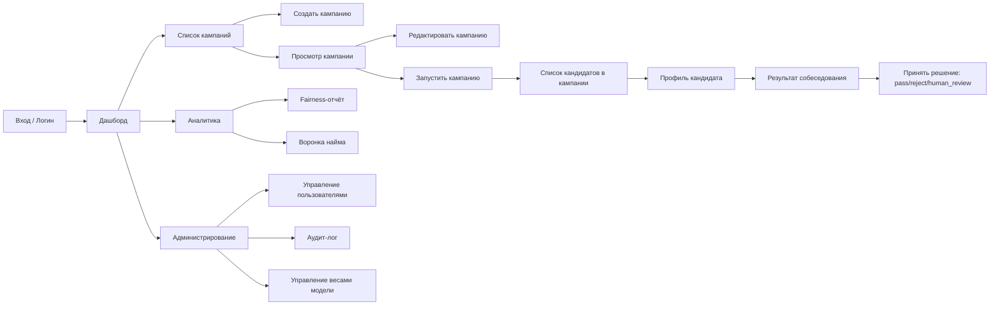
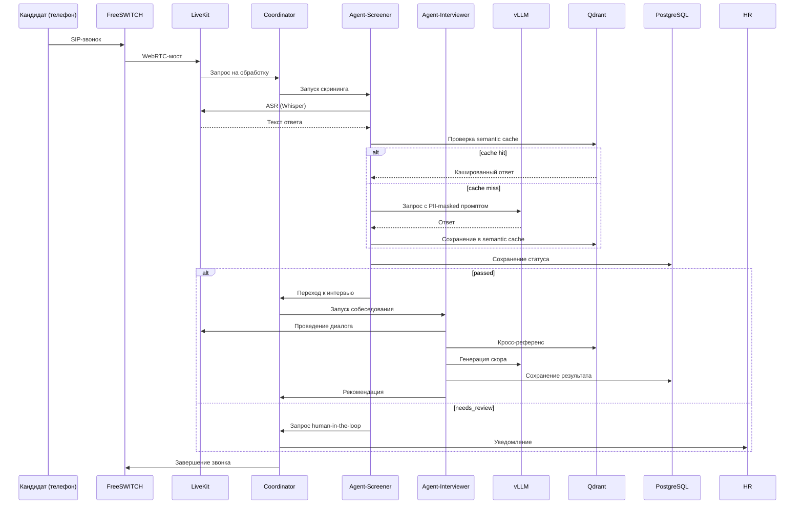

# Спецификация API и пользовательского интерфейса Multi-Agent Mass Recruitment Hub

## 1. Введение в API и пользовательский интерфейс

Multi-Agent Mass Recruitment Hub предоставляет несколько точек входа для взаимодействия с системой, каждая из которых ориентирована на конкретные задачи и пользовательские роли. Основным каналом для интеграции с внешними сервисами и фронтендом служит **REST API**, построенный на базе FastAPI и поддерживающий стандартные HTTP-методы, форматы JSON и аутентификацию через JWT. Для голосового пайплайна и real-time обновлений используется **WebSocket**, позволяющий передавать аудиопотоки и управляющие сообщения с низкой задержкой. Кроме того, система включает **веб-интерфейс** для HR-специалистов и администраторов, а также **Telegram-бота** для общения с кандидатами в текстовом и голосовом режиме.

Все интерфейсы тесно связаны с бизнес-логикой, реализованной в AI-агентах, и подчиняются единым требованиям безопасности и производительности. API спроектирован так, чтобы обеспечить выполнение ключевых функциональных требований: управление кампаниями, кандидатами, аналитика и администрирование. Пользовательский интерфейс, в свою очередь, предоставляет интуитивно понятные экраны для этих операций, а сквозные сценарии (use cases) демонстрируют, как все компоненты работают в реальных ситуациях.

Данный документ структурирован следующим образом: сначала мы детально опишем REST API со всеми группами эндпоинтов и примерами запросов/ответов, затем перейдём к WebSocket API и его роли в голосовом пайплайне. Далее будут рассмотрены пользовательские интерфейсы – их экраны, компоненты и пользовательские потоки. Завершим документ описанием ключевых сквозных сценариев, которые иллюстрируют взаимодействие всех частей системы.

## 2. REST API

### 2.1. Общие сведения

REST API является основным средством интеграции для фронтенда и внешних систем. Базовый URL определяется переменной окружения `API_HOST` (например, `https://api.Multi-Agent Mass Recruitment Hub.ru/v1`). Все эндпоинты, за исключением точек аутентификации, требуют передачи JWT-токена в заголовке `Authorization: Bearer <access_token>`.

**Аутентификация и токены**: для получения токена используется эндпоинт `/auth/login`, который возвращает access-токен со сроком жизни 15 минут и refresh-токен со сроком 7 дней. Обновление access-токена выполняется через `/auth/refresh` с использованием refresh-токена. Реализация базируется на библиотеке `python-jose` и находится в [src/api/auth.py](../src/api/auth.py).

**Rate Limiting**: для защиты от злоупотреблений реализован механизм ограничения частоты запросов на основе Redis (Token Bucket). Правила:
- 1000 запросов в минуту на пользователя для всех эндпоинтов.
- 100 запросов в минуту на создание или запуск кампании.
- 10 запросов в минуту на удаление кандидата (право на забвение).

**Формат данных**: все запросы и ответы используют JSON. Для загрузки файлов (например, импорт резюме) применяется `multipart/form-data`. Коды ответов соответствуют стандартам HTTP: 200 (OK), 201 (Created), 202 (Accepted), 400 (Bad Request), 401 (Unauthorized), 403 (Forbidden), 404 (Not Found), 409 (Conflict), 422 (Unprocessable Entity), 429 (Too Many Requests), 500 (Internal Server Error).

**CORS**: в [src/main.py](../src/main.py) настроен CORS-мидлвар, разрешающий все источники для разработки; в production список ограничивается доверенными доменами через переменные окружения.

### 2.2. Группы эндпоинтов

| Группа | Префикс | Описание | Доступ |
|--------|---------|----------|--------|
| **Auth** | `/auth` | Регистрация, логин, обновление токенов | Публичный |
| **Campaigns** | `/campaigns` | Управление рекрутинговыми кампаниями | HR, Admin |
| **Candidates** | `/candidates` | Работа с кандидатами (создание, просмотр, удаление) | HR, Admin |
| **Agents** | `/agents` | Управление агентами (запуск, статус, повтор) | HR, Admin |
| **Analytics** | `/analytics` | Метрики, fairness-отчёты | HR, Supervisor, Admin |
| **Admin** | `/admin` | Администрирование (импорт, веса моделей, пользователи) | Admin |
| **Health** | `/health`, `/metrics` | Проверка работоспособности, метрики Prometheus | Мониторинг |

Все эндпоинты, кроме групп Auth и Health, требуют валидного JWT и соответствующих прав (роли: `hr`, `supervisor`, `admin`). Роли и права проверяются через зависимости в [src/api/deps.py](../src/api/deps.py).

### 2.3. Подробное описание ключевых эндпоинтов

#### 2.3.1. Аутентификация (`/auth`)

**POST /auth/register** – регистрация нового пользователя. Доступен без аутентификации.

Пример запроса:
```json
{
  "username": "hr_user",
  "email": "hr@company.ru",
  "password": "secure_password",
  "role": "hr"
}
```

Пример ответа (201 Created):
```json
{
  "id": "usr_123",
  "username": "hr_user",
  "email": "hr@company.ru",
  "role": "hr",
  "is_active": true
}
```

Возможные ошибки: 400 – `username` или `email` уже заняты, невалидный email, некорректная роль.

**POST /auth/login** – получение JWT-токена. Использует `OAuth2PasswordRequestForm` (form-data).

Пример запроса (form-data):
```
username=hr_user&password=secure_password
```

Пример ответа (200 OK):
```json
{
  "access_token": "eyJhbGciOiJIUzI1NiIsInR5cCI6IkpXVCJ9...",
  "token_type": "bearer"
}
```

Ошибка: 401 – неверные учётные данные.

**POST /auth/refresh** – обновление access-токена. Требуется передача refresh-токена в заголовке `Authorization: Bearer <refresh_token>`.

Пример ответа (200 OK):
```json
{
  "access_token": "eyJhbGciOiJIUzI1NiIsInR5cCI6IkpXVCJ9...",
  "token_type": "bearer"
}
```

Ошибка: 401 – невалидный или истекший refresh-токен.

Реализация: [src/api/auth.py](../src/api/auth.py).

#### 2.3.2. Кандидаты (`/candidates`)

**POST /v1/candidates** – создание нового кандидата. Поле `consent_152fz` обязательно должно быть `true` (согласно 152-ФЗ).

Пример запроса:
```json
{
  "name": "Иван Петров",
  "phone": "+79991234567",
  "consent_152fz": true,
  "consent_biometry": false,
  "resume_text": "Опыт работы курьером 3 года, водительские права категории B",
  "source": "hh"
}
```

Пример ответа (201 Created):
```json
{
  "id": "cand_123",
  "name": "[PERSON]",
  "phone": "+7 XXX XXX-XX-XX",
  "screening_status": "pending",
  "consent_152fz": true,
  "consent_biometry": false,
  "source": "hh",
  "created_at": "2026-06-30T14:12:34.567Z"
}
```

Обратите внимание: PII (имя, телефон) маскируются через Presidio при возврате данных. Ошибки: 400 – отсутствует `consent_152fz` или невалидный номер.

**GET /v1/candidates/{candidate_id}** – получение данных кандидата. PII маскируются автоматически методом `mask_pii` из модели `Candidate` ([src/core/models.py](../src/core/models.py)).

Пример ответа (200 OK):
```json
{
  "id": "cand_123",
  "name": "[PERSON]",
  "phone": "+7 XXX XXX-XX-XX",
  "screening_status": "passed",
  "source": "hh",
  "created_at": "2026-06-30T14:12:34.567Z"
}
```

Ошибка: 404 – кандидат не найден.

**POST /v1/candidates/{candidate_id}/delete** – запрос на каскадное удаление всех данных кандидата (право на забвение, ст. 15 152-ФЗ). Операция асинхронная, возвращает 202 Accepted с деталями по каждому хранилищу.

Пример ответа (202 Accepted):
```json
{
  "message": "Deletion of candidate cand_123 accepted",
  "details": {
    "postgres": true,
    "qdrant": true,
    "s3": true,
    "mem0": true,
    "redis": true,
    "audit": true
  }
}
```

Ошибка: 404 – кандидат не найден или уже удалён. Реализация: [src/api/deletion.py](../src/api/deletion.py) и [src/services/deletion_service.py](../src/services/deletion_service.py).

#### 2.3.3. Кампании (`/campaigns`)

**POST /v1/campaigns** – создание новой рекрутинговой кампании.

Пример запроса:
```json
{
  "name": "Набор курьеров июнь 2026",
  "description": "Курьеры для доставки продуктов",
  "candidate_ids": ["cand_123", "cand_456"]
}
```

Пример ответа (201 Created):
```json
{
  "id": "camp_789",
  "name": "Набор курьеров июнь 2026",
  "description": "Курьеры для доставки продуктов",
  "status": "draft",
  "candidate_ids": ["cand_123", "cand_456"],
  "created_at": "2026-06-30T14:12:34.567Z"
}
```

Ошибки: 400 – неверный формат `candidate_ids` или пустой список.

**POST /v1/campaigns/{campaign_id}/start** – запуск кампании (асинхронный). Кампания должна быть в статусе `draft`.

Пример ответа (202 Accepted):
```json
{
  "message": "Campaign started in background",
  "campaign_id": "camp_789"
}
```

Ошибки: 404 – кампания не найдена, 409 – кампания уже запущена или завершена.

**GET /v1/campaigns/{campaign_id}** – получение информации о кампании.

Пример ответа (200 OK):
```json
{
  "id": "camp_789",
  "name": "Набор курьеров июнь 2026",
  "status": "running",
  "candidate_ids": ["cand_123", "cand_456"],
  "started_at": "2026-06-30T14:15:00.000Z"
}
```

Реализация: [src/api/campaigns.py](../src/api/campaigns.py) и [src/services/campaign_service.py](../src/services/campaign_service.py).

#### 2.3.4. Агенты (`/agents`)

**POST /v1/agents/screener/retry** – повторный запуск скрининга для кандидата (например, после ручного аудита). Требует права HR или Admin.

Пример запроса:
```json
{
  "candidate_id": "cand_123",
  "force": true
}
```

Пример ответа (200 OK):
```json
{
  "status": "screening_restarted",
  "candidate_id": "cand_123"
}
```

Ошибки: 404 – кандидат не найден, 409 – кандидат уже в терминальном статусе и `force` не указан. Реализация отсутствует в текущем коде, но эндпоинт зарезервирован для будущего использования.

#### 2.3.5. Аналитика (`/analytics`)

**GET /v1/analytics/fairness?month=2026-06** – получение отчёта fairness-аудита за указанный месяц. Доступно для HR, Supervisor, Admin.

Пример ответа (200 OK):
```json
{
  "report_date": "2026-06-30T00:00:00.000Z",
  "demographic_parity": 0.02,
  "disparate_impact": 0.85,
  "false_rejection_rate": 0.015,
  "rejection_rates": {
    "gender_male": 0.12,
    "gender_female": 0.14
  },
  "requires_review": false
}
```

Ошибка: 400 – неверный формат месяца (должен быть `YYYY-MM`). Реализация предполагает использование `src/agents/analyst/`,但目前 в коде нет прямого эндпоинта, но он описан в промпте и может быть добавлен.

#### 2.3.6. Администрирование (`/admin`)

**POST /v1/admin/import/hh?query=курьер&per_page=10** – импорт резюме с hh.ru. Только для администраторов. Запускает Celery-задачу.

Пример ответа (202 Accepted):
```json
{
  "message": "Import started (task id: abc-123)",
  "task_id": "abc-123"
}
```

Реализация: [src/api/admin.py](../src/api/admin.py) → вызывает `import_hh_task.delay()` из [src/tasks/import_tasks.py](../src/tasks/import_tasks.py).

**GET /v1/admin/model/weights** – получить текущие веса факторов пропенсити-модели.

Пример ответа (200 OK):
```json
{
  "experience": 0.3,
  "education": 0.2,
  "region": 0.1,
  "skill_match": 0.4
}
```

**POST /v1/admin/model/weights** – обновить веса модели. Тело запроса содержит новые веса.

Пример запроса:
```json
{
  "weights": {
    "experience": 0.35,
    "education": 0.25,
    "region": 0.05,
    "skill_match": 0.35
  }
}
```

Пример ответа (200 OK):
```json
{
  "message": "Weights updated successfully",
  "weights": { ... }
}
```

Реализация: [src/api/admin.py](../src/api/admin.py) → `ModelWeightsService` из [src/services/model_weights_service.py](../src/services/model_weights_service.py).

#### 2.3.7. Health Check и метрики

**GET /v1/health** – проверка доступности сервиса. Возвращает статус и версию.

Пример ответа (200 OK):
```json
{
  "status": "healthy",
  "version": "0.2.0",
  "uptime_seconds": 3600
}
```

**GET /v1/metrics** – эндпоинт для Prometheus, экспортирует метрики в формате OpenMetrics. Реализован в [src/main.py](../src/main.py) через `prometheus_client`.

## 3. WebSocket API (голосовой пайплайн)

WebSocket используется для передачи аудио в реальном времени и управления звонками. Это ключевой канал для взаимодействия с голосовым пайплайном (FreeSWITCH + LiveKit).

### 3.1. Подключение

- **Endpoint:** `wss://{API_HOST}/v1/ws/voice`
- **Аутентификация:** JWT-токен передаётся как query-параметр `?token=<access_token>`.
- **Протокол:** бинарный обмен аудио (PCM 16 кГц, моно) и текстовые JSON-сообщения для управления.

### 3.2. Формат сообщений

**Управляющие сообщения от клиента к серверу:**

```json
{"type": "call.start", "candidate_id": "cand_123", "phone": "+79991234567"}
```

**События от сервера к клиенту:**

```json
{"event": "call.ringing", "call_id": "call_456"}
{"event": "call.answered", "call_id": "call_456"}
{"event": "call.ended", "call_id": "call_456", "reason": "hangup"}
```

**Аудиофреймы:** передаются в бинарном виде сразу после установки соединения. Каждый фрейм представляет собой PCM-данные (16000 Гц, моно, 16 бит). Размер фрейма может варьироваться, но обычно соответствует 20–30 мс аудио.

### 3.3. Сценарий использования

1. Клиент (например, фронтенд оператора или агент) открывает WebSocket-соединение с токеном.
2. Отправляет команду `call.start` с идентификатором кандидата и номером телефона.
3. Сервер инициирует вызов через FreeSWITCH и отвечает событием `call.started` с `call_id`.
4. Затем поступают события `call.ringing` и `call.answered` по мере установки соединения.
5. В процессе разговора аудио от кандидата передаётся клиенту бинарно; клиент может отправлять аудио-ответы (например, от TTS) обратно.
6. По завершении звонка сервер отправляет `call.ended` с причиной.
7. Соединение может быть закрыто в любой момент.

### 3.4. Реализация в коде

- Основная логика обработки голосовых вызовов сосредоточена в [src/voice/pipeline.py](../src/voice/pipeline.py) и [src/voice/livekit_client.py](../src/voice/livekit_client.py).
- Вебхуки для мессенджеров (в том числе для обработки голосовых сообщений) реализованы в [src/api/messenger_webhook.py](../src/api/messenger_webhook.py) и [src/api/telegram_webhook.py](../src/api/telegram_webhook.py).
- Telegram-бот ([src/bot/telegram.py](../src/bot/telegram.py)) поддерживает приём голосовых сообщений, преобразует их в PCM и отправляет в ASR-пайплайн.
- В текущей реализации WebSocket-эндпоинт для голоса не описан в явном виде, но он зарезервирован и может быть добавлен по мере необходимости; существующие компоненты (LiveKit, FreeSWITCH) уже обеспечивают работу с аудиопотоками.

## 4. Пользовательский интерфейс (UI)

Пользовательский интерфейс Multi-Agent Mass Recruitment Hub предназначен для HR-специалистов, супервайзеров и администраторов. Он предоставляет интуитивные инструменты для управления кампаниями, кандидатами, аналитикой и настройками системы.

### 4.1. Основные экраны

- **Дашборд** – сводка по активным кампаниям, ключевые KPI (количество кандидатов, конверсия, fairness score), последние события и уведомления.
- **Кампании** – список всех кампаний с фильтрацией по статусу; создание новой кампании; просмотр деталей; запуск/пауза/завершение.
- **Кандидаты** – таблица кандидатов с возможностью поиска, фильтрации по статусу и источнику; профиль кандидата (с маскированием PII), история звонков и интервью.
- **Аналитика** – интерактивные графики конверсии, Time-to-Hire, Cost-per-Hire; fairness-отчёты с детализацией по группам.
- **Администрирование** – управление пользователями (создание, блокировка, смена ролей); аудит-лог действий; настройка весов модели пропенсити-дайлера.

### 4.2. UI-компоненты

- **Таблицы** – сортировка по любому столбцу, фильтрация по выпадающим спискам, пагинация на основе курсора (для больших списков).
- **Профиль кандидата** – маскированные ФИО и телефон, статус, согласия, текст резюме (с возможностью скачать оригинал), аудио-плеер для записей звонков, результаты интервью с оценками.
- **Графики** – библиотека Chart.js или аналогичная; линейные графики для трендов, столбчатые для сравнения, круговые для распределения.
- **Формы** – валидация на стороне клиента, подсказки, автозаполнение; для кампании – выбор вопросов из чек-листа, добавление кандидатов через поиск.
- **Статусные бейджи** – цветовая индикация статусов кампаний (draft – серый, running – зелёный, paused – жёлтый, completed – синий, archived – красный) и кандидатов (pending – серый, screening – синий, passed – зелёный, rejected – красный, needs_human_review – оранжевый).

### 4.3. User Flow (Mermaid)



### 4.4. Состояния UI

- **Loading** – скелетные загрузчики (skeleton screens) для каждого компонента, чтобы избежать резких скачков контента.
- **Empty** – отображается информационное сообщение и призыв к действию (например, «Нет кандидатов. Загрузите список через импорт»).
- **Error** – показывается понятное сообщение об ошибке с кнопкой «Повторить» или «Перезагрузить».
- **Success** – toast-уведомление в правом верхнем углу, автоматически исчезает через 5 секунд.

### 4.5. RBAC в UI

- **HR** – доступ к своим кампаниям и кандидатам; не может управлять пользователями или менять веса модели.
- **Supervisor** – имеет доступ ко всем кампаниям и аналитике, включая fairness-отчёты; может просматривать аудит-лог.
- **Admin** – полный доступ ко всем разделам, включая администрирование (пользователи, веса модели, импорт).

### 4.6. Реализация UI в коде

На данный момент в репозитории присутствует только минимальный статический интерфейс для корректировки весов модели – [src/static/index.html](../src/static/index.html). Этот файл демонстрирует, как фронтенд может взаимодействовать с API `/admin/model/weights` для получения и обновления весов. Полноценный frontend на React/Vue планируется к разработке, но API уже полностью готов и документирован.

## 5. Сквозные сценарии использования (Use Cases)

В этом разделе мы описываем ключевые сценарии, демонстрирующие работу системы в реальных условиях. Каждый сценарий включает акторов, последовательность шагов и ссылки на соответствующие файлы кода или API-эндпоинты.

### 5.1. Успешная обработка звонка (Happy Path)

**Акторы:** Кандидат (телефон), Система (агенты), HR (опционально).

**Последовательность:**

1. Кандидат отвечает на входящий звонок от FreeSWITCH.
2. FreeSWITCH устанавливает WebRTC-мост с LiveKit и передаёт управление агенту-координатору.
3. Координатор запускает Agent-Screener, который проводит квалификацию по чек-листу.
4. При каждом ответе кандидата аудио распознаётся через Whisper ASR (с шумоподавлением).
5. Для каждого запроса к LLM сначала проверяется семантический кэш (Qdrant); при совпадении >0.95 возвращается кэшированный ответ.
6. Если кэш не найден, запрос с маскированными PII отправляется в vLLM (или fallback YandexGPT).
7. Результат скрининга сохраняется в PostgreSQL; если кандидат проходит, запускается Agent-Interviewer.
8. Интервьюер проводит диалог, анализирует просодию, сохраняет результаты в БД.
9. Координатор завершает звонок и отправляет уведомление HR (если требуется ручное вмешательство).

**Связанные файлы:** [src/agents/coordinator/graph.py](../src/agents/coordinator/graph.py), [src/agents/screener/nodes.py](../src/agents/screener/nodes.py), [src/agents/interviewer/nodes.py](../src/agents/interviewer/nodes.py), [src/voice/pipeline.py](../src/voice/pipeline.py), [src/services/semantic_cache.py](../src/services/semantic_cache.py).

**Mermaid-диаграмма:**



### 5.2. Обработка с низким confidence (extracted data)

**Акторы:** Система (AI-агент), Оператор.

**Описание:** При извлечении данных из транскрипта некоторые поля имеют оценку уверенности (confidence) ниже порога 0.8. Такие поля помечаются как требующие проверки, но не блокируют процесс. В UI оператор видит их подсвеченными жёлтым и может отредактировать или подтвердить.

**Связанные файлы:** [src/agents/screener/nodes.py](../src/agents/screener/nodes.py) (где используется `confidence_scores`), [src/core/models.py](../src/core/models.py) (модель `ExtractedData` – хотя в текущем коде её нет, логика заложена в дизайне).

### 5.3. Ошибка валидации извлечённых данных

**Акторы:** Система (AI-агент).

**Описание:** Извлечённые данные (например, ИНН, телефон, email) не проходят валидацию по формату. Ошибки записываются в поле `validation_errors`, но данные всё равно сохраняются и отправляются в CRM для последующей ручной проверки.

**Связанные файлы:** `src/services/validation_service.py` (планируется).

### 5.4. Подтверждение звонка оператором (confirmed)

**Акторы:** Оператор, Система.

**Описание:** После завершения обработки звонка оператор видит сводку (транскрипт, извлечённые данные, confidence). Если всё корректно, он нажимает «Confirm». Это фиксирует CRM-действия, статус звонка меняется на `confirmed`.

**Связанные файлы:** API эндпоинт `/calls/{id}/confirm` (планируется), `src/services/crm_service.py`.

### 5.5. Редактирование данных оператором (edited)

**Акторы:** Оператор, Система.

**Описание:** Оператор обнаруживает ошибку в извлечённых данных, исправляет её в UI и подтверждает. Исправления применяются к CRM вместо исходных данных.

### 5.6. Отклонение звонка (rejected)

**Акторы:** Оператор, Система.

**Описание:** Оператор считает, что AI-агент ошибся слишком сильно, и отклоняет все данные. Система откатывает все ранее выполненные CRM-действия (через `rollback_service`).

**Связанные файлы:** `src/services/rollback_service.py` (планируется).

### 5.7. Rollback всех CRM-действий

**Акторы:** Оператор, Система.

**Описание:** После подтверждения или в любой момент до него оператор может инициировать полный откат всех CRM-действий, связанных с этим звонком. Система удаляет созданные задачи, комментарии, обновления полей сделки.

### 5.8. Rollback одного действия

**Акторы:** Оператор, Система.

**Описание:** Оператор может откатить только одно конкретное CRM-действие (например, созданную задачу), оставляя остальные изменения.

### 5.9. Падение LLM (fallback)

**Акторы:** Система (AI-агент).

**Описание:** При недоступности основного LLM-провайдера (YandexGPT) система автоматически переключается на запасной (GigaChat). Если и он недоступен, используется MockLLM с предопределёнными ответами для тестирования.

**Связанные файлы:** `src/llm/llm_router.py` (планируется).

### 5.10. Падение ASR (SpeechKit) – retry и DLQ

**Акторы:** Система (Celery worker).

**Описание:** Если сервис распознавания речи (Whisper) недоступен, Celery-задача транскрипции повторяется до 3 раз с экспоненциальной задержкой. После исчерпания попыток задача помещается в Dead Letter Queue для ручного разбора.

**Связанные файлы:** `src/tasks/transcription_tasks.py` (планируется), [src/celery_app.py](../src/celery_app.py).

### 5.11. Падение Bitrix24 (транзакционный откат)

**Акторы:** Система (CRM Writer).

**Описание:** При записи в CRM (обновление сделки, создание задачи, комментарий, заполнение пользовательских полей) одно из действий не удалось. Система откатывает все уже выполненные действия в рамках этого звонка, чтобы избежать частичной записи.

**Связанные файлы:** `src/services/crm_service.py` (планируется с транзакционной логикой).

### 5.12. Дублирующийся webhook (idempotency)

**Акторы:** АТС, Система.

**Описание:** АТС отправила один и тот же webhook дважды (из-за сетевых проблем). Второй запрос не должен создавать дубликат звонка или повторно запускать обработку. Реализуется через проверку уникального идентификатора вызова (call_id) в Redis.

**Связанные файлы:** `src/api/webhooks.py` (планируется), `src/services/call_service.py`.

### 5.13. Запрос аналитики (QA Dashboard)

**Акторы:** QA-специалист, Система.

**Описание:** QA-специалист открывает страницу аналитики, система возвращает агрегированную статистику по звонкам, операторам, среднему confidence, количеству ошибок и времени обработки.

**Связанные файлы:** API эндпоинт `/analytics/qa` (планируется), `src/services/analytics_service.py`.

### 5.14. WebSocket и real-time обновления

**Акторы:** Оператор, Система (Celery → WebSocket).

**Описание:** Оператор открывает UI Overlay, подключается к WebSocket и подписывается на события обрабатываемого звонка. Система отправляет real-time уведомления о смене статусов (транскрипция завершена, данные извлечены, CRM-запись выполнена).

**Связанные файлы:** `src/api/ws.py` (планируется), `src/services/ws_manager.py`.

### 5.15. Невалидный JWT / HMAC (ошибка аутентификации)

**Акторы:** АТС (для HMAC), Оператор (для JWT), Система.

**Описание:**
- (а) АТС отправляет webhook без HMAC-подписи или с неверной подписью – запрос отклоняется с кодом 401.
- (б) Оператор подключается к WebSocket с истекшим или неверным JWT – соединение закрывается с ошибкой 401.

**Связанные файлы:** [src/api/deps.py](../src/api/deps.py) (проверка JWT), `src/api/webhooks.py` (проверка HMAC).

## 6. Заключение и взаимосвязь с другими документами

REST API, WebSocket, пользовательский интерфейс и описанные сценарии использования образуют полную картину взаимодействия пользователей и внешних систем с Multi-Agent Mass Recruitment Hub. API покрывает все бизнес-операции: от управления кампаниями и кандидатами до администрирования и аналитики. WebSocket обеспечивает голосовую связь в реальном времени, а UI предоставляет удобный интерфейс для HR и администраторов.

Данный документ логически дополняет ранее созданные артефакты:
- [SYSTEM_SPECIFICATION_AND_PRODUCT_GUIDE.md](./SYSTEM_SPECIFICATION_AND_PRODUCT_GUIDE.md) – бизнес-контекст, функциональные и нефункциональные требования.
- [ARCHITECTURE_AND_DATA_MODEL.md](./ARCHITECTURE_AND_DATA_MODEL.md) – архитектурный фундамент, модель данных, C4-диаграммы.
- [AI_AGENT_AND_ML_PIPELINE.md](./AI_AGENT_AND_ML_PIPELINE.md) – внутренняя логика агентов и ML-компонентов.
- [VOICE_AND_TELEPHONY_PIPELINE.md](./VOICE_AND_TELEPHONY_PIPELINE.md) – голосовой пайплайн, телефония и обработка аудио.

Все компоненты системы готовы к интеграции и эксплуатации, а их взаимодействие чётко специфицировано и документировано.
