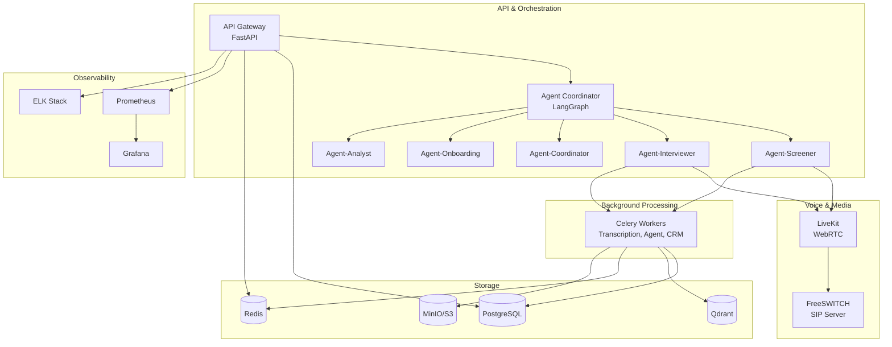
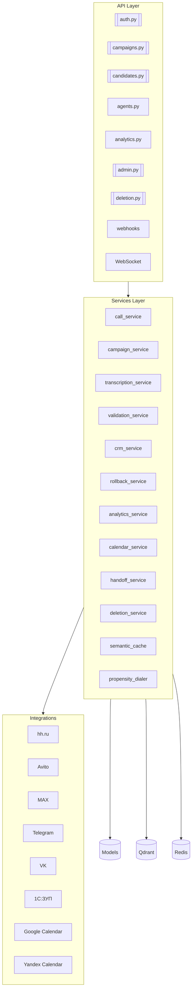
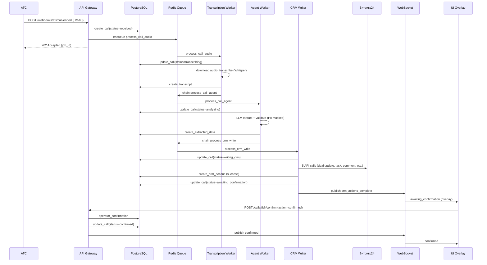
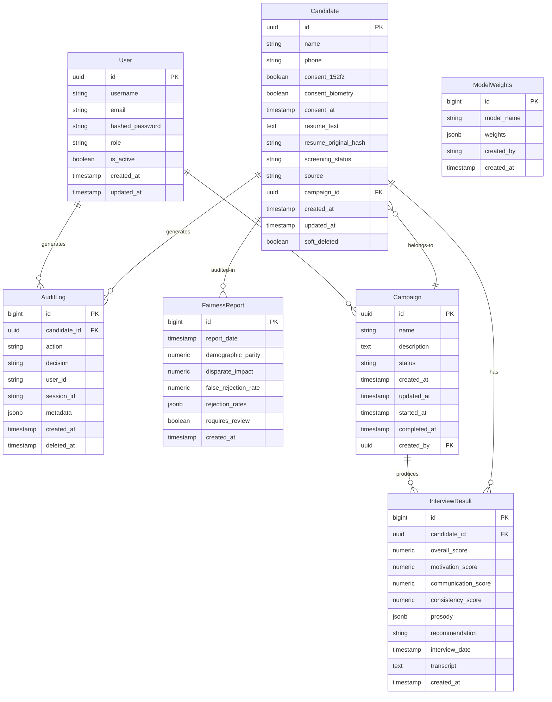
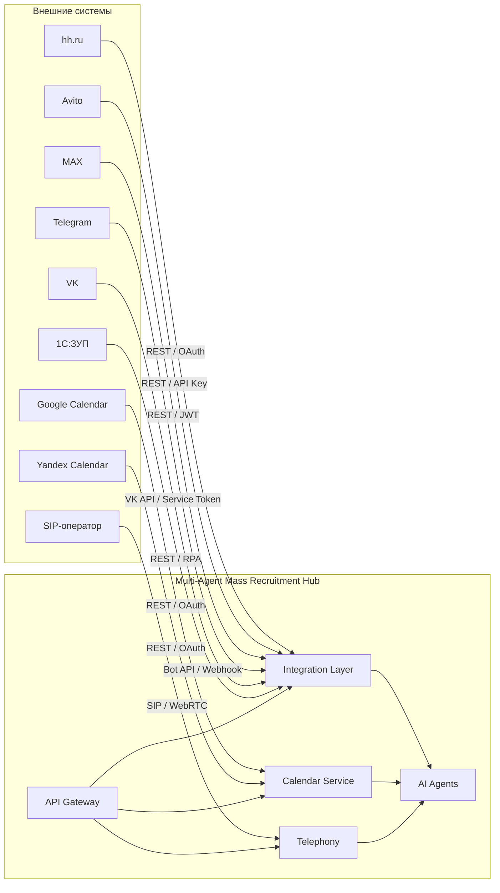

## Архитектура и модель данных Multi-Agent Mass Recruitment Hub

---

# 1. Введение в архитектуру

Архитектура Multi-Agent Mass Recruitment Hub представляет собой событийно-ориентированную мультиагентную систему, построенную на принципах микросервисной декомпозиции и горизонтального масштабирования. Выбор такого подхода обусловлен необходимостью обрабатывать тысячи параллельных голосовых сессий, интегрироваться с десятками внешних сервисов и обеспечивать высокую отказоустойчивость при работе с персональными данными граждан РФ.

Центральным элементом архитектуры является **графовый оркестратор на LangGraph**, который управляет пятью специализированными AI-агентами (Screener, Interviewer, Coordinator, Onboarding, Analyst). Каждый агент реализован как отдельный граф состояний с чёткими conditional edges, что обеспечивает детерминированность выполнения бизнес-процессов и возможность приостановки для ручного вмешательства (human‑in‑the‑loop). Вокруг агентов выстроена инфраструктура: API-шлюз на FastAPI, голосовой пайплайн на базе FreeSWITCH и LiveKit, асинхронные очереди задач (Celery), векторное хранилище (Qdrant), реляционная база данных (PostgreSQL) и полный стек наблюдаемости (Prometheus, Grafana, ELK).

Данный документ детализирует архитектуру на уровнях C4 (контейнеры и компоненты), фиксирует ключевые архитектурные решения (ADR), описывает модель данных PostgreSQL и схему интеграций с внешними системами. Все разделы логически связаны: архитектурные решения обосновывают выбор хранилищ, модель данных определяет структуру таблиц, а интеграции показывают, как система обменивается данными с внешним миром.

---

# 2. C4-модель (Уровни 2 и 3)

## 2.1. Контейнерная диаграмма (C4 Level 2)

На уровне контейнеров система состоит из следующих основных исполняемых модулей:

- **API Gateway (FastAPI)** — точка входа для всех HTTP/WebSocket-запросов. Обрабатывает REST-запросы от фронтенда, webhook-уведомления от АТС и мессенджеров, а также устанавливает WebSocket-соединения для голосового пайплайна. Реализован в `[src/main.py](../src/main.py)`, использует роутеры из `src/api/` и middleware для аутентификации, rate limiting и аудита.

- **Оркестратор агентов (LangGraph)** — графовый движок, управляющий последовательностью вызовов пяти агентов. Координатор (`src/agents/coordinator/`) маршрутизирует кандидатов между агентами в зависимости от статуса скрининга. Каждый агент (`screener`, `interviewer`, `onboarding`, `analyst`) имеет собственный граф (`graph.py`) и узлы (`nodes.py`), реализованные на LangGraph.

- **Voice Pipeline (FreeSWITCH + LiveKit)** — обеспечивает телефонную связь и WebRTC-обработку. FreeSWITCH (`infra/docker/freeswitch/`) выступает SIP-сервером с поддержкой до 3000 параллельных звонков на ноду, а LiveKit (`infra/livekit/`) управляет WebRTC-сессиями, adaptive barge-in и потоковой обработкой аудио (ASR → LLM → TTS).

- **Celery Workers** — фоновые задачи, выполняющие длительные операции: транскрипция аудио (`src/tasks/`), работа AI-агента и запись в CRM. Используют Redis как брокер (`[src/celery_app.py](../src/celery_app.py)`).

- **Хранилища**:
  - **PostgreSQL** — основная реляционная БД для кандидатов, кампаний, результатов интервью, аудит-логов и метрик fairness. Версия 16 с pgvector для геопоиска.
  - **Qdrant** — векторное хранилище для семантического кэша, RAG-документов и профилей кандидатов. Развёрнуто в кластере из 4 шардов.
  - **Redis** — используется для кэширования сессий, хранения состояния handoff, очередей Celery и pub/sub для WebSocket-уведомлений.
  - **MinIO/S3** — объектное хранилище для аудиозаписей звонков и артефактов ML-экспериментов.

- **Мониторинг** — Prometheus для сбора метрик, Grafana для визуализации, ELK Stack (Elasticsearch, Logstash, Kibana) для централизованного логирования и аудита.



**Взаимодействие контейнеров:**
- API Gateway принимает запросы от внешних систем (АТС, мессенджеры, фронтенд) и передаёт их в оркестратор или напрямую в Celery для фоновой обработки.
- Оркестратор вызывает агентов последовательно, каждый агент может обращаться к голосовому пайплайну, хранилищам и Celery для асинхронных операций.
- LiveKit и FreeSWITCH обмениваются аудиопотоками через WebRTC-мост; LiveKit также взаимодействует с агентами через ASR/TTS.
- Celery workers используют Redis для очередей и результат-бэкенд, обращаются к PostgreSQL и Qdrant для чтения/записи данных.
- Мониторинг собирает метрики и логи со всех компонентов.

## 2.2. Компонентная диаграмма (C4 Level 3)

На уровне компонентов детализируем слои внутри контейнеров.

**API Layer (`src/api/`):**
- Роутеры: `[auth.py](../src/api/auth.py)` (JWT-аутентификация), `[campaigns.py](../src/api/campaigns.py)` (управление кампаниями), `[candidates.py](../src/api/candidates.py)` (CRUD кандидатов), `agents.py` (запуск/повтор агентов), `analytics.py` (метрики и fairness-отчёты), `[admin.py](../src/api/admin.py)` (импорт, веса моделей), `[deletion.py](../src/api/deletion.py)` (право на забвение), `[messenger_webhook.py](../src/api/messenger_webhook.py)`, `[telegram_webhook.py](../src/api/telegram_webhook.py)` (входящие сообщения от мессенджеров).
- Middleware: CORS (`[src/main.py](../src/main.py)`), JWT-валидация (`[src/api/deps.py](../src/api/deps.py)`), rate limiting (планируется), аудит через structlog (`[src/core/audit_logger.py](../src/core/audit_logger.py)`).

**Agent Layer (`src/agents/`):**
- Пять агентов, каждый имеет файл `graph.py` и `nodes.py`:
  - **Screener**: узлы `validate_consent`, `analyze_resume`, `ask_questions`, `evaluate`, `human_review`.
  - **Interviewer**: `prepare_questions`, `conduct_interview`, `analyze_prosody`, `analyze_video` (опционально), `analyze_results`, `human_review_interview`.
  - **Coordinator**: `route_candidate`, `screener_node`, `interviewer_node`, `analyst_node`, `handle_handoff`, `analytics_report`, `human_review`.
  - **Onboarding**: `collect_documents`, `verify_documents`, `schedule_welcome`, `send_onboarding_package`, `human_review`.
  - **Analyst**: `aggregate_metrics`, `detect_bottlenecks`, `fairness_audit`, `generate_report`, `human_review`.
- Инструменты агентов (вызовы сервисов): `src/services/` — доступ к БД, Qdrant, телефонии (`make_call`), мессенджерам (`send_omnichannel_message`), LLM (через `src/llm/`).

**Services Layer (`src/services/`):**
- `call_service.py` — управление звонками (создание, обновление статуса).
- `[campaign_service.py](../src/services/campaign_service.py)` — CRUD кампаний.
- `transcription_service.py` — интеграция с Whisper ASR.
- `validation_service.py` — валидация извлечённых данных (телефон, ИНН, email, дата, сумма).
- `crm_service.py` — запись в Битрикс24 (через интеграции).
- `rollback_service.py` — откат CRM-действий.
- `analytics_service.py` — агрегация статистики.
- `[calendar_service.py](../src/services/calendar_service.py)` — проверка доступности календарей HR.
- `[handoff_service.py](../src/services/handoff_service.py)` — сохранение состояния диалога в Redis при переключении каналов.
- `[deletion_service.py](../src/services/deletion_service.py)` — каскадное удаление данных кандидата.
- `[semantic_cache.py](../src/services/semantic_cache.py)` — MVR-кэш для LLM.
- `[propensity_dialer.py](../src/services/propensity_dialer.py)` — CatBoost-модель для выбора времени звонка.

**Связи между слоями:** API → Services → Models/Integrations. API вызывает сервисы, сервисы работают с моделями и интеграциями. Celery workers также используют сервисы для выполнения фоновых задач.



## 2.3. Диаграмма потоков данных (Sequence Diagram)

Сквозной сценарий обработки звонка от webhook до подтверждения оператором:



На каждом шаге участвуют конкретные файлы:
- **API:** `src/api/webhooks.py` → `handle_call_ended()`, вызывает `call_service.create_call()`.
- **Транскрипция:** `src/workers/tasks.py` → `process_call_audio`, использует `transcription_service.transcribe_audio()`.
- **AI-агент:** `src/workers/agent_worker.py` → `process_call_agent`, запускает `orchestrator.process_transcript()` из `[src/agents/orchestrator.py](../src/agents/orchestrator.py)`.
- **CRM Writer:** `src/workers/crm_writer_worker.py` → `process_crm_write`, использует `crm_service.write_to_crm()`.
- **WebSocket:** `src/api/ws.py` и `src/services/ws_manager.py` для публикации событий через Redis pub/sub.

---

# 3. Реестр архитектурных решений (ADR)

Архитектурные решения фиксируются в формате ADR для обеспечения прозрачности и обоснованности выбранных технологий. Ниже перечислены утверждённые решения, принятые в ходе проектирования, а также предлагаемые новые ADR, выявленные в результате gap-анализа.

## 3.1. Утверждённые ADR (0001–0006)

| № | Название | Решение | Обоснование (кратко) | Ссылка на код |
|---|----------|---------|----------------------|---------------|
| 0001 | Orchestration Framework | LangGraph > CrewAI | Детерминированность выполнения, typed-state, human-in-the-loop, conditional edges для юридической чистоты отбора | `src/agents/*/graph.py`, `[src/core/state.py](../src/core/state.py)` |
| 0002 | Telephony Engine | FreeSWITCH > Asterisk | Поддержка 3000+ параллельных звонков на ноду, событийная архитектура (ESL), кластеризация, многопоточная модель | `src/telephony/`, `infra/docker/freeswitch/` |
| 0003 | LLM Inference Optimization | vLLM + MVR-cache | PagedAttention, prefix‑cache aware routing, асимметричное кэширование промптов (снижение стоимости до 10 раз) | `src/llm/`, `[src/services/semantic_cache.py](../src/services/semantic_cache.py)` |
| 0004 | Voice Pipeline | LiveKit + Whisper + Silero | Низкая задержка, adaptive barge‑in (менее 300 мс), streaming-обработка ASR→LLM→TTS, WER <8% после fine‑tune | `src/voice/`, `infra/livekit/` |
| 0005 | CI/CD Pipeline | GitHub Actions + Yandex CR + Helm | Автоматизация сборки, тестирования и деплоя, локализация в РФ-контуре (Yandex Cloud), управление через Helm | `.github/workflows/ci.yml`, `infra/helm/` |
| 0006 | Deployment Strategy | Yandex Managed K8s + Helm + HPA | Managed control plane, горизонтальное масштабирование (HPA), отказоустойчивость, соответствие требованиям ФСТЭК | `infra/terraform/`, `infra/helm/[values-prod.yaml](../infra/helm/mass-recruit-hub/values-prod.yaml)` |

## 3.2. Предлагаемые новые ADR (gap-анализ)

На основе анализа текущей реализации и требований выявлены следующие пробелы, требующие фиксации в виде отдельных ADR:

- **ADR-0007: PII Anonymization Strategy** — выбор Microsoft Presidio с кастомными recognizer'ами для РФ (паспорт, СНИЛС, телефон, адрес) против альтернатив (Microsoft FTE, regex-маскирование). Критично для соответствия 152-ФЗ. Реализация: `src/pii/`.

- **ADR-0008: Observability Stack** — выбор Prometheus для метрик (vs VictoriaMetrics), ELK для логов (vs Loki), Jaeger для трассировки (vs Tempo). Обоснование: единый стек с существующей инфраструктурой, зрелость решений. Связано: `infra/prometheus/`, `infra/grafana/`, `infra/elk/`.

- **ADR-0009: Integration Pattern** — унификация подходов к интеграциям: REST для синхронных запросов (hh.ru, Avito, календари), Webhooks для асинхронных уведомлений (АТС, мессенджеры), gRPC для внутренних высоконагруженных вызовов (между агентами). Связано: `src/integrations/`, `[src/services/hr_integrations.py](../src/services/hr_integrations.py)`.

- **ADR-0010: Semantic Caching Strategy** — выбор Qdrant для хранения семантического кэша против Redis Stack (с модулем поиска) или специализированных решений. Обоснование: российская разработка, высокая производительность при поиске по миллионам векторов, поддержка фильтрации по payload. Связано: `[src/services/semantic_cache.py](../src/services/semantic_cache.py)`.

- **ADR-0011: Database Sharding & Replication** — стратегия масштабирования PostgreSQL и Qdrant при росте объёма данных (>10 млн кандидатов): партиционирование таблиц по дате, read‑replicas для аналитики, шардирование Qdrant (4 шарда, 2 реплики). Связано: `infra/terraform/`, `migrations/`.

- **ADR-0012: Multi-region / Disaster Recovery** — архитектура для отказоустойчивости при сбое целого региона (актуально для РФ): резервное копирование в другой регион, автоматическое переключение DNS, репликация БД. Связано: `infra/helm/`, `infra/terraform/`.

## 3.3. Шаблон нового ADR

Для создания новых ADR рекомендуется использовать следующий шаблон (размещается в `docs/adr/ADR-XXXX-название.md`):

```markdown
# ADR-NNNN: [Краткое название решения]

**Статус:** Proposed / In Review / Approved / Deprecated / Superseded  
**Дата:** YYYY-MM-DD  
**Авторы:** [Имена/роли]

## Контекст
Опишите проблему или потребность, которая привела к необходимости принятия решения.  
Какие бизнес- или технические требования повлияли на выбор?  
Какие альтернативы рассматривались?

## Рассмотренные варианты

### Вариант 1: [Название]
- **Плюсы:** ...
- **Минусы:** ...
- **Затраты:** (оценка усилий)

### Вариант 2: [Название]
- **Плюсы:** ...
- **Минусы:** ...
- **Затраты:** ...

### Вариант 3: [Название]
- **Плюсы:** ...
- **Минусы:** ...
- **Затраты:** ...

## Решение
Опишите, какой вариант выбран и почему. Приведите аргументы, основанные на данных, требованиях, ограничениях.  
Укажите, соответствует ли это решение существующим ADR (если есть).

## Последствия

### Положительные
- Что улучшится?
- Какие риски снизятся?

### Отрицательные
- Какие компромиссы приняты?
- Какие новые риски появляются?

### Нейтральные
- Изменения в процессах разработки, эксплуатации, документации.

## Связанные ADR
- ADR-XXXX: [Название] – ссылка

## Реализация
Ссылки на конкретные файлы кода или конфигурации, которые реализуют это решение:  
- `src/...`
- `infra/...`
- `tests/...`

## Участники
- Архитектор: ...
- Разработчик: ...
- Другие роли: ...

## История изменений
| Дата | Версия | Изменение | Автор |
|------|--------|-----------|-------|
| ... | 1.0 | Создание | ... |
```

---

# 4. Модель данных (PostgreSQL + pgvector)

Модель данных Multi-Agent Mass Recruitment Hub спроектирована для обеспечения высокой производительности при массовых операциях, соблюдения требований 152-ФЗ (аудит, согласия, право на забвение) и гибкости благодаря использованию JSONB-полей. Основные сущности: кандидаты, кампании, результаты интервью, пользователи, аудит-логи, отчёты fairness и веса моделей.

## 4.1. ER-диаграмма (Mermaid)



## 4.2. Детальное описание таблиц

### Таблица `candidates`

Хранит основную информацию о кандидатах. Поля с ПДн (name, phone, resume_text) маскируются перед передачей в LLM через Presidio (`[src/pii/anonymizer.py](../src/pii/anonymizer.py)`). Поле `soft_deleted` используется для права на забвение (ст. 15 152-ФЗ).

| Поле | Тип | Nullable | Default | Описание |
|------|-----|----------|---------|----------|
| `id` | UUID | NO | `gen_random_uuid()` | Первичный ключ |
| `name` | VARCHAR(255) | NO | — | ФИО кандидата |
| `phone` | VARCHAR(20) | NO | — | Номер телефона |
| `consent_152fz` | BOOLEAN | NO | `false` | Согласие на обработку ПДн (ст. 9 152-ФЗ) |
| `consent_biometry` | BOOLEAN | NO | `false` | Согласие на обработку голосовой биометрии |
| `consent_at` | TIMESTAMPTZ | YES | — | Дата и время получения согласия |
| `resume_text` | TEXT | YES | — | Текст резюме (маскируется) |
| `resume_original_hash` | VARCHAR(64) | YES | — | SHA-256 хеш оригинального текста резюме для аудита |
| `screening_status` | VARCHAR(32) | NO | `'pending'` | Статус: `pending`, `screening`, `passed`, `rejected`, `needs_human_review` |
| `source` | VARCHAR(32) | YES | — | Источник: `hh`, `avito`, `manual` и др. |
| `campaign_id` | UUID | NO | — | Внешний ключ к `campaigns.id` |
| `created_at` | TIMESTAMPTZ | NO | `now()` | Дата создания |
| `updated_at` | TIMESTAMPTZ | NO | `now()` | Дата последнего обновления |
| `soft_deleted` | BOOLEAN | NO | `false` | Признак мягкого удаления (право на забвение) |

**Индексы:**
- `idx_candidates_phone` на `phone` (быстрый поиск по телефону).
- `idx_candidates_status` на `screening_status` (фильтрация по статусу).
- `idx_candidates_campaign` на `campaign_id` (JOIN с кампаниями).
- `idx_candidates_created` на `created_at` (сортировка по дате).

### Таблица `campaigns`

Хранит рекрутинговые кампании, объединяющие кандидатов для массового обзвона.

| Поле | Тип | Nullable | Default | Описание |
|------|-----|----------|---------|----------|
| `id` | UUID | NO | `gen_random_uuid()` | Первичный ключ |
| `name` | VARCHAR(255) | NO | — | Название кампании |
| `description` | TEXT | YES | — | Описание |
| `status` | VARCHAR(32) | NO | `'draft'` | Статус: `draft`, `running`, `paused`, `completed`, `archived` |
| `created_at` | TIMESTAMPTZ | NO | `now()` | Дата создания |
| `updated_at` | TIMESTAMPTZ | NO | `now()` | Дата последнего обновления |
| `started_at` | TIMESTAMPTZ | YES | — | Время запуска |
| `completed_at` | TIMESTAMPTZ | YES | — | Время завершения |
| `created_by` | UUID | NO | — | Внешний ключ к `users.id` (кто создал) |

**Индексы:** на `status` и `created_by`.

### Таблица `interview_results`

Содержит результаты мини-собеседований: оценки по шкале 0–1, просодические метрики (JSONB) и рекомендацию.

| Поле | Тип | Nullable | Default | Описание |
|------|-----|----------|---------|----------|
| `id` | BIGINT | NO | `auto_increment` | Первичный ключ |
| `candidate_id` | UUID | NO | — | Внешний ключ к `candidates.id` |
| `overall_score` | NUMERIC(3,2) | NO | — | Общая оценка (0.00–1.00) |
| `motivation_score` | NUMERIC(3,2) | YES | — | Оценка мотивации |
| `communication_score` | NUMERIC(3,2) | YES | — | Оценка коммуникации |
| `consistency_score` | NUMERIC(3,2) | YES | — | Оценка консистентности |
| `prosody` | JSONB | YES | — | Просодические метрики: `tone`, `speech_rate`, `avg_pause_seconds`, `interruptions`, `confidence` |
| `recommendation` | VARCHAR(32) | YES | — | Рекомендация: `pass`, `review`, `reject` |
| `interview_date` | TIMESTAMPTZ | NO | — | Дата и время собеседования |
| `transcript` | TEXT | YES | — | Транскрипт разговора (маскированный) |
| `created_at` | TIMESTAMPTZ | NO | `now()` | Дата сохранения |

**Индексы:** на `candidate_id` и `interview_date`.

### Таблица `users`

Хранит учётные записи пользователей системы с ролями (admin, hr, supervisor).

| Поле | Тип | Nullable | Default | Описание |
|------|-----|----------|---------|----------|
| `id` | UUID | NO | `gen_random_uuid()` | Первичный ключ |
| `username` | VARCHAR(64) | NO | — | Уникальный логин |
| `email` | VARCHAR(128) | NO | — | Уникальный email |
| `hashed_password` | VARCHAR(256) | NO | — | Хеш пароля (bcrypt) |
| `role` | VARCHAR(32) | NO | `'hr'` | Роль: `admin`, `hr`, `supervisor` |
| `is_active` | BOOLEAN | NO | `true` | Активен ли пользователь |
| `created_at` | TIMESTAMPTZ | NO | `now()` | Дата создания |
| `updated_at` | TIMESTAMPTZ | NO | `now()` | Дата последнего обновления |

**Индексы:** уникальные индексы на `username` и `email`.

### Таблица `audit_logs`

Структурированные логи всех действий с ПДн для соответствия 152-ФЗ (ст. 18.1, 22). Поля обязательные: `candidate_id`, `action`, `timestamp`, `decision`, `user_id`.

| Поле | Тип | Nullable | Default | Описание |
|------|-----|----------|---------|----------|
| `id` | BIGINT | NO | `auto_increment` | Первичный ключ |
| `candidate_id` | UUID | NO | — | Внешний ключ к `candidates.id` |
| `action` | VARCHAR(64) | NO | — | Действие (например, `screening_started`, `pii_masked`, `consent_given`) |
| `decision` | VARCHAR(32) | YES | — | Принятое решение |
| `user_id` | VARCHAR(64) | YES | — | Инициатор (UUID или `'system'`) |
| `session_id` | VARCHAR(64) | YES | — | Идентификатор сессии |
| `metadata` | JSONB | YES | — | Дополнительные данные |
| `created_at` | TIMESTAMPTZ | NO | `now()` | Время события |
| `deleted_at` | TIMESTAMPTZ | YES | — | Время мягкого удаления (право на забвение) |

**Индексы:** на `candidate_id` и `action`, на `created_at` для быстрого поиска по времени.

### Таблица `fairness_reports`

Хранит результаты ежемесячного fairness-аудита, вычисляемые в Agent-Analyst (`[src/agents/analyst/fairness_metrics.py](../src/agents/analyst/fairness_metrics.py)`).

| Поле | Тип | Nullable | Default | Описание |
|------|-----|----------|---------|----------|
| `id` | BIGINT | NO | `auto_increment` | Первичный ключ |
| `report_date` | TIMESTAMPTZ | NO | `now()` | Дата формирования отчёта |
| `demographic_parity` | NUMERIC(5,4) | YES | — | Разница в вероятностях отказа между группами |
| `disparate_impact` | NUMERIC(5,4) | YES | — | Disparate Impact (отношение вероятностей) |
| `false_rejection_rate` | NUMERIC(5,4) | YES | — | Доля ложных отказов (FRR) |
| `rejection_rates` | JSONB | YES | — | Отказы по группам (пол, возраст, регион) |
| `requires_review` | BOOLEAN | NO | `false` | Требуется ли ручное вмешательство |
| `created_at` | TIMESTAMPTZ | NO | `now()` | Дата сохранения |

**Индексы:** на `report_date`.

### Таблица `model_weights`

Хранит историю изменений весов факторов пропенсити-модели (CatBoost). Позволяет HR-директору корректировать веса через админ-панель (`[src/static/index.html](../src/static/index.html)`).

| Поле | Тип | Nullable | Default | Описание |
|------|-----|----------|---------|----------|
| `id` | BIGINT | NO | `auto_increment` | Первичный ключ |
| `model_name` | VARCHAR(64) | NO | — | Имя модели (например, `propensity_dialer`) |
| `weights` | JSONB | NO | — | Веса факторов (JSON) |
| `created_by` | VARCHAR(64) | YES | — | Кто создал (username) |
| `created_at` | TIMESTAMPTZ | NO | `now()` | Дата сохранения |

## 4.3. Особые поля и constraints

- **consent_152fz** и **consent_biometry** — обязательные для начала скрининга. Валидация выполняется в методе `validate_consent` модели `Candidate` (`[src/core/models.py](../src/core/models.py)`). Если `consent_152fz = false`, скрининг блокируется.
- **soft_deleted** — флаг для реализации права на забвение. При удалении данные не стираются физически, а помечаются, что позволяет сохранить аудиторский след. Каскадное удаление из связанных таблиц выполняется через `[src/services/deletion_service.py](../src/services/deletion_service.py)`.
- **resume_original_hash** — SHA-256 хеш оригинального резюме. Используется для проверки целостности и аудита (например, чтобы убедиться, что резюме не было изменено после импорта).

## 4.4. Миграции и управление схемой

Управление схемой осуществляется через **Alembic** (`[alembic.ini](../alembic.ini)`, `migrations/`). Существующие миграции:

- **[001_initial_schema.py](../migrations/versions/001_initial_schema.py)** — создание таблиц `candidates`, `call_logs`, `interview_results`, `audit_logs`, `fairness_reports`.
- **[002_add_model_weights.py](../migrations/versions/002_add_model_weights.py)** — добавление таблицы `model_weights` и начальной записи для `propensity_dialer`.
- **[003_add_users.py](../migrations/versions/003_add_users.py)** — создание таблицы `users` и добавление администратора по умолчанию.

**Команды:**
```bash
alembic upgrade head   # применить все миграции
alembic downgrade -1   # откатить на одну миграцию
alembic revision --autogenerate -m "описание"  # создать новую миграцию
```

**Политика миграций:** все миграции должны быть обратно совместимыми (не удалять колонки, не изменять nullable без default). Перед деплоем в production выполняется `alembic upgrade head` в Kubernetes Job (см. `[scripts/deploy-prod.sh](../scripts/deploy-prod.sh)`).

## 4.5. Retention политика

Настройки хранятся в `[src/core/config.py](../src/core/config.py)`:

- **Данные кандидатов:** до отзыва согласия + 1 год (параметр `CANDIDATE_DATA_RETENTION_DAYS`).
- **Аудит-логи:** 3 года on-line (Elasticsearch), 5 лет архив (S3) — `AUDIT_LOG_RETENTION_DAYS = 1095`.
- **Fairness-отчёты:** 3 года.
- **Аудиозаписи звонков:** 90 дней.

Очистка выполняется Celery Beat задачей `cleanup_expired_data` (ежедневно).

## 4.6. Резервное копирование

- **PostgreSQL:** ежедневный pg_dump (retention 30 дней) + WAL-G для point-in-time recovery (retention 7 дней). Команды: `pg_dump`, `wal-g backup-push`. Автоматизация через Kubernetes CronJobs.
- **Qdrant:** снапшоты каждые 6 часов, хранятся в S3 (retention 14 дней).
- **Тестирование восстановления:** еженедельно на staging-окружении.

---

# 5. Схема интеграций с внешними системами

Multi-Agent Mass Recruitment Hub взаимодействует с широким спектром внешних систем: HR-платформы, мессенджеры, календари, CRM и телефонные операторы. Интеграции реализованы с использованием единых подходов к обработке ошибок, ретраям и мониторингу, что обеспечивает надёжность и предсказуемость.

## 5.1. Общая схема интеграций (Mermaid)



## 5.2. Детальное описание каждой интеграции

### hh.ru
- **Назначение:** импорт резюме и откликов.
- **Протокол:** REST API, аутентификация OAuth 2.0 (или API Key).
- **Частота:** on-demand (по запросу администратора).
- **Реализация:** `[src/integrations/job_boards.py](../src/integrations/job_boards.py)` — функция `fetch_resumes_from_hh()`.
- **Обработка ошибок:** retry 3 раза с exponential backoff через tenacity.
- **Мониторинг:** метрики `mrh_integration_requests_total{platform="hh"}` и `mrh_integration_errors_total{platform="hh"}`.

### Avito
- **Назначение:** импорт откликов.
- **Протокол:** REST API, API Key.
- **Частота:** polling каждые 5 минут (поскольку Avito не поддерживает webhook).
- **Реализация:** `[src/integrations/job_boards.py](../src/integrations/job_boards.py)` — `fetch_resumes_from_avito()` (заглушка).
- **Retry:** аналогично hh.ru.

### MAX (Сбер)
- **Назначение:** обмен сообщениями с кандидатами, handoff.
- **Протокол:** REST API, JWT-аутентификация.
- **Частота:** on-demand (при handoff или отправке уведомлений).
- **Реализация:** `[src/services/hr_integrations.py](../src/services/hr_integrations.py)` — `send_max_message()`.
- **Особенности:** основной канал для РФ.

### Telegram
- **Назначение:** исходящие уведомления, приём сообщений через webhook.
- **Протокол:** Bot API (HTTPS), Bot Token.
- **Частота:** real-time.
- **Реализация:** `[src/bot/telegram.py](../src/bot/telegram.py)` (бот) и `[src/api/telegram_webhook.py](../src/api/telegram_webhook.py)` (webhook).
- **Пример:** отправка сообщения через `send_telegram_message()`.

### VK
- **Назначение:** исходящие сообщения (fallback для Telegram).
- **Протокол:** VK API, Service Token.
- **Частота:** real-time.
- **Реализация:** `[src/services/hr_integrations.py](../src/services/hr_integrations.py)` — `send_vk_message()`.

### 1С:ЗУП
- **Назначение:** экспорт данных о нанятых сотрудниках после онбординга.
- **Протокол:** REST API (если 1С опубликован), RPA-слой (если API нет).
- **Частота:** batch daily (или по запросу).
- **Реализация:** `[src/services/hr_integrations.py](../src/services/hr_integrations.py)` — функция `send_to_1c()` (заглушка).

### Google Calendar / Яндекс.Календарь
- **Назначение:** проверка доступности HR, создание событий собеседований.
- **Протокол:** REST API, OAuth 2.0.
- **Частота:** on-demand.
- **Реализация:** `[src/services/calendar_service.py](../src/services/calendar_service.py)` — функции `get_google_free_busy()`, `get_yandex_free_busy()`, `check_calendar_availability()`.

### SIP-оператор
- **Назначение:** исходящие звонки через FreeSWITCH.
- **Протокол:** SIP (UDP/TCP), регистрация на SIP-транке.
- **Частота:** on-demand (при обзвоне).
- **Реализация:** `[src/telephony/freeswitch_client.py](../src/telephony/freeswitch_client.py)` — `make_call()`.

## 5.3. Сводная таблица интеграций

| Интеграция | Протокол | Auth | Направление | Частота | Реализация |
|------------|----------|------|-------------|---------|------------|
| hh.ru | REST | OAuth 2.0 / API Key | Импорт резюме | on-demand | `[src/integrations/job_boards.py](../src/integrations/job_boards.py)` |
| Avito | REST | API Key | Импорт откликов | polling 5 мин | `[src/integrations/job_boards.py](../src/integrations/job_boards.py)` |
| MAX | REST | JWT | Импорт/Экспорт | on-demand | `[src/services/hr_integrations.py](../src/services/hr_integrations.py)` |
| Telegram | Bot API | Bot Token | Исходящие уведомления | real-time | `[src/bot/telegram.py](../src/bot/telegram.py)`, `[src/api/telegram_webhook.py](../src/api/telegram_webhook.py)` |
| VK | VK API | Service Token | Исходящие сообщения | real-time | `[src/services/hr_integrations.py](../src/services/hr_integrations.py)` |
| 1С:ЗУП | REST / RPA | Локальная сеть | Экспорт нанятых | batch daily | `[src/services/hr_integrations.py](../src/services/hr_integrations.py)` |
| Google Calendar | REST | OAuth 2.0 | Чтение/запись | on-demand | `[src/services/calendar_service.py](../src/services/calendar_service.py)` |
| Яндекс.Календарь | REST | OAuth 2.0 | Чтение/запись | on-demand | `[src/services/calendar_service.py](../src/services/calendar_service.py)` |
| SIP-оператор | SIP | — | Исходящие звонки | on-demand | `[src/telephony/freeswitch_client.py](../src/telephony/freeswitch_client.py)` |

## 5.4. Единая политика обработки ошибок и retry

Для всех интеграций применяется единая политика:

- **Retry:** 3 попытки с exponential backoff (0.5s, 1s, 2s, max 10s) через библиотеку tenacity (`[src/services/hr_integrations.py](../src/services/hr_integrations.py)` и `[src/integrations/job_boards.py](../src/integrations/job_boards.py)`).
- **Fallback:** если внешний API недоступен, запрос сохраняется в Redis-очередь и повторяется позже (см. `[src/services/handoff_service.py](../src/services/handoff_service.py)` для handoff).
- **Алерты:** уведомление в Telegram при >5% ошибок за 5 минут для любой платформы (правило в `[infra/prometheus/alerts.yaml](../infra/prometheus/alerts.yaml)`).

---

# 6. Заключение и взаимосвязь с другими документами

Архитектура Multi-Agent Mass Recruitment Hub выстроена вокруг гибкого графового оркестратора, поддерживающего детерминированные бизнес-процессы с возможностью ручного вмешательства. Модель данных PostgreSQL обеспечивает надёжное хранение всех сущностей с учётом требований 152-ФЗ, а интеграции с внешними системами реализованы с едиными подходами к отказоустойчивости и наблюдаемости.

Представленный в данном документе материал является логическим продолжением **[SYSTEM_SPECIFICATION_AND_PRODUCT_GUIDE.md](./SYSTEM_SPECIFICATION_AND_PRODUCT_GUIDE.md)**, где описаны бизнес-контекст и функциональные требования. Для более глубокого погружения в работу каждого агента и голосового пайплайна рекомендуется обратиться к документам **AGENT_PIPELINE.md** и **VOICE_PIPELINE.md**, а для API-контрактов — к **API_REFERENCE.md**. Развёртывание и эксплуатация детализированы в **DEPLOYMENT_GUIDE.md**.

Все архитектурные решения зафиксированы в реестре ADR (раздел 3) и подлежат пересмотру при изменении требований или появлении новых технологий.
