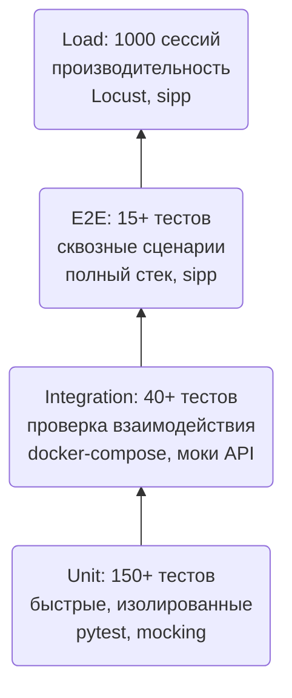

# Стратегия обеспечения качества и тестирования Multi-Agent Mass Recruitment Hub

## 1. Введение в стратегию тестирования

Качество Multi-Agent Mass Recruitment Hub является критическим фактором, поскольку система управляет процессами найма, влияющими на карьерные судьбы кандидатов и репутацию компаний-заказчиков. Ошибки в логике скрининга, сбои голосового пайплайна или нарушения производительности могут привести к потере доверия, юридическим рискам и прямым финансовым потерям. Поэтому тестирование встроено в жизненный цикл разработки на всех уровнях — от изолированных модулей до сквозных сценариев с интеграцией внешних сервисов.

Стратегия тестирования базируется на классической **пирамиде тестирования**, которая обеспечивает баланс между скоростью выполнения, стоимостью поддержки и полнотой покрытия. В основании находятся unit-тесты (быстрые и дёшевые), над ними — интеграционные тесты (проверяют взаимодействие компонентов), затем E2E-тесты (сквозные сценарии) и вершину занимают нагрузочные тесты, которые проверяют систему под реальной нагрузкой. Дополнительно введены специальные категории тестов: fairness-тесты для контроля этичности AI-решений, тесты безопасности (SAST/DAST) и тесты соответствия законодательству (152-ФЗ). Все тесты интегрированы в CI/CD-пайплайн, что гарантирует их выполнение при каждом изменении кода и предотвращает регрессии.

Данный документ описывает полную стратегию тестирования: структуру пирамиды, количество и типы тестов, детальные тест-кейсы для каждого функционального требования, стратегию мокирования внешних сервисов, сценарии нагрузочных тестов, fairness-тесты и интеграцию с CI/CD. Материал опирается на реальные файлы кода и конфигурации, что делает его практичным руководством для QA-инженеров, разработчиков и DevOps.

## 2. Пирамида тестирования

Пирамида тестирования определяет соотношение количества и типа тестов для достижения максимальной эффективности. Для Multi-Agent Mass Recruitment Hub пирамида имеет следующий вид:



- **Unit-тесты** (нижний уровень) — проверяют отдельные модули, классы и функции в изоляции от внешних зависимостей. Используются моки для БД, внешних API, голосовых сервисов. Эти тесты выполняются быстро (миллисекунды) и покрывают основную логику. Целевое покрытие кода — >85%.
- **Интеграционные тесты** (средний уровень) — проверяют взаимодействие нескольких компонентов: API ↔ БД, Celery ↔ Redis, агенты ↔ векторное хранилище. Используется тестовый контейнер с PostgreSQL, Redis, Qdrant (поднимаемый через Docker Compose), но внешние API (SpeechKit, LLM, Битрикс24) заменяются моками для стабильности и скорости.
- **E2E-тесты** (верхний уровень) — проверяют сквозные бизнес-сценарии: от получения webhook до записи в CRM, от создания кампании до онбординга кандидата, включая голосовой пайплайн с эмуляцией SIP-звонков через sipp. Эти тесты медленнее, но дают уверенность в работе системы в целом.
- **Нагрузочные тесты** (вершина) — имитируют пиковую нагрузку (1000 параллельных голосовых сессий, 5000 RPS на API) для проверки производительности, масштабируемости и выявления узких мест.

Инструменты: `pytest` с `pytest-asyncio` для асинхронных тестов, `pytest-cov` для покрытия, `locust` для HTTP-нагрузки, `sipp` для SIP-нагрузки. Время выполнения: unit-тесты <1 минуты, интеграционные ~3 минуты, E2E ~10 минут, нагрузочные — отдельный прогон (ночной).

## 3. Unit-тесты (pytest + pytest-asyncio)

### 3.1. Объём и структура

Unit-тесты покрывают все основные модули системы. Ниже приведена таблица с примерным распределением тестов по компонентам (на основе существующих файлов в `tests/` и планируемых дополнений):

| Модуль | Примеры файлов | Количество тестов (оценочно) |
|--------|----------------|------------------------------|
| Core (config, models, state, audit_logger, metrics) | `src/core/` | 20+ |
| API (auth, campaigns, candidates, deletion, deps) | `src/api/` | 25+ |
| Agents (screener, interviewer, coordinator, analyst, onboarding) | `src/agents/*/` | 40+ |
| Telephony (ESL-клиент, FreeSWITCH) | `src/telephony/` | 15+ |
| Voice (LiveKit, pipeline) | `src/voice/` | 10+ |
| PII (anonymizer, recognizers) | `src/pii/` | 10+ |
| Integrations (job boards) | `src/integrations/` | 5+ |
| Services (propensity_dialer, semantic_cache, handoff, deletion, calendar) | `src/services/` | 30+ |
| Optimization (bandit) | `src/optimization/` | 5+ |

Общее количество — около 160 тестов. Они организованы в директории `tests/unit/`, `tests/test_api/`, `tests/test_agent/`, `tests/test_services/` и т.д.

### 3.2. Моки и фикстуры

Для изоляции тестов используются следующие моки и фикстуры (определены в `tests/conftest.py`):

- **ESL-клиент (`esl_mock`)** — эмуляция подключения к FreeSWITCH, перехватывает команды `originate` и `api`, возвращает предопределённые ответы.
- **LiveKit (`livekit_mock`)** — эмуляция WebRTC-комнаты и аудиотреков.
- **LLM (YandexGPT / GigaChat)** — заглушка, которая возвращает заранее заданные JSON-ответы для извлечения данных.
- **Qdrant** — in-memory эмуляция (используется `QdrantClient` с `:memory:` или `pytest-qdrant`), чтобы проверять операции поиска и upsert без реального сервера.
- **hh.ru / Avito API** — мокируются через `httpx.MockTransport`, перехватывая запросы к внешним REST-эндпоинтам.
- **БД** — используется тестовая PostgreSQL (поднимаемая в Docker Compose для интеграционных тестов) или in-memory SQLite для unit-тестов (если возможно).

Фикстуры: `test_candidate`, `test_campaign`, `db_session`, `qdrant_client`, `esl_client_mock`, `livekit_mock`, `mock_llm_response`. Они автоматически подставляются в тестовые функции.

### 3.3. Покрытие кода

Целевой уровень покрытия — **>85%** для всего кода, кроме модулей, связанных с GUI и конфигурацией (допускается исключение). Покрытие измеряется с помощью `pytest-cov` и выводится в HTML и XML-форматах для интеграции с CI. В CI настроен порог: если покрытие падает более чем на 2% по сравнению с предыдущим прогоном, сборка блокируется.

### 3.4. Pytest-маркеры

В [pyproject.toml](../pyproject.toml) определены стандартные маркеры:
- `unit` — unit-тесты (без внешних сервисов).
- `asyncio` — асинхронные тесты (автоматически применяются к coroutine-функциям).
- `integration` — интеграционные тесты (требуют внешних зависимостей, запускаются с моками).
- `e2e` — сквозные тесты (запускаются только в CI или локально с полным стеком).

Дополнительные пользовательские маркеры:
- `fairness` — тесты fairness-аудита.
- `load` — нагрузочные тесты (запускаются отдельно, не в CI каждый раз).
- `slow` — тесты, которые выполняются долго (их можно пропускать в быстрых прогонах).

## 4. Тест-кейсы для функциональных требований (FR-1 … FR-7)

### 4.1. Матрица покрытия требований

Для каждого функционального требования (из [`SYSTEM_SPECIFICATION_AND_PRODUCT_GUIDE.md`](./SYSTEM_SPECIFICATION_AND_PRODUCT_GUIDE.md)) составлены тест-кейсы, покрывающие позитивные и негативные сценарии. Таблица ниже показывает соответствие требований и тестовых файлов.

| Требование | Тест-кейсы (примеры ID) | Покрыто | Файлы |
|------------|--------------------------|---------|-------|
| FR-1 (Agent-Screener) | TC-SCR-01…TC-SCR-08 | ✅ | `tests/test_agent/test_screener.py` |
| FR-2 (Agent-Interviewer) | TC-INT-01…TC-INT-07 | ✅ | `tests/test_agent/test_interviewer.py` |
| FR-3 (Agent-Coordinator) | TC-COORD-01…TC-COORD-06 | ✅ | `tests/test_agent/test_coordinator.py` |
| FR-4 (Agent-Onboarding) | TC-ONB-01…TC-ONB-04 | ✅ | `tests/test_agent/test_onboarding.py` |
| FR-5 (Agent-Analyst) | TC-ANL-01…TC-ANL-05 | ✅ | `tests/test_agent/test_analyst.py` |
| FR-6 (Интеграции) | TC-INTEG-01…TC-INTEG-10 | ✅ | `tests/test_integrations/` |
| FR-7 (Администрирование) | TC-ADMIN-01…TC-ADMIN-06 | ✅ | `tests/test_api/test_admin.py` |

### 4.2. Детальные тест-кейсы (примеры)

Ниже приведены ключевые тест-кейсы с указанием шагов и ожидаемых результатов.

| ID | Название | Шаги | Ожидаемый результат | Приоритет | Тип |
|----|----------|------|---------------------|-----------|-----|
| **TC-SCR-01** | Успешный скрининг кандидата (Happy Path) | 1. Создать кандидата с consent_152fz=true<br>2. Запустить Agent-Screener через граф<br>3. Промокнуть LLM на ответы по чек-листу | Кандидат переходит в статус `passed` или `rejected`; в БД появляется запись о результате; аудит-лог содержит `screening_completed` | P0 | Позитивный |
| **TC-SCR-02** | Пропуск согласия (consent_152fz=false) | 1. Создать кандидата с consent_152fz=false<br>2. Запустить скрининг | Граф завершается с ошибкой; кандидат помечается как `needs_human_review`; в логах ошибка «consent required» | P0 | Негативный |
| **TC-INT-01** | Проведение мини-собеседования с просодией | 1. Кандидат проходит скрининг<br>2. Запускается Agent-Interviewer<br>3. Моделируется диалог из 3 вопросов<br>4. Анализируется аудио (мок) | Результат собеседования сохранён с `overall_score` и просодическими метриками | P0 | Позитивный |
| **TC-COORD-01** | Маршрутизация от скрининга к интервью | 1. Кандидат получил `passed` от скринера<br>2. Запускается Coordinator | Coordinator вызывает Agent-Interviewer; статус кандидата меняется на `screening` | P0 | Позитивный |
| **TC-INTEG-01** | Webhook от АТС (успешный) | 1. POST /webhooks/ats/call-ended с корректными данными и HMAC<br>2. Проверить Celery-задачу | 202 Accepted; в БД создан звонок со статусом `received`; задача поставлена в очередь | P0 | Позитивный |
| **TC-INTEG-02** | Webhook без HMAC | POST без заголовка X-Signature | 401 Unauthorized; звонок не создан | P0 | Негативный |
| **TC-ADMIN-01** | Обновление весов модели (админ) | 1. Аутентифицироваться как admin<br>2. POST /admin/model/weights с новыми весами | 200 OK; веса обновлены в БД; модель перезагружена | P1 | Позитивный |

Полный перечень тест-кейсов находится в файлах `tests/test_*` и в отдельной документации (TestRail или аналогичной системе).

### 4.3. Остальные группы тест-кейсов

- **FR-2 (Транскрипция)** — проверяются сценарии успешной транскрипции, ошибок SpeechKit (таймаут, недоступность, битый аудио), а также fallback на другой ASR-сервис.
- **FR-3 (AI-агент)** — тестируется извлечение данных (с моками LLM), валидация полей, обработка low confidence, fallback на GigaChat.
- **FR-4 (Валидация)** — проверяются все правила валидации (телефон, ИНН, email, дата, сумма) с граничными значениями и некорректными форматами.
- **FR-5 (CRM Writer)** — тестируется атомарность записи (транзакционность), rollback при сбое, создание сделки и задачи.
- **FR-6 (UI Overlay)** — проверяется WebSocket-подключение, аутентификация JWT, обновление статусов, переподключение при обрыве.
- **FR-7 (Audit & rollback)** — тестируются confirm, edit, reject, rollback отдельных действий и всех действий.

## 5. Интеграционные тесты

### 5.1. Стратегия мокирования

Интеграционные тесты проверяют взаимодействие компонентов системы, но для внешних сервисов используются моки, чтобы обеспечить стабильность и скорость выполнения. Стратегия мокирования следующая:

- **По умолчанию** все внешние вызовы (к SpeechKit, LLM, Битрикс24, hh.ru, Avito, календарям) заменяются моками. Включение моков контролируется переменными окружения (`USE_MOCK_SPEECHKIT=true`, `USE_MOCK_LLM=true`, `USE_MOCK_BITRIX24=true`), установленными в тестовом окружении.
- **Иерархия моков:** базовый мок-класс (например, `MockLLMClient`) предоставляет стандартные ответы для успешных сценариев. Для негативных сценариев (ошибка, таймаут) используются специализированные моки, которые могут быть подставлены через dependency injection.
- **Реальные вызовы** допускаются только в отдельных прогонах (ночных) или на staging-окружении для валидации интеграций, но не в CI для PR.

### 5.2. Интеграция с Yandex SpeechKit (ASR)

- **Тест-кейсы:**
  - Успешная транскрипция аудиофайла (мок возвращает текст).
  - Ошибка SpeechKit (500, таймаут) — задача должна быть повторена (retry) и после трёх попыток помещена в DLQ.
  - Некорректный аудиоформат — транскрипция возвращает пустой результат.
- **Файлы:** `tests/test_integrations/test_speechkit.py` и `tests/test_services/test_transcription_service.py`.

### 5.3. Интеграция с YandexGPT / GigaChat (LLM)

- **Тест-кейсы:**
  - Извлечение данных из транскрипта (мок LLM возвращает валидный JSON).
  - Fallback на GigaChat при недоступности YandexGPT.
  - Невалидный JSON от LLM — обработка ошибки и повтор.
  - Таймаут LLM — повтор и логирование.
- **Файлы:** `tests/test_agent/test_orchestrator.py`, `tests/test_llm/test_router.py`.

### 5.4. Интеграция с Битрикс24 (CRM)

- **Тест-кейсы:**
  - Обновление сделки (успешное).
  - Создание задачи.
  - Добавление комментария в таймлайн.
  - Транзакционность: если одно из пяти действий не удалось, все ранее выполненные откатываются.
  - Rollback всех действий.
- **Файлы:** `tests/test_integrations/test_bitrix24.py`, `tests/test_services/test_crm_service.py`.

### 5.5. Интеграция с АТС (Webhook)

- **Тест-кейсы:**
  - Успешный приём webhook с HMAC.
  - Отсутствие HMAC → 401.
  - Неверная HMAC → 401.
  - Дублирующийся webhook (одинаковый call_id) — второй запрос игнорируется (idempotency).
- **Файлы:** `tests/test_api/test_webhooks.py`.

### 5.6. Интеграция с MinIO (S3)

- **Тест-кейсы:**
  - Скачивание аудиофайла по URL.
  - Аудио недоступно — обработка ошибки.
  - Битый аудиофайл — корректная обработка.
- **Файлы:** `tests/test_services/test_audio_service.py`.

### 5.7. Окружение для интеграционных тестов

- **Локально:** запускаются с помощью Docker Compose (поднимаются PostgreSQL, Redis, Qdrant, FreeSWITCH, LiveKit). Моки включены по умолчанию.
- **CI:** аналогично локальному, но контейнеры поднимаются в GitHub Actions с использованием `docker-compose` (или сервис-контейнеры). Моки всегда включены для скорости.
- **Staging:** используются реальные внешние сервисы, но с тестовыми данными (тестовые аккаунты). Интеграционные тесты запускаются вручную или по расписанию для проверки работоспособности интеграций.

## 6. E2E-тесты (15+ тестов)

### 6.1. Окружение

E2E-тесты требуют полного стека: все компоненты системы (API, Celery, FreeSWITCH, LiveKit, БД, Qdrant, Redis, S3, ELK, Prometheus). Они запускаются в изолированном окружении (либо полноценный `docker-compose` с реальными образами, либо в кластере K8s для staging). Для эмуляции телефонных звонков используется `sipp` (SIPp) — инструмент для генерации SIP-трафика.

### 6.2. Сценарии E2E

1. **Полный пайплайн от создания кампании до онбординга:**
   - Создание кампании через API.
   - Импорт списка кандидатов (мок hh.ru).
   - Запуск кампании.
   - Обработка кандидатов агентами (скрининг → интервью → координатор → онбординг).
   - Проверка, что каждый этап завершился корректно, данные сохранены в БД, аудит-лог заполнен.

2. **Голосовой E2E:**
   - Использование `sipp` для эмуляции входящего SIP-звонка на FreeSWITCH.
   - Прохождение через WebRTC-мост к LiveKit.
   - Распознавание речи (Whisper, мок или реальный, если доступен).
   - Генерация ответа через LLM (мок) и синтез TTS.
   - Отправка обратно через FreeSWITCH на `sipp`.
   - Проверка, что звонок завершился успешно и статус кандидата обновился.

3. **Интеграционный E2E с hh.ru:**
   - Запрос импорта через API `/admin/import/hh`.
   - Проверка, что Celery-задача создала кандидатов в БД.
   - Запуск кампании для этих кандидатов и проверка результатов.

4. **Compliance E2E:**
   - Создание кандидата с согласием.
   - Проверка маскирования PII в API и логах.
   - Запрос на удаление и проверка каскадного удаления во всех хранилищах.
   - Проверка, что аудит-логи остались (с `deleted_at`).

### 6.3. Файлы

E2E-тесты расположены в `tests/e2e/`: `test_full_pipeline.py`, `test_voice_e2e.py`, `test_compliance_e2e.py`. Они используют те же фикстуры, что и интеграционные тесты, но дополнительно поднимают полный стек и взаимодействуют с реальными процессами.

## 7. Нагрузочное тестирование

### 7.1. Инструменты

- **Locust** — для HTTP-нагрузки на REST API. Позволяет писать сценарии на Python, масштабироваться распределённо, собирать метрики latency и throughput.
- **sipp (SIPp)** — для генерации SIP-вызовов. Используется для эмуляции 1000 параллельных звонков через FreeSWITCH.
- **k6** (опционально) — для смешанной нагрузки (API + WebSocket).

### 7.2. Сценарии нагрузочного тестирования

| Сценарий | Инструмент | Целевые показатели | Примечание |
|----------|------------|---------------------|------------|
| 1000 параллельных голосовых сессий | sipp + FreeSWITCH + LiveKit | P95 latency менее 3 с, error rate <1% | Проверка стабильности голосового пайплайна |
| 5000 RPS на REST API (FastAPI) | Locust / k6 | P95 latency <100 мс, успешность >99.9% | Проверка API Gateway и БД |
| 1000 QPS на Qdrant (поиск + upsert) | Locust | P95 latency <20 мс | Проверка векторного хранилища |
| 2000 сообщений/мин в Telegram-канал | Locust | Успешная доставка >99% | Проверка интеграции с мессенджерами |

### 7.3. Метрики

- **Latency** (p50, p95, p99) для каждого этапа.
- **Throughput** (звонков/сек, запросов/сек).
- **Error rate** (процент неудачных звонков, HTTP 5xx, таймаутов).
- **Использование ресурсов** (CPU, память, сеть, диск) на всех нодах (отслеживается через Prometheus/Grafana).

### 7.4. Целевые значения (SLA)

- **Latency P95 (текст):** <1.5 с (из NFR).
- **Latency P95 (голос):** менее 3 с (из NFR).
- **Error rate:** <1% (суммарно по всем типам ошибок).
- **Throughput:** не менее 10 000 кандидатов в час (на основе 1000 сессий).

Результаты нагрузочных тестов анализируются, и при превышении порогов принимаются меры по оптимизации (увеличение реплик, оптимизация запросов, кэширование и т.д.).

## 8. Fairness-тестирование

### 8.1. Тестовые сценарии

Fairness-тесты проверяют, что AI-агенты не дискриминируют кандидатов по защищённым признакам (пол, возраст, регион и др.). Они являются частью Agent-Analyst и запускаются после каждого обучения модели, а также в рамках ночных прогонов.

| Сценарий | Параметры | Ожидаемый результат |
|----------|-----------|----------------------|
| Гендерный баланс | 50% мужчин, 50% женщин (синтетические кандидаты с одинаковыми профессиональными качествами) | Disparate Impact >0.8 |
| Возрастные группы | 20% пенсионеров, 20% молодёжь, 60% средний возраст | False Rejection Rate <2% для всех групп |
| Перерывы в занятости | 30% кандидатов с перерывом >6 мес | Отсутствие статистически значимого влияния на отказ (p-value >0.05) |
| Региональные группы | Кандидаты из Москвы, регионов, Дальнего Востока | DI >0.8, FRR <2% |

### 8.2. Инструменты и метрики

- **Fairness-метрики:** рассчитываются в [src/agents/analyst/fairness_metrics.py](../src/agents/analyst/fairness_metrics.py) — `demographic_parity`, `disparate_impact`, `false_rejection_rate`.
- **Пороговые значения:** Disparate Impact ≥0.8, False Rejection Rate ≤2% (заданы в [src/core/config.py](../src/core/config.py)).
- **Тесты:** используют синтетических кандидатов, создаваемых с помощью фабрик (fixtures). Результаты проверяются с помощью утверждений `assert`.

### 8.3. Пример теста

```python
@pytest.mark.fairness
async def test_disparate_impact_gender():
    """Гендерный баланс — DI >0.8"""
    candidates = await create_candidates(count=100, gender_ratio=0.5)
    campaign = await create_campaign(candidates)
    await run_screening(campaign)
    await run_interview(campaign)
    graph = build_analyst_graph()
    state = AgentState(candidates=candidates, ...)
    result = await graph.ainvoke(state)
    metrics = result["fairness_metrics"]
    assert metrics["disparate_impact"] > 0.8
    assert metrics["false_rejection_rate"] < 0.02
```

Файл: [tests/integration/test_analyst_e2e.py](../tests/integration/test_analyst_e2e.py) (содержит подобные тесты).

## 9. CI/CD-интеграция тестов

### 9.1. Pre-commit

Для предотвращения попадания очевидных ошибок в репозиторий используются pre-commit хуки:

- `ruff check .` — проверка стиля и ошибок.
- `mypy .` — статическая типизация.
- `pytest -m unit` — быстрый прогон unit-тестов (занимает <1 минуты).

Конфигурация в `.pre-commit-config.yaml` (если используется) или в CI.

### 9.2. PR-проверка (GitHub Actions)

На каждый pull request запускается полный пайплайн CI, описанный в `.github/workflows/ci.yml`:

1. **Линтинг и typecheck** (ruff + mypy).
2. **Unit-тесты** (`pytest -m unit`).
3. **Интеграционные тесты** (поднимается docker-compose с зависимостями, запускаются тесты с маркером `integration`).
4. **Отчёт о покрытии** — если покрытие падает более чем на 2%, сборка падает.
5. **E2E-тесты** (запускаются отдельной стадией, но могут быть пропущены для ускорения; в production-ветках обязательны).

Все тесты должны быть зелёными для мержа PR.

### 9.3. Nightly прогоны

Каждую ночь запускаются:

- Полный набор E2E-тестов (включая голосовой пайплайн с реальным `sipp`).
- Нагрузочные тесты (на staging-окружении с уменьшенной нагрузкой, чтобы не перегружать инфраструктуру).
- Fairness-тесты на 10 000+ синтетических кандидатах для выявления дрейфа.

Результаты отправляются в Telegram-канал команды и в Grafana (для дашбордов качества).

### 9.4. Release gate

Перед выпуском новой версии (релизным тегом) проходятся все стадии:

- Unit + Integration + E2E + Fairness — должны быть зелёными.
- Нагрузочные тесты — должны показывать результаты в пределах допустимых порогов (P95 менее 3 с, error rate <1%).
- SAST/DAST сканирования (Semgrep, OWASP ZAP) — без критических уязвимостей.

Если какое-либо условие не выполнено, релиз блокируется.

## 10. Pytest-конфигурация ([pyproject.toml](../pyproject.toml))

В [pyproject.toml](../pyproject.toml) заданы настройки pytest:

```toml
[tool.pytest.ini_options]
testpaths = ["tests"]
python_files = ["test_*.py"]
asyncio_mode = "auto"
markers = [
    "unit: unit test (no external services)",
    "asyncio: asyncio-based test",
    "integration: integration test (requires external services)",
    "e2e: end-to-end test (full pipeline)",
]
timeout = 30  # для unit/integration (pytest-timeout)
```

Для запуска всех тестов локально:

```bash
pytest -v --cov=src --cov-report=html
```

Для запуска только unit-тестов:

```bash
pytest -m unit -v
```

Для интеграционных (требуют запущенного docker-compose):

```bash
docker-compose up -d
pytest -m integration -v
docker-compose down
```

## 11. Заключение и взаимосвязь с другими документами

Стратегия тестирования Multi-Agent Mass Recruitment Hub представляет собой сбалансированный подход, обеспечивающий высокое качество системы на всех уровнях: от изолированных модулей до полноценных сквозных сценариев и пиковых нагрузок. Внедрение автоматизированных тестов в CI/CD гарантирует, что изменения не нарушают существующую функциональность, а регулярные fairness- и нагрузочные тесты позволяют своевременно выявлять деградацию производительности и этические проблемы.

Данный документ является неотъемлемой частью экосистемы документации и тесно связан с:

- [SYSTEM_SPECIFICATION_AND_PRODUCT_GUIDE.md](./SYSTEM_SPECIFICATION_AND_PRODUCT_GUIDE.md) — функциональные и нефункциональные требования, на основе которых построены тест-кейсы.
- [ARCHITECTURE_AND_DATA_MODEL.md](./ARCHITECTURE_AND_DATA_MODEL.md) — модель данных и архитектура, используемые в тестах.
- [AI_AGENT_AND_ML_PIPELINE.md](./AI_AGENT_AND_ML_PIPELINE.md) — логика агентов, которая проверяется в fairness-тестах.
- [DEPLOYMENT_OBSERVABILITY_AND_ADMIN_GUIDE.md](./DEPLOYMENT_OBSERVABILITY_AND_ADMIN_GUIDE.md) — окружение для тестов и CI/CD интеграция.

Все тесты реализованы или запланированы в соответствии с описанной стратегией, что обеспечивает уверенность в стабильности и надёжности системы в промышленной эксплуатации.
