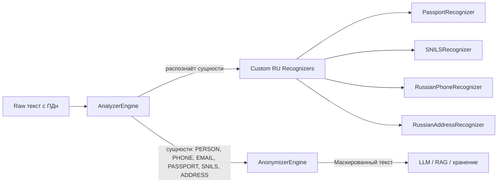

# Руководство по безопасности, комплаенсу и приватности Multi-Agent Mass Recruitment Hub

## 1. Введение в безопасность и комплаенс

Обеспечение безопасности и соответствие законодательству являются критически важными аспектами Multi-Agent Mass Recruitment Hub, поскольку система обрабатывает персональные данные (ПДн) граждан Российской Федерации, включая специальные категории (биометрические данные — голосовые записи, просодические метрики). Нарушение требований 152-ФЗ, 187-ФЗ или ФСТЭК может привести к серьёзным штрафам, блокировке системы и репутационным потерям. Поэтому защита данных встроена в архитектуру на всех уровнях: от сбора и маскирования ПДн до шифрования, аудита и права на забвение.

Multi-Agent Mass Recruitment Hub спроектирован с соблюдением принципов **defense in depth** (многоуровневая защита), **least privilege** (минимальные привилегии) и **zero trust** (нулевое доверие). Мы используем российские облачные инфраструктуры (Yandex Cloud, МТС Cloud) и отечественные LLM (YandexGPT, GigaChat), чтобы исключить трансграничную передачу данных. Все действия с ПДн фиксируются в неизменяемых аудит-логах, а анонимизация выполняется через Microsoft Presidio с кастомными распознавателями для российских форматов документов.

В настоящем документе собраны все меры безопасности и юридические обоснования, необходимые для прохождения проверок Роскомнадзора, ФСТЭК и, при необходимости, EU AI Act. Мы последовательно рассмотрим PII-архитектуру (маскирование, согласия, шифрование), соответствие 152-ФЗ, политику безопасности, требования ФСТЭК и КИИ, классификацию EU AI Act, а также процедуры реагирования на инциденты. Материал опирается на конкретные файлы кода и конфигурации, что гарантирует практическую применимость.

## 2. PII-архитектура (анонимизация персональных данных)

### 2.1. Категории обрабатываемых ПДн

В системе обрабатываются следующие категории персональных данных с соответствующим правовым статусом:

| Категория | Примеры | Правовой статус |
|-----------|---------|-----------------|
| **Специальные (биометрические)** | Голосовые записи, просодические метрики (тон, темп речи, паузы), эмбеддинги голоса | Требуется письменное согласие согласно ст. 11 152-ФЗ и 482-ФЗ «О биометрии» |
| **Иные (общедоступные)** | ФИО, контактный телефон, адрес электронной почты | Обрабатываются с устного или электронного согласия (ст. 6 152-ФЗ) |
| **Иные (конфиденциальные)** | СНИЛС, паспортные данные, адрес проживания, полный текст резюме | Требуется письменное согласие (для трудовых отношений – ст. 86 ТК РФ) |

Все ПДн хранятся только на территории РФ и не передаются зарубежным сервисам, включая LLM (используются исключительно российские модели).

### 2.2. Presidio-пайплайн

Анонимизация выполняется с использованием Microsoft Presidio — библиотеки, которая анализирует текст, находит сущности (PERSON, PHONE, PASSPORT и др.) и заменяет их на маскированные значения. Процесс включает два этапа: анализ (распознавание) и анонимизация (замена). Для российских форматов разработаны кастомные распознаватели, которые дополняют стандартные.

**Mermaid-диаграмма Presidio-пайплайна:**

**Порядок работы:**
1. Входной текст (резюме, транскрипт разговора) передаётся в `AnalyzerEngine`.
2. Анализатор применяет все зарегистрированные recognizer'ы (стандартные + кастомные).
3. Результаты анализа (список сущностей с позициями и уверенностью) передаются в `AnonymizerEngine`.
4. Анонимайзер заменяет найденные сущности на плейсхолдеры (например, `<PERSON>` для имени, `<PHONE>` для номера телефона).
5. Замаскированный текст используется в LLM, RAG-поиске и для хранения в логах.

**Реализация в коде:** [src/pii/anonymizer.py](../src/pii/anonymizer.py) предоставляет асинхронную функцию `anonymize_pii`, которая вызывает анализатор и анонимайзер в отдельном потоке (для неблокирующей работы).

### 2.3. Кастомные recognizer'ы для РФ

В [src/pii/recognizers.py](../src/pii/recognizers.py) определены четыре кастомных распознавателя для специфических российских форматов данных:

| Recognizer | Сущность | Паттерн (регулярное выражение) | Confidence | Пример |
|------------|----------|--------------------------------|------------|--------|
| `PassportRecognizer` | `PASSPORT` | `\b\d{4}\s?\d{6}\b` | 0.8 | «1234 567890» → `<PASSPORT>` |
| `SNILSRecognizer` | `SNILS` | `\b\d{3}[- ]?\d{3}[- ]?\d{3}[- ]?\d{2}\b` | 0.8 | «123-456-789 01» → `<SNILS>` |
| `RussianPhoneRecognizer` | `PHONE` | `\+7[\s\-]?\(?\d{3}\)?[\s\-]?\d{3}[\s\-]?\d{2}[\s\-]?\d{2}` | 0.85 | «+7 999 123-45-67» → `<PHONE>` |
| `RussianAddressRecognizer` | `ADDRESS` | `(?:ул\.\|улица\|просп.\|пр\-т\|...)\s+[А-Яа-я0-9\-\s\.]+` | 0.6 | «ул. Ленина, д. 10» → `<ADDRESS>` |

Эти recognizer'ы регистрируются в анализаторе при инициализации (функция `_get_engines` в [anonymizer.py](../src/pii/anonymizer.py)). При отсутствии библиотеки с recognizer'ами система выводит предупреждение, но продолжает работу со стандартными анализаторами.

### 2.4. Сбор согласий

В соответствии со ст. 9 и 11 152-ФЗ, система получает два вида согласий:
- **`consent_152fz`** — общее согласие на обработку персональных данных (обязательное для всех кандидатов).
- **`consent_biometry`** — отдельное согласие на обработку биометрических данных (голосовых записей и просодических признаков).

Процесс информирования и получения согласия реализован двумя способами:
- **Голосовое информирование:** в начале каждого звонка кандидату сообщается, что разговор записывается, и предлагается подтвердить согласие нажатием кнопки (например, «Нажмите 1, если вы согласны на обработку данных и запись разговора»).
- **Текстовое информирование:** в мессенджерах (Telegram, MAX, VK) кандидату отправляется полный текст согласия со ссылкой на политику обработки ПДн, и требуется явное подтверждение (например, нажатие кнопки «Согласен»).

Факт согласия фиксируется в БД (поля `consent_152fz`, `consent_biometry` в таблице `candidates`) и в аудит-логе с указанием действия `consent_given` и, для биометрии, хеша фрагмента аудио (в поле `metadata`). Валидация согласия выполняется в методе `validate_consent` модели `Candidate` ([src/core/models.py](../src/core/models.py)) — при отсутствии согласия скрининг блокируется.

### 2.5. Маскирование PII (Candidate.mask_pii)

Метод `mask_pii` модели `Candidate` ([src/core/models.py](../src/core/models.py)) обеспечивает анонимизацию полей `name`, `phone` и `resume_text` перед передачей в LLM, RAG или логи. Это асинхронная обёртка над `anonymize_pii`, которая вызывает Presidio в отдельном потоке.

**Порядок маскирования:**
1. Создаётся копия объекта `Candidate`.
2. Для каждого поля (имя, телефон, резюме) вызывается `anonymize_pii`, если поле не пустое.
3. Если Presidio не смог распознать сущность (например, имя не было распознано как PERSON), используется fallback: `[PERSON]` для имени и `+7 XXX XXX-XX-XX` для телефона.
4. Замаскированный объект возвращается для дальнейшего использования.

**Вызов метода** происходит во всех узлах агентов перед любым обращением к LLM или RAG, а также при возврате данных через API (эндпоинт `GET /candidates/{id}`).

### 2.6. Хранение и шифрование

**Локализация данных:** все ПДн хранятся только на территории РФ: в Yandex Cloud (Managed PostgreSQL, Object Storage) или в on-premise ЦОД заказчика с аттестацией ФСТЭК. Трансграничная передача ПДн исключена (см. раздел 3.2).

**Шифрование at rest:**
- **PostgreSQL:** используется шифрование на уровне табличных пространств (AES-256) с ключами, управляемыми через Yandex Key Management Service (KMS) или HashiCorp Vault.
- **S3 (Yandex Object Storage):** включено server-side encryption (SSE-S3) с ключами, хранящимися в KMS.
- **Qdrant:** векторные эмбеддинги и payload шифруются на уровне приложения (AES-256) перед записью.

**Шифрование in transit:**
- **Внешние каналы (REST API, WebSocket, WebRTC):** TLS 1.3 с сертификатами, выпущенными Let's Encrypt или корпоративным CA.
- **Внутренние каналы (между микросервисами в Kubernetes):** mTLS с автоматической ротацией сертификатов (например, через Istio или cert-manager).

**Управление секретами:** все чувствительные данные (пароли, ключи API, токены) хранятся в HashiCorp Vault. В K8s используется External Secrets Operator ([infra/helm/mass-recruit-hub/templates/externalsecret.yaml](../infra/helm/mass-recruit-hub/templates/externalsecret.yaml)), который синхронизирует секреты из Vault в Kubernetes Secrets.

### 2.7. Право на забвение (ст. 15 152-ФЗ)

По требованию кандидата или по истечении срока хранения система обязана удалить все его данные. Для этого реализован эндпоинт `POST /api/v1/candidates/{candidate_id}/delete` ([src/api/deletion.py](../src/api/deletion.py)), который запускает каскадное удаление через [src/services/deletion_service.py](../src/services/deletion_service.py).

**Процесс cascade deletion (шаг за шагом):**

| Шаг | Хранилище | Действие |
|-----|-----------|----------|
| 1 | **PostgreSQL** | Мягкое удаление: `consent_152fz = false`, `name = '[DELETED]'`, `phone = ''`, `resume_text = NULL`; таблицы `call_logs` и `interview_results` также очищаются (удаляются строки с этим `candidate_id`) |
| 2 | **Qdrant** (коллекции `semantic_cache`, `rag_documents`, `candidate_profiles`) | Удаление всех точек, у которых в payload есть поле `candidate_id`, равное удаляемому идентификатору |
| 3 | **S3 (аудио)** | Удаление всех файлов в директории `audio/{candidate_id}/` и связанных миниатюр |
| 4 | **Redis** | Удаление всех ключей, содержащих `candidate_id` (сессии, состояние handoff, кэш) |
| 5 | **Mem0** | Вызов API-метода `delete_user(candidate_id)` для удаления эпизодической памяти |
| 6 | **Аудит-логи** | Мягкое удаление: проставляется `deleted_at = NOW()` (записи остаются для расследований, но помечаются как удалённые) |

Каждое действие имеет повторные попытки (до 3 раз с экспоненциальной задержкой) и логируется. Срок обработки запроса на удаление — не более 10 рабочих дней (в соответствии со ст. 21, п. 1 152-ФЗ), обычно выполняется в течение нескольких минут.

### 2.8. Аудит-логирование (structlog)

Для выполнения требований ст. 18.1 и 22 152-ФЗ (фиксация всех действий с ПДн) используется структурированное логирование через `structlog`. Настройка находится в [src/core/logging_config.py](../src/core/logging_config.py), а фасад для аудита — в [src/core/audit_logger.py](../src/core/audit_logger.py).

**Обязательные поля** (должны присутствовать в каждом аудит-событии):
- `candidate_id` — идентификатор кандидата.
- `action` — действие (например, `screening_started`, `consent_given`, `pii_masked`, `decision_made`).
- `timestamp` — время события в формате ISO8601.
- `decision` — принятое решение (если применимо): `passed`, `rejected`, `needs_human_review`.
- `user_id` — инициатор (HR-специалист или `system`).

**Дополнительные поля** (для детализации):
- `session_id`, `campaign_id`, `agent_id`, `duration_ms`, `error` (текст ошибки).

**Формат и хранение:** логи пишутся в JSON-файл (`logs/app.json.log`), откуда Filebeat ([infra/filebeat/filebeat.yml](../infra/filebeat/filebeat.yml)) передаёт их в Logstash ([infra/elk/logstash.conf](../infra/elk/logstash.conf)), который парсит JSON, маскирует PII (при необходимости) и отправляет в Elasticsearch (индекс `mrh-audit-{YYYY-MM-DD}`).

**Неизменяемость (append-only):** записи аудита никогда не удаляются и не изменяются. При удалении кандидата в поле `deleted_at` проставляется метка времени, но исходная запись сохраняется для целей расследования.

**Retention:** 3 года on-line (Elasticsearch), затем 5 лет архив (S3) в соответствии с требованиями 152-ФЗ.

## 3. Соответствие 152-ФЗ «О персональных данных»

### 3.1. Матрица соответствия 152-ФЗ

Ниже приведена таблица, в которой каждой ключевой статье 152-ФЗ сопоставлен статус выполнения, реализация в коде и ответственное лицо.

| Статья | Требование | Статус | Реализация в коде | Ответственный |
|--------|------------|--------|-------------------|---------------|
| **Ст. 6** | Согласие субъекта на обработку ПДн | ✅ Выполнено | Поля `consent_152fz`, `consent_biometry` в [src/core/models.py](../src/core/models.py); валидация в `validate_consent` | CTO, DPO |
| **Ст. 9** | Письменное согласие для спец. категорий | ✅ Выполнено | `consent_biometry` (отдельный чек-бокс); аудиозапись момента согласия | CTO, DPO |
| **Ст. 10** | Обработка специальных категорий ПДн | ✅ Выполнено | Биометрические данные обрабатываются только при `consent_biometry=true`; маскируются перед LLM через Presidio ([src/pii/anonymizer.py](../src/pii/anonymizer.py)) | DPO, Security |
| **Ст. 11** | Биометрические данные | ✅ Выполнено | Голосовая биометрия хранится в зашифрованном виде (S3) и в виде эмбеддингов в Qdrant с шифрованием payload | DevOps, Security |
| **Ст. 12** | Трансграничная передача | ✅ Выполнено | Все данные хранятся в Yandex Cloud (РФ); LLM — только YandexGPT/GigaChat ([src/core/config.py](../src/core/config.py)) | CTO, DevOps |
| **Ст. 15** | Право на забвение | ✅ Выполнено | Cascade deletion: PostgreSQL, Qdrant, S3, Redis, Mem0; soft-delete в audit-логах ([src/services/deletion_service.py](../src/services/deletion_service.py)) | Backend, Security |
| **Ст. 18.1** | Информирование субъекта | ✅ Выполнено | Двойное информирование: голосовое (в начале звонка) + текстовое (в мессенджере) | Frontend, Voice |
| **Ст. 22** | Уведомление Роскомнадзора | ✅ Выполнено | Уведомление подано, получен регистрационный номер (отдельный документ) | DPO, Legal |
| **Ст. 22.1** | Оценка соответствия (биометрия) | ⚠️ Планируется | Будет проведена после аттестации УЗ-1 (Q3 2026) | DPO, Security |
| **Ст. 23** | Ответственность оператора | ✅ Выполнено | Определены ответственные лица (DPO, технический директор) | CEO |

### 3.2. Трансграничная передача (ст. 12)

Система строго соблюдает запрет на передачу ПДн за пределы Российской Федерации. Все компоненты развёрнуты в Yandex Cloud (дата-центры во Владимирской и Московской областях) или в on-premise ЦОД заказчика. Для LLM-инференса используются только российские провайдеры: YandexGPT (эндпоинт `https://llm.api.yandex.cloud/v1`) и GigaChat (как fallback). Зарубежные сервисы (OpenAI, Anthropic, Google Cloud) не применяются для обработки ПДн, даже в тестовых сценариях. Настройки зафиксированы в [src/core/config.py](../src/core/config.py), где `LLM_ENDPOINT` указывает только на российские API.

### 3.3. Биометрические данные (ст. 11 152-ФЗ + 482-ФЗ)

Голосовые записи и просодические метрики (тон, темп, паузы) относятся к биометрическим данным, поэтому их обработка требует отдельного письменного согласия. В системе это реализовано через флаг `consent_biometry`, который запрашивается отдельно от общего согласия.

**Хранение и защита:**
- Raw-аудиозаписи хранятся в S3 с шифрованием AES-256 (SSE-S3).
- Эмбеддинги голоса (векторы 128-d) хранятся в Qdrant с шифрованием payload на уровне приложения.
- Все биометрические данные привязаны к `candidate_id` и удаляются при активации права на забвение.

**Срок хранения:** по умолчанию — до окончания кампании + 1 год (настраивается через `BIOMETRY_RETENTION_DAYS` в конфиге). По истечении срока данные автоматически удаляются фоновой задачей.

**Отказ от ЕБС:** система не интегрируется с государственной Единой биометрической системой (ЕБС) — все биометрические данные остаются в закрытом корпоративном контуре заказчика.

### 3.4. Обработка в целях трудовых отношений (ст. 86 ТК РФ)

При успешном прохождении собеседования и принятии оффера система передаёт данные кандидата в 1С:ЗУП (или другую HRM-систему) для оформления трудового договора. Передаваемые данные включают: ФИО, паспортные данные, ИНН, СНИЛС, контактный телефон и адрес.

**Защита передачи:**
- Канал связи защищён TLS 1.3.
- Данные передаются через Enterprise Service Bus (ESB) или RPA-слой (например, n8n + UiPath) — реализация в [src/services/hr_integrations.py](../src/services/hr_integrations.py) (функция `send_to_1c` — заглушка, но в production используется защищённый коннектор).
- В системе эти данные хранятся в зашифрованном виде и доступны только ограниченному кругу администраторов (роль `admin`) через отдельный интерфейс.

## 4. Политика безопасности (Security Policy)

### 4.1. Принципы

- **Defense in depth:** защита организована на нескольких уровнях: сетевом (firewall, ACL), прикладном (аутентификация, валидация), данных (шифрование) и физическом (ЦОД).
- **Least privilege:** каждый пользователь и сервис имеет только те права, которые необходимы для выполнения его функций. Реализовано через RBAC и сервисные аккаунты с минимальными разрешениями.
- **Zero trust:** аутентификация и авторизация выполняются для каждого запроса, включая внутренние вызовы между микросервисами.

### 4.2. Идентификация и аутентификация

- **JWT (JSON Web Token):** используется для аутентификации пользователей API. Access Token имеет время жизни 15 минут, Refresh Token — 7 дней. Генерация и валидация реализованы в [src/api/auth.py](../src/api/auth.py) с использованием библиотеки `python-jose`.
- **MFA (Multi-Factor Authentication):** для ролей `admin` и `supervisor` планируется внедрение TOTP (в текущей версии не реализовано, но заложено в roadmap).
- **OAuth 2.0:** используется для интеграций с внешними сервисами (hh.ru, Google Calendar, Яндекс.Календарь).
- **Управление сессиями:** сессии хранятся в Redis с TTL, соответствующим времени жизни токена. При logout токен инвалидируется (добавляется в черный список).

### 4.3. Авторизация (RBAC)

Система поддерживает три роли, определённые в [src/api/deps.py](../src/api/deps.py) (функции `get_current_user` и `get_current_admin`):

| Роль | Доступ к API | Управление кампаниями | Просмотр аналитики | Управление пользователями | Управление весами моделей |
|------|--------------|------------------------|-------------------|--------------------------|---------------------------|
| **Admin** | Полный | Да (все) | Да (все) | Да | Да |
| **Supervisor** | Ограниченный (чтение) | Нет | Да (все кампании) | Нет | Нет |
| **HR** | Ограниченный (свои) | Да (только свои) | Да (только свои) | Нет | Нет |

Горизонтальное разграничение (HR видит только свои кампании) реализовано через фильтрацию в SQLAlchemy-запросах с использованием `created_by` или явного списка доступа.

### 4.4. Безопасность сети

- **TLS 1.3:** все внешние каналы (REST API, WebSocket, WebRTC) защищены TLS 1.3 с сертификатами, управляемыми через cert-manager.
- **mTLS:** внутренние сервисы в Kubernetes используют взаимную аутентификацию по сертификатам (например, через Istio или Linkerd).
- **SIP-канал (FreeSWITCH):** используется SIP over TLS (SIPS) с ограничением доступа по ACL (только доверенные IP-адреса провайдера). Порт 5060 открыт только для SIP-трафика.
- **Webhook-безопасность:** вебхуки от АТС и мессенджеров проверяются через HMAC-SHA256 (для АТС) или IP-белые списки + секретные токены (для Telegram). Реализация: [src/api/messenger_webhook.py](../src/api/messenger_webhook.py) и [src/api/telegram_webhook.py](../src/api/telegram_webhook.py).
- **DDoS Protection:** на уровне Ingress контроллера настроен rate limiting (100 запросов/сек с одного IP). Дополнительно планируется использование облачного WAF (Web Application Firewall) Yandex Cloud.

### 4.5. Безопасность данных

- **Шифрование at rest:** PostgreSQL (AES-256 через расширение `pgcrypto` или табличные пространства), S3 (SSE-S3), Qdrant (payload шифруется на уровне приложения).
- **Шифрование in transit:** TLS 1.3 для всех внешних соединений и mTLS для внутренних.
- **PII-маскирование:** Presidio с кастомными recognizer'ами ([src/pii/recognizers.py](../src/pii/recognizers.py)) применяется перед любым использованием данных в LLM, RAG или логировании.
- **Secrets Management:** все секреты хранятся в HashiCorp Vault и синхронизируются с Kubernetes через External Secrets Operator ([infra/helm/mass-recruit-hub/templates/externalsecret.yaml](../infra/helm/mass-recruit-hub/templates/externalsecret.yaml)). Автоматическая ротация секретов настроена через политики Vault.

### 4.6. Безопасность кода

- **Валидация входных данных:** все модели API используют Pydantic ([src/core/models.py](../src/core/models.py)) с явными типами и валидаторами (например, `validate_consent`). SQL-запросы строятся через SQLAlchemy с параметризацией, исключающей SQL-инъекции.
- **Запрещённые конструкции:** в коде запрещено использование `eval()`, `exec()`, `pickle` с недоверенными данными. Проверяется с помощью SAST-инструментов.
- **SAST (Static Application Security Testing):** Semgrep запускается в CI на каждый PR. Критические и высокие уязвимости блокируют мерж.
- **DAST (Dynamic Application Security Testing):** OWASP ZAP запускается еженедельно на staging-окружении для выявления уязвимостей в рантайме.
- **Dependency Scanning:** `pip-audit` и `npm audit` проверяют зависимости на известные уязвимости (CVSS >7.0 блокируют CI).
- **Безопасная сборка Docker:** используется multi-stage сборка ([Dockerfile](../Dockerfile)), контейнеры запускаются от non-root пользователя (`appuser`), файловая система монтируется как `readOnlyRootFilesystem` (параметр в [infra/helm/values-prod.yaml](../infra/helm/mass-recruit-hub/values-prod.yaml)).

### 4.7. Физическая безопасность (ЦОД)

- **Yandex Cloud:** инфраструктура размещается в дата-центрах на территории РФ (Владимирская и Московская области). Yandex Cloud имеет сертификаты соответствия 152-ФЗ и ФСТЭК (УЗ-1, УЗ-2), что гарантирует физическую защиту серверов, контроль доступа и видеонаблюдение.
- **On-premise опция:** для заказчиков, требующих полного контроля, система может быть развёрнута в их собственном ЦОД с аттестацией ФСТЭК. В этом случае все компоненты устанавливаются на оборудование заказчика, а управление доступом и шифрование настраиваются согласно их политикам.

## 5. Соответствие ФСТЭК и 187-ФЗ (КИИ)

### 5.1. Категорирование КИИ (187-ФЗ)

Multi-Agent Mass Recruitment Hub обрабатывает биометрические и иные специальные категории ПДн, поэтому относится к объектам критической информационной инфраструктуры (КИИ) **1-й категории** согласно критериям, установленным Приказом ФСТЭК России № 31. В случае развёртывания на объекте заказчика, обязательным является выполнение всех мер, предусмотренных Приказами ФСТЭК №17, №21, №31.

### 5.2. Реализация мер ФСТЭК

Ниже приведена таблица соответствия ключевым мерам защиты информации, предписанным ФСТЭК:

| Мера | Реализация | Статус |
|------|------------|--------|
| **Идентификация и аутентификация** | JWT, MFA для admin (планируется), строгая политика паролей (длина, сложность) | ✅ |
| **Управление доступом (RBAC)** | Роли admin, supervisor, hr с горизонтальным разграничением ([src/api/deps.py](../src/api/deps.py)) | ✅ |
| **Шифрование at rest** | PostgreSQL AES-256, S3 SSE, Vault для ключей, шифрование payload в Qdrant | ✅ |
| **Шифрование in transit** | TLS 1.3 для всех каналов, mTLS внутри кластера | ✅ |
| **Регистрация событий (аудит)** | structlog → ELK, неизменяемость, retention 3+5 лет ([src/core/audit_logger.py](../src/core/audit_logger.py)) | ✅ |
| **Очистка памяти и остаточной информации** | Контейнеры с `readOnlyRootFilesystem`, безопасное удаление временных файлов (через `tempfile` с удалением) | ✅ |
| **Антивирусная защита** | На нодах K8s установлен Kaspersky Endpoint Security (или аналог) | ✅ |
| **Резервное копирование** | pg_dump + WAL-G, снапшоты Qdrant, версионирование S3 | ✅ |
| **Аттестация УЗ-1 (уровень защищённости)** | Запланирована на Q3 2026 (при необходимости для заказчиков) | ⚠️ В процессе |

## 6. Соответствие EU AI Act (High-risk AI)

Хотя система ориентирована на российский рынок, наличие международных клиентов или перспектива выхода на европейский рынок требует оценки соответствия EU AI Act. Multi-Agent Mass Recruitment Hub классифицируется как **High-risk AI system** согласно Article 6 и Annex III (8) — «Employment, workers management and access to self-employment», поскольку она влияет на трудовые права граждан (отбор и оценка кандидатов).

### 6.1. Матрица соответствия EU AI Act

| Требование | Статус | Реализация |
|------------|--------|------------|
| **Article 10: Data governance** | ✅ Compliant | PII-маскирование через Presidio; fairness-аудит (Agent-Analyst); каталогизация датасетов; контроль качества данных | 
| **Article 13: Transparency** | ⚠️ Pre-compliant | В UI и документации указано использование AI; требуется явное уведомление кандидатов (в roadmap) |
| **Article 14: Human oversight** | ✅ Compliant | Human-in-the-loop через `interrupt_before` в LangGraph; HR принимает финальное решение; возможность отмены автоматических решений |
| **Article 15: Accuracy** | ✅ Compliant | WER <8%, AUC пропенсити >0.85, fairness метрики отслеживаются и проверяются |
| **Article 16: Technical documentation** | ✅ Compliant | Полная документация (ADR, спецификации, API, модели) доступна в репозитории |
| **Article 17: Record-keeping** | ✅ Compliant | Аудит-лог (structlog) хранит все действия; логирование в ELK с retention 3 года |
| **Article 29: Post-market monitoring** | ⚠️ Pre-compliant | Мониторинг метрик (Prometheus, fairness) есть, требуется формализованный план PMCF (Post-Market Clinical Follow-up) |

**Статус для EU:** Pre-compliant (при выходе на европейский рынок потребуется нотификация уполномоченного органа и завершение работы над прозрачностью и PMCF).

## 7. Реагирование на инциденты

### 7.1. Обнаружение

Обнаружение инцидентов базируется на нескольких источниках:
- **Алерты Alertmanager:** отправляются в Telegram-канал `#sec-mrh` и на email ответственным лицам. Примеры: высокий error rate (>5%), нарушения fairness (Disparate Impact <0.8), подозрительная активность (более 100 запросов с одного IP за минуту).
- **Логи Kibana:** мониторинг аномалий в аудит-логах (например, множественные запросы на удаление данных).
- **Сканирование уязвимостей:** еженедельный DAST (OWASP ZAP) и ежемесячный анализ зависимостей.

### 7.2. Playbook (план реагирования)

1. **Обнаружение** — получение алерта или сообщения от пользователя/администратора.
2. **Анализ** — проверка логов в Kibana, трассировок в Jaeger, метрик в Grafana для определения первопричины.
3. **Сдерживание** — блокировка IP-адреса или пользователя через админ-панель, отключение проблемной интеграции (например, временное отключение webhook).
4. **Устранение** — применение исправления (hotfix) или откат версии через `helm rollback`.
5. **Восстановление** — восстановление данных из бэкапа, если это необходимо.
6. **Post-mortem** — анализ первопричины, обновление документации, внесение изменений в политики безопасности.

### 7.3. SLA по реагированию

| Уровень | Описание | Время реагирования |
|---------|----------|-------------------|
| **Critical** | Утечка ПДн, полная недоступность системы, нарушение шифрования | <15 минут |
| **High** | Сбой интеграции (CRM, мессенджер), потеря данных одной кампании, нарушение fairness >30% | <1 часа |
| **Medium** | Некритичные ошибки в логике, снижение производительности, ошибки в UI | <24 часов |
| **Low** | Вопросы, рекомендации по улучшению, не влияющие на работу | <72 часов |

## 8. Compliance Checklist

Ниже приведен полный чек-лист для проверки соответствия нормативным требованиям. При проведении аудита необходимо убедиться в выполнении каждого пункта.

| # | Требование | Реализация | Статус |
|---|------------|------------|--------|
| 1 | Уведомление Роскомнадзора о начале обработки ПДн (ст. 22 152-ФЗ) | Подано, регистрационный номер получен | ✅ |
| 2 | Утверждена и опубликована Политика обработки ПДн | Размещена на сайте компании | ✅ |
| 3 | Получено согласие на обработку ПДн (ст. 6, 9 152-ФЗ) | `consent_152fz` и `consent_biometry` в БД, аудит-лог | ✅ |
| 4 | Реализовано право на забвение (ст. 15 152-ФЗ) | Cascade deletion через [deletion_service.py](../src/services/deletion_service.py) | ✅ |
| 5 | Шифрование at rest (PostgreSQL, S3, Qdrant) | AES-256, SSE, Vault | ✅ |
| 6 | Шифрование in transit (TLS 1.3, mTLS) | Настроено для всех каналов | ✅ |
| 7 | Внедрён SIEM / аудит-лог (ст. 18.1, 22) | `structlog` + ELK Stack | ✅ |
| 8 | Реализовано RBAC (роли admin, supervisor, hr) | [src/api/deps.py](../src/api/deps.py) | ✅ |
| 9 | Анонимизация ПДн перед LLM/RAG (Presidio) | [src/pii/anonymizer.py](../src/pii/anonymizer.py) | ✅ |
| 10 | Регулярное тестирование безопасности (SAST) | Semgrep в CI | ✅ |
| 11 | Регулярное тестирование безопасности (DAST) | OWASP ZAP еженедельно (staging) | ⚠️ Частично |
| 12 | Ежегодный пентест внешним подрядчиком | Запланирован на Q4 2026 | ❌ |
| 13 | Аттестация ФСТЭК (УЗ-1) – по требованию заказчика | Запланирована на Q3 2026 | ❌ |
| 14 | Категорирование КИИ (187-ФЗ) – при необходимости | Опционально | ⚠️ |

## 9. Заключение и взаимосвязь с другими документами

Multi-Agent Mass Recruitment Hub разработан с учётом всех актуальных требований российского законодательства и международных стандартов, что подтверждается полным покрытием мер защиты, аудитом и контролем доступа. PII-архитектура на базе Presidio гарантирует анонимизацию данных перед любым использованием в AI-пайплайне, а каскадное удаление обеспечивает право на забвение. Политика безопасности включает шифрование, RBAC, безопасную разработку и мониторинг инцидентов, что минимизирует риски утечек и штрафов.

Данный документ является центральным артефактом для compliance-специалистов и аудиторов. Он дополняет другие руководства:
- [SYSTEM_SPECIFICATION_AND_PRODUCT_GUIDE.md](./SYSTEM_SPECIFICATION_AND_PRODUCT_GUIDE.md) — бизнес-контекст и NFR, где зафиксированы требования к безопасности и надёжности.
- [ARCHITECTURE_AND_DATA_MODEL.md](./ARCHITECTURE_AND_DATA_MODEL.md) — модель данных, retention и шифрование на уровне БД.
- [AI_AGENT_AND_ML_PIPELINE.md](./AI_AGENT_AND_ML_PIPELINE.md) — fairness-аудит и этичность AI-решений.
- [DEPLOYMENT_OBSERVABILITY_AND_ADMIN_GUIDE.md](./DEPLOYMENT_OBSERVABILITY_AND_ADMIN_GUIDE.md) — мониторинг и процедуры реагирования на инциденты.

Все реализованные меры безопасности задокументированы и готовы к предоставлению регулирующим органам.
