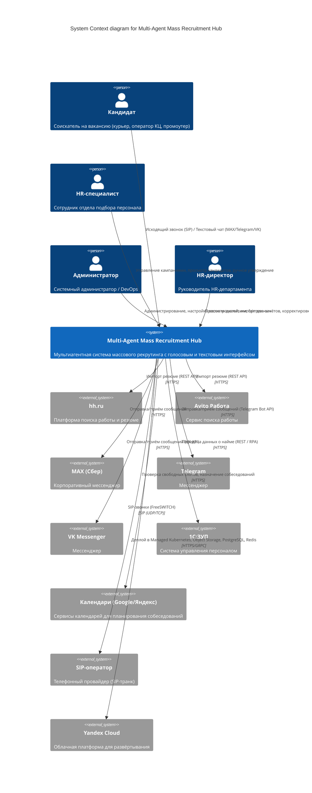
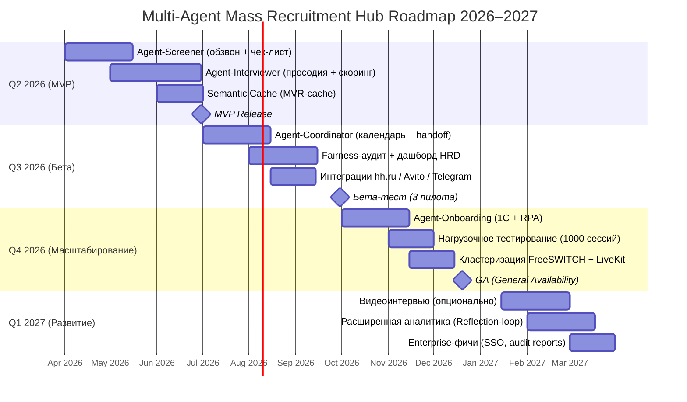

## Спецификация системы и продуктовый гайд Multi-Agent Mass Recruitment Hub

---

# 1. Введение и Executive Summary

## 1.1. Краткий обзор проекта

**Multi-Agent Mass Recruitment Hub** — это мультиагентная система массового рекрутинга с голосовым и текстовым интерфейсами, предназначенная для полной автоматизации воронки подбора персонала на линейные позиции: курьеры, операторы контакт-центров, промоутеры и другие массовые профессии.

Система представляет собой оркестрацию пяти специализированных AI-агентов, построенных на базе графового фреймворка LangGraph. Каждый агент выполняет свою функцию в рамках сквозного процесса найма: от первичного скрининга кандидатов до автоматического онбординга и аналитики. Голосовой интерфейс реализован через связку FreeSWITCH (SIP-телефония) и LiveKit Agents (WebRTC-пайплайн), что обеспечивает высококачественное распознавание и синтез речи с задержками менее трёх секунд.

Система спроектирована с учётом требований российского законодательства (152-ФЗ, 187-ФЗ, ФСТЭК) и полностью локализована в инфраструктуре Yandex Cloud, что гарантирует безопасное хранение и обработку персональных данных граждан РФ без их передачи за пределы страны.

## 1.2. Ключевые целевые показатели

Решение нацелено на достижение следующих бизнес-результатов (источник: `raw-specification.md`):

| Показатель | Базовое значение | Целевое значение | Способ измерения |
|------------|------------------|------------------|------------------|
| Конверсия из дозвона в назначение собеседования | 5–8% | **>25%** | `passed` / `total` (Prometheus-метрика `mrh_candidates_total`) |
| Cost-per-Hire | 1500 ₽ | **<500 ₽** (снижение на 70%) | Расчётный (затраты на рекрутинг / число наймов) |
| Time-to-Hire | 21 день | **<7 дней** (сокращение в 3 раза) | Среднее время от отклика до выхода на стажировку |
| Доля полностью автоматизированных наймов | 0% | **>90%** | Доля кандидатов, прошедших скрининг без участия HR |
| WER (распознавание речи) | 25–40% | **<8%** | Оценка на тестовом датасете телефонных разговоров |
| Доля ложных отказов (False Rejection Rate) | — | **<2%** | `false_rejections` / `rejected` (fairness-аудит) |
| Параллельные голосовые сессии | — | **1000** на кластер | Мониторинг FreeSWITCH + LiveKit |
| Uptime | — | **99.9%** | Kubernetes probes, Prometheus-алерты |

## 1.3. Структура документа

Настоящий документ представляет собой единый источник истины, объединяющий бизнес-контекст, продуктовое видение, функциональные и нефункциональные требования, архитектуру системы, анализ конкурентной среды, дорожную карту развития, модель монетизации и глоссарий терминов. Каждый последующий раздел логически дополняет предыдущий, обеспечивая целостное понимание системы для всех участников команды — от бизнес-заказчиков до разработчиков и инженеров по эксплуатации.

---

# 2. Бизнес-контекст и Product Vision

## 2.1. Проблема

Массовый рекрутинг на линейные позиции сталкивается с фундаментальной проблемой: до **75% рабочего времени** HR-специалистов уходит на «холодный» обзвон и первичную квалификацию кандидатов. Ручной обзвон даёт контакт-рейт лишь 20–25% без учёта оптимального времени звонка, а конверсия из отклика в найм составляет всего **5–8%** при среднем Time-to-Hire в **21 день**.

Существующие инструменты не решают проблему комплексно:
- **ATS-системы** (Huntflow, Talantix) — обеспечивают учёт кандидатов, но не содержат AI-обзвона.
- **IVR-роботы** (Naumen, Zvonobot) — работают по жёстким скриптам, не адаптируются к ответам кандидата, а качество распознавания речи на зашумлённых телефонных линиях составляет 25–40% WER.
- **Зарубежные платформы** (HireVue, Paradox) — не соответствуют 152-ФЗ, не локализованы в РФ и не поддерживают российские каналы коммуникации (MAX, VK).

## 2.2. Решение

Multi-Agent Mass Recruitment Hub автоматизирует всю воронку массового найма через пять специализированных AI-агентов, оркестрируемых графовым фреймворком LangGraph:

1. **Agent-Screener** — осуществляет первичный обзвон кандидатов с выбором оптимального времени через предиктивный дайлер (CatBoost), проводит квалификацию по чек-листу и при необходимости активирует LLM-диалог для нестандартных ответов.

2. **Agent-Interviewer** — проводит мини-собеседование (3–5 вопросов) с динамической адаптацией сценария, анализирует просодию речи (темп, тон, паузы, перебивания) и опционально выполняет видеоанализ эмоций и внимания.

3. **Agent-Coordinator** — проверяет календарь HR через интеграцию с Google/Яндекс.Календарём, назначает время собеседования с учётом временной зоны кандидата и обеспечивает омниканальный handoff (при недозвоне переключает диалог в мессенджер с сохранением контекста).

4. **Agent-Onboarding** — после принятия оффера автоматически запускает процесс адаптации: интеграцию с 1С:ЗУП, рассылку инструкций и доступов, напоминания о первом рабочем дне.

5. **Agent-Analyst** — собирает метрики по воронке найма, выполняет ежемесячный fairness-аудит для выявления скрытой дискриминации и запускает reflection-loop для дообучения пропенсити-модели через MLflow.

## 2.3. Vision Statement

> **«AI, который нанимает людей. Первый звонок — последний звонок в поиске работы.»**

**Миссия:** Устранить рутину в массовом найме, сократить Time-to-Hire в 3 раза и дать каждому кандидату мгновенную обратную связь, сохраняя человеческий подход и полное соответствие законодательству РФ.

**Слоган:** *«Найм без границ. Один агент — тысячи кандидатов.»*

## 2.4. Целевая аудитория (Personas)

### Мария — HR-специалист
- **Роль:** Рекрутер в контакт-центре, нанимает 50+ курьеров/операторов в месяц.
- **Боли:** Тратит 80% времени на обзвон и скрининг, не успевает обрабатывать всех откликнувшихся, страдает от рутины.
- **Потребности:** Автоматизация рутины, быстрый отсев неподходящих, удобный дашборд с результатами.
- **Сценарий:** Загружает список кандидатов → запускает кампанию → получает отчёт с рекомендованными к собеседованию.

### Алексей — HR-директор
- **Роль:** Руководитель HR-департамента, отвечает за Cost-per-Hire и Time-to-Hire.
- **Боли:** Высокая стоимость найма, длительные сроки закрытия вакансий, отсутствие объективных метрик качества скрининга.
- **Потребности:** Снижение Cost-per-Hire на 70%, контроль fairness, прозрачная аналитика.
- **Сценарий:** Просматривает дашборд с KPI, корректирует веса модели через админ-панель ([src/static/index.html](../src/static/index.html)), получает ежемесячный fairness-отчёт.

### Иван — Кандидат
- **Роль:** Соискатель на линейную позицию (курьер, промоутер).
- **Боли:** Долгое ожидание ответа после отклика, неудобные форматы собеседований.
- **Потребности:** Быстрая обратная связь, возможность общаться в привычном мессенджере, понятные вопросы.
- **Сценарий:** Откликается на вакансию → получает звонок от AI-агента → отвечает на 3–5 вопросов → в течение часа получает результат и приглашение на собеседование.

### Ольга — Администратор
- **Роль:** Системный администратор / DevOps, настраивает интеграции, управляет доступом.
- **Боли:** Сложность интеграции с 1С и календарями, обеспечение 152-ФЗ.
- **Потребности:** Простое развёртывание (Helm + K8s), централизованное управление секретами (Vault), мониторинг (Prometheus + Grafana).
- **Сценарий:** Разворачивает систему через [scripts/deploy-prod.sh](../scripts/deploy-prod.sh), настраивает webhook-ы и следит за алертами.

---

# 3. Функциональные требования (FR-1 … FR-7)

В данном разделе формально описываются семь ключевых функциональных требований к системе. Каждое требование сопровождается пользовательской историей (User Story), критериями приёмки (Acceptance Criteria) и ссылкой на реализацию в исходном коде. Такой подход обеспечивает связь между бизнес-потребностями и технической реализацией.

---

## FR-1: Agent-Screener (Скринер)

**User Story:**  
*Как HR-рекрутер, я хочу загрузить список кандидатов и запустить автоматический обзвон с выбором оптимального времени, чтобы повысить контакт-рейт до 40% и не тратить время на ручной дозвон.*

**Назначение:** Массовый скрининг кандидатов по жёсткому чек-листу (график, локация, опыт) с использованием предиктивного дайлера для выбора оптимального времени звонка. При нестандартных ответах активируется LLM с семантическим кэшированием для снижения стоимости инференса.

**Acceptance Criteria:**
- [ ] Загрузка кандидатов через CSV/API из источников: hh.ru, Avito, ручной ввод.
- [ ] Предиктивный дайлер на CatBoost предсказывает вероятность дозвона >60% для каждого кандидата (признаки: час, день недели, сегмент, история попыток).
- [ ] Квалификация по чек-листу через граф состояний LangGraph с typed-state ([src/core/state.py](../src/core/state.py)).
- [ ] При нестандартном ответе — активация LLM с семантическим кэшем (MVR-cache) для снижения стоимости.
- [ ] Автоматическое таргетирование вакансий: парсинг и скоринг резюме с hh.ru, Avito через RAG ([src/integrations/job_boards.py](../src/integrations/job_boards.py)).

**Реализация в коде:**
- Граф агента: [src/agents/screener/graph.py](../src/agents/screener/graph.py) — построение графа с узлами `validate_consent`, `analyze_resume`, `ask_questions`, `evaluate`, `human_review`.
- Узлы: [src/agents/screener/nodes.py](../src/agents/screener/nodes.py) — реализация каждого узла с обработкой ошибок и метриками.
- Предиктивный дайлер: [src/services/propensity_dialer.py](../src/services/propensity_dialer.py) — CatBoost-модель с загрузкой из MLflow.

---

## FR-2: Agent-Interviewer (Собеседник)

**User Story:**  
*Как HR-рекрутер, я хочу, чтобы AI-агент провёл голосовое мини-собеседование (3–5 вопросов) и проанализировал просодию, чтобы объективно оценить soft-skills кандидата.*

**Назначение:** Проведение мини-собеседования с динамической адаптацией сценария вопросов на основе резюме и предыдущих ответов. Анализ просодии речи (темп, тон, паузы, перебивания) и опционально видео (эмоции, внимание) для оценки soft-skills и консистентности ответов.

**Acceptance Criteria:**
- [ ] Динамическая адаптация сценария вопросов на основе резюме и ответов.
- [ ] Анализ тональности, темпа речи, пауз и речевых перебиваний через `librosa` (просодия) — [src/agents/interviewer/prosody.py](../src/agents/interviewer/prosody.py).
- [ ] Проверка консистентности ответов кросс-референсом через RAG по базе успешных кейсов (Qdrant).
- [ ] Опционально: анализ видео (эмоции, внимание) через OpenCV + DeepFace — [src/agents/interviewer/video_analyzer.py](../src/agents/interviewer/video_analyzer.py), [src/agents/interviewer/face_utils.py](../src/agents/interviewer/face_utils.py).
- [ ] Итоговый отчёт с оценкой мотивации, коммуникации и лидерского потенциала — `[src/agents/interviewer/nodes.py](../src/agents/interviewer/nodes.py):analyze_results`.

**Реализация в коде:**
- Граф агента: [src/agents/interviewer/graph.py](../src/agents/interviewer/graph.py) — построение графа с опциональным включением видеоанализа.
- Узлы: [src/agents/interviewer/nodes.py](../src/agents/interviewer/nodes.py) — подготовка вопросов, проведение интервью, анализ просодии, анализ видео, анализ результатов.
- Промпты: [src/agents/interviewer/prompts.py](../src/agents/interviewer/prompts.py) — системный промпт и библиотека вопросов.

---

## FR-3: Agent-Coordinator (Координатор)

**User Story:**  
*Как HR-рекрутер, я хочу, чтобы AI-агент автоматически назначил собеседование, проверив мой календарь, и отправил напоминания кандидату, чтобы я не тратил время на согласование.*

**Назначение:** Проверка календаря HR через интеграцию с Google Calendar / Яндекс.Календарь, назначение времени собеседования с учётом временной зоны и предпочтений кандидата. Омниканальный handoff: при двух неудачных звонках — переключение на мессенджер (MAX → Telegram → VK) с сохранением контекста через Redis.

**Acceptance Criteria:**
- [ ] Интеграция с Google Calendar / Яндекс.Календарь (проверка свободных слотов) — [src/services/calendar_service.py](../src/services/calendar_service.py).
- [ ] Учёт временной зоны и предпочтений кандидата.
- [ ] Отправка ссылки на чат-бот для загрузки документов в MAX/Telegram/VK.
- [ ] Автоматические напоминания (push, SMS, e-mail) за 24 и 2 часа.
- [ ] Омниканальный handoff: при 2 неудачных звонках — переключение на мессенджер с сохранением контекста (Redis) — [src/services/handoff_service.py](../src/services/handoff_service.py).

**Реализация в коде:**
- Граф агента: [src/agents/coordinator/graph.py](../src/agents/coordinator/graph.py) — маршрутизация между агентами, узлы `screener`, `interviewer`, `analyst`, `handoff`.
- Узлы: [src/agents/coordinator/nodes.py](../src/agents/coordinator/nodes.py) — реализация маршрутизации, вызова агентов и handoff.
- Handoff-сервис: [src/services/handoff_service.py](../src/services/handoff_service.py) — сохранение/восстановление состояния в Redis.

---

## FR-4: Agent-Onboarding (Онбординг)

**User Story:**  
*Как HR-рекрутер, я хочу, чтобы после принятия оффера AI-агент автоматически запустил процесс адаптации (интеграция с 1С, рассылка инструкций), чтобы сэкономить время на рутинных задачах.*

**Назначение:** Автоматический запуск процесса адаптации после найма: создание записи в 1С:ЗУП через RPA-слой, рассылка приветственного пакета (инструкции, доступы, регламенты), автоответы на частые вопросы новичков через RAG по базе знаний HR.

**Acceptance Criteria:**
- [ ] Автоматический запуск создания записи в 1С:ЗУП через RPA-слой.
- [ ] Рассылка приветственного пакета (инструкции, доступы, регламенты).
- [ ] Автоответы на частые вопросы новичков через RAG по базе знаний HR.
- [ ] Напоминания о первом рабочем дне.

**Реализация в коде:**
- Граф агента: [src/agents/onboarding/graph.py](../src/agents/onboarding/graph.py) — узлы `collect_documents`, `verify_documents`, `schedule_welcome`, `send_onboarding_package`, `human_review`.
- Узлы: [src/agents/onboarding/nodes.py](../src/agents/onboarding/nodes.py) — реализация каждого этапа онбординга.

---

## FR-5: Agent-Analyst (Аналитик)

**User Story:**  
*Как HR-директор, я хочу видеть дашборд с метриками воронки и fairness-аудит, а также иметь возможность скорректировать веса модели, чтобы быстро реагировать на дрейф и обеспечивать справедливый отбор.*

**Назначение:** Сбор метрик по воронке найма в реальном времени, генерация отчётов для HR-директора с выявлением аномалий, ежемесячный fairness-аудит (Disparate Impact, Demographic Parity, False Rejection Rate) с проверкой порогов (DI ≥0.8, FRR ≤2%) и reflection-loop для дообучения пропенсити-модели через MLflow.

**Acceptance Criteria:**
- [ ] Сбор метрик в реальном времени (конверсия, отказы, узкие места) в Prometheus — [src/core/metrics.py](../src/core/metrics.py).
- [ ] Ежемесячный fairness-аудит (Disparate Impact, Demographic Parity, False Rejection Rate) с проверкой порогов — [src/agents/analyst/fairness_metrics.py](../src/agents/analyst/fairness_metrics.py).
- [ ] Reflection-loop: после каждого цикла найма анализ успешных/неуспешных диалогов, дообучение пропенсити-модели через MLflow.
- [ ] Дашборд в Grafana с возможностью ручной корректировки весов факторов (опыт, образование, регион) — [src/static/index.html](../src/static/index.html).

**Реализация в коде:**
- Граф агента: [src/agents/analyst/graph.py](../src/agents/analyst/graph.py) — узлы `aggregate_metrics`, `detect_bottlenecks`, `fairness_audit`, `generate_report`, `human_review`.
- Узлы: [src/agents/analyst/nodes.py](../src/agents/analyst/nodes.py) — агрегация метрик, fairness-аудит с извлечением данных из БД.
- Fairness-метрики: [src/agents/analyst/fairness_metrics.py](../src/agents/analyst/fairness_metrics.py) — расчёт demographic parity, disparate impact, false rejection rate.

---

## FR-6: Интеграции с внешними системами

**User Story:**  
*Как система, я должна бесшовно взаимодействовать с внешними HR-платформами, мессенджерами, календарями и CRM, чтобы обеспечить сквозной процесс найма без ручного переноса данных.*

**Назначение:** Интеграция с внешними системами для импорта резюме (hh.ru, Avito), общения с кандидатами (MAX, Telegram, VK), синхронизации календарей (Google, Яндекс) и экспорта данных в HR-системы (1С:ЗУП).

**Перечень интеграций и реализация в коде:**

| Интеграция | Протокол | Аутентификация | Направление | Реализация |
|------------|----------|----------------|-------------|------------|
| hh.ru | REST API | OAuth 2.0 / API Key | Импорт резюме | [src/integrations/job_boards.py](../src/integrations/job_boards.py) |
| Avito Jobs | REST API | API Key | Импорт откликов | [src/integrations/job_boards.py](../src/integrations/job_boards.py) |
| MAX (Сбер) | REST API | JWT | Импорт/Экспорт | [src/services/hr_integrations.py](../src/services/hr_integrations.py) |
| Telegram | Bot API | Bot Token | Исходящие уведомления | [src/bot/telegram.py](../src/bot/telegram.py), [src/api/telegram_webhook.py](../src/api/telegram_webhook.py) |
| VK | VK API | Service Token | Исходящие сообщения | [src/services/hr_integrations.py](../src/services/hr_integrations.py) |
| 1С:ЗУП | REST / RPA / ESB | Локальная сеть | Экспорт нанятых | [src/services/hr_integrations.py](../src/services/hr_integrations.py) |
| Google Calendar | REST API | OAuth 2.0 | Чтение/запись | [src/services/calendar_service.py](../src/services/calendar_service.py) |
| Яндекс.Календарь | REST API | OAuth 2.0 | Чтение/запись | [src/services/calendar_service.py](../src/services/calendar_service.py) |

---

## FR-7: Администрирование

**User Story:**  
*Как администратор, я хочу управлять пользователями, ролями, кампаниями и настройками системы через удобный интерфейс, чтобы обеспечивать безопасный и контролируемый доступ к системе.*

**Назначение:** Управление пользователями и ролями (RBAC: admin, hr, supervisor), управление рекрутинговыми кампаниями (создание, запуск, пауза, завершение), управление весами модели пропенсити-дайлера через специальный дашборд.

**Acceptance Criteria:**
- [ ] RBAC: роли Admin, HR, Supervisor — [src/api/deps.py](../src/api/deps.py).
- [ ] JWT-аутентификация (FastAPI + OAuth2) — [src/api/auth.py](../src/api/auth.py).
- [ ] Управление кампаниями (создание, запуск, пауза, завершение) — [src/api/campaigns.py](../src/api/campaigns.py).
- [ ] Дашборд для корректировки весов модели (статический интерфейс) — [src/static/index.html](../src/static/index.html).

**Реализация в коде:**
- Аутентификация и авторизация: [src/api/auth.py](../src/api/auth.py), [src/api/deps.py](../src/api/deps.py).
- Управление кампаниями: [src/api/campaigns.py](../src/api/campaigns.py), [src/services/campaign_service.py](../src/services/campaign_service.py).
- Администрирование: [src/api/admin.py](../src/api/admin.py) — импорт резюме, управление весами модели.
- Админ-панель: [src/static/index.html](../src/static/index.html) — интерфейс для корректировки весов модели.

---

# 4. Нефункциональные требования (NFR)

Нефункциональные требования определяют качественные характеристики системы, обеспечивающие её надёжную и эффективную работу в условиях реальной эксплуатации. Эти требования критически важны для массового рекрутинга, где система должна обрабатывать тысячи кандидатов с минимальными задержками и максимальной доступностью.

---

## NFR-1. Производительность

Система должна обеспечивать низкую задержку обработки запросов и высокую пропускную способность для поддержки массовых обзвонов:

| Параметр | Целевое значение | Способ измерения |
|----------|------------------|------------------|
| Текстовый ответ агента (P95) | **<1.5 секунды** | Гистограмма `mrh_pipeline_duration_seconds` |
| Голосовой ответ (P95) | **менее 3 секунды** | Гистограмма `mrh_pipeline_duration_seconds` с лейблом `agent_stage="interviewer_conduct"` |
| Параллельные голосовые сессии | **1000** на кластер | Мониторинг FreeSWITCH + LiveKit |
| Throughput обзвонов | **до 10 000** кандидатов в час | Расчётный (на основе 1000 сессий × средняя длительность) |

---

## NFR-2. Масштабируемость

Система должна обеспечивать горизонтальное масштабирование компонентов для обработки растущей нагрузки:

- **Горизонтальное масштабирование агентов:** через Kubernetes HPA по CPU/Memory (конфигурация в [infra/helm/mass-recruit-hub/values-prod.yaml](../infra/helm/mass-recruit-hub/values-prod.yaml)).
- **Кластеризация FreeSWITCH:** 3 ноды в active-active режиме, балансировка через DNS SRV или SIP-прокси.
- **Qdrant и PostgreSQL:** управляемые сервисы в Yandex Cloud с автоматическим резервированием.

---

## NFR-3. Безопасность и комплаенс

Система должна соответствовать требованиям российского законодательства и обеспечивать защиту персональных данных:

| Требование | Реализация |
|------------|------------|
| **152-ФЗ** | Обязательное получение согласия на обработку ПДн (`consent_152fz`, `consent_biometry` в [src/core/models.py](../src/core/models.py)), двойное информирование (голосовое + текстовое) |
| **Анонимизация PII** | Presidio с кастомными recognizer'ами (паспорт, СНИЛС, телефон, адрес) — [src/pii/recognizers.py](../src/pii/recognizers.py) |
| **Локализация данных** | Все данные хранятся только в РФ (Yandex Cloud / МТС Cloud / on-premise) |
| **Право на забвение** | Каскадное удаление данных из PostgreSQL, Qdrant, S3, Mem0, Redis — [src/services/deletion_service.py](../src/services/deletion_service.py) |
| **Аудит** | Структурированные JSON-логи через structlog с обязательными полями: `candidate_id`, `action`, `timestamp`, `decision`, `user_id` — [src/core/audit_logger.py](../src/core/audit_logger.py) |
| **Шифрование** | TLS 1.3 in transit, AES-256 at rest (PostgreSQL, S3) |
| **RBAC** | Роли: admin, hr, supervisor — [src/api/deps.py](../src/api/deps.py) |

---

## NFR-4. Наблюдаемость

Система должна обеспечивать полную наблюдаемость для мониторинга, отладки и аудита:

| Компонент | Реализация |
|-----------|------------|
| **Метрики** | Prometheus (сбор метрик приложения и инфраструктуры) — [src/core/metrics.py](../src/core/metrics.py), [infra/prometheus/prometheus.yml](../infra/prometheus/prometheus.yml) |
| **Визуализация** | Grafana (дашборды из `infra/grafana/`) |
| **Логи** | ELK Stack (Filebeat → Logstash → Elasticsearch → Kibana) — [infra/elk/logstash.conf](../infra/elk/logstash.conf), [infra/filebeat/filebeat.yml](../infra/filebeat/filebeat.yml) |
| **Трассировка** | OpenTelemetry → Jaeger (опционально) |

---

## NFR-5. Надёжность

Система должна быть устойчива к сбоям и обеспечивать быстрое восстановление:

| Параметр | Целевое значение |
|----------|------------------|
| **Uptime** | 99.9% (SLA) |
| **RTO (Recovery Time Objective)** | <4 часа |
| **RPO (Recovery Point Objective)** | <1 час |
| **Резервное копирование** | pg_dump/WAL-G для PostgreSQL, снапшоты Qdrant |
| **Retry-политики** | exponential backoff для внешних API (hh.ru, Avito, календари) |

---

# 5. Архитектура системы (C4 Level 1 — Контекст)

Архитектура Multi-Agent Mass Recruitment Hub следует стандарту C4 model и на первом уровне (Context) показывает взаимодействие системы с внешними сущностями: пользователями и внешними системами. Это даёт общее понимание того, где система находится в экосистеме и как она обменивается данными с внешним миром.

## 5.1. Контекстная диаграмма

## 5.2. Пояснение к диаграмме

**Пользователи системы:**
- **Кандидат** — взаимодействует с системой через исходящие звонки (SIP) и текстовые сообщения в мессенджерах (MAX, Telegram, VK). Получает приглашения на собеседования, напоминания и обратную связь.
- **HR-специалист** — управляет кампаниями через веб-интерфейс, просматривает карточки кандидатов, принимает решения в случаях, требующих ручного вмешательства (human-in-the-loop).
- **Администратор** — выполняет задачи по администрированию: настройка весов моделей, импорт резюме с внешних платформ, управление доступом.
- **HR-директор** — использует систему для мониторинга KPI, просмотра fairness-отчётов и корректировки стратегий найма.

**Внешние системы:**
- **hh.ru, Avito Работа** — источники резюме и откликов. Система импортирует данные через REST API.
- **MAX, Telegram, VK** — каналы коммуникации с кандидатами. Система отправляет и принимает сообщения через их API.
- **1С:ЗУП** — целевая система для экспорта данных о нанятых сотрудниках. Интеграция осуществляется через REST API, ESB или RPA-слой.
- **Календари (Google, Яндекс)** — используются для проверки доступности HR и назначения собеседований.
- **SIP-оператор** — обеспечивает телефонную связь через SIP-транк, подключённый к FreeSWITCH.
- **Yandex Cloud** — облачная платформа для развёртывания всех компонентов системы (Kubernetes, PostgreSQL, Redis, Object Storage).

**Протоколы взаимодействия:**
- **HTTPS** — для всех REST API-взаимодействий с внешними системами и пользовательским интерфейсом.
- **SIP (UDP/TCP)** — для телефонных звонков через FreeSWITCH.
- **WebRTC** — для голосового пайплайна между FreeSWITCH и LiveKit Agents.
- **gRPC** — для внутреннего взаимодействия с Qdrant и другими компонентами.

---

# 6. Продуктовый Discovery и конкурентный анализ

Данный раздел представляет результаты продуктового исследования, включая анализ соответствия пользовательских историй текущей реализации (Gap-анализ), сравнительный анализ конкурентных решений, выявление недостающих KPI и формулировку UX-гипотез для дальнейшего развития продукта.

---

## 6.1. Сверка user stories с реализацией (Gap-анализ)

| № | Название (User Story) | Роль + цель | Статус реализации | Gap / примечания | Effort |
|---|------------------------|-------------|--------------------|-------------------|--------|
| **US-001** | Предиктивный обзвон по базе | HR-рекрутер хочет загрузить список и запустить автодозвон с выбором времени | ✅ **Реализовано** | В [src/agents/screener/nodes.py](../src/agents/screener/nodes.py) используется `predict_propensity` и `make_call` | – |
| **US-002** | Semantic caching для массовых обзвонов | HR-рекрутер хочет снизить стоимость LLM-инференса | ✅ **Реализовано** | [src/services/semantic_cache.py](../src/services/semantic_cache.py) интегрирован в узлы `ask_questions` | – |
| **US-003** | Омниканальный handoff при недозвоне | Кандидат хочет продолжить диалог в мессенджере | ✅ **Реализовано** | `handle_handoff` в `coordinator/nodes.py`, `HandoffService` | – |
| **US-004** | Аудируемое согласие на ПДн | Кандидат хочет дать информированное согласие | ✅ **Реализовано** | Поля `consent_152fz` и `consent_biometry`, валидация в `validate_consent` | – |
| **US-005** | Мини-собеседование с анализом просодии | HR-рекрутер хочет оценить soft-skills | ✅ **Реализовано** | `conduct_interview`, `analyze_prosody_node` в `interviewer/nodes.py` | – |
| **US-006** | Проверка консистентности через RAG | Agent-Interviewer хочет выявить противоречия в ответах | ⚠️ **Частично** | В `analyze_results` нет явного кросс-референса с Qdrant; используется только общий скор | M |
| **US-007** | Назначение собеседования без участия HR | HR-рекрутер хочет автоматическое планирование | ❌ **Не реализовано** | В `coordinator/nodes.py` нет вызова `check_calendar_availability`; интеграция с календарями есть, но не связана с графом | L |
| **US-008** | Автоматический онбординг после найма | HR-рекрутер хочет запустить адаптацию | ⚠️ **Частично** | Граф онбординга есть (`onboarding/graph.py`), но интеграция с 1С – заглушка (`rpa_trigger`) | L |
| **US-009** | Дашборд с fairness-аудитом | HR-директор хочет видеть метрики и корректировать веса | ✅ **Реализовано** | `fairness_audit_node` в `analyst/nodes.py`, экспорт в Prometheus и API `/analytics/fairness` | – |
| **US-010** | Reflection-loop и incremental learning | Agent-Analyst должен дообучать модель после каждого цикла | ⚠️ **Частично** | В `analyst/nodes.py` нет явного запуска ретраина; есть только анализ и рекомендации | M |
| **US-011** | Структурированный аудит-лог (structlog) | Администратор хочет соответствие 152-ФЗ | ✅ **Реализовано** | [src/core/audit_logger.py](../src/core/audit_logger.py), все узлы используют `audit_log()` | – |
| **US-012** | Human-in-the-loop (interrupt) | Архитектор хочет приостановку графа для ручного утверждения | ✅ **Реализовано** | `interrupt_before=["human_review"]` во всех графах | – |

**Вывод:** Основные функции скрининга, собеседования и аудита реализованы. Критические пробелы:
- **US-007** (планирование собеседования) — отсутствует интеграция календаря в координатор.
- **US-008** (онбординг) — нет реальной интеграции с 1С.
- **US-006** (консистентность) — RAG-кросс-референс не используется в полной мере.
- **US-010** (reflection-loop) — автоматический ретраин не реализован.

---

## 6.2. Конкурентный анализ

| Конкурент | Ключевые фичи | Наши преимущества | Наши слабые места |
|-----------|---------------|-------------------|-------------------|
| **Skillaz** | 1000+ клиентов, широкая партнёрская сеть | AI-first: голосовой пайплайн, адаптивный диалог | Отсутствие AI-скрининга, только текстовые чат-боты |
| **MagicSearch** | Глубокое ML-сопоставление резюме и вакансий | Voice-native: телефон + мессенджеры | Только текстовый интерфейс, нет голосового канала |
| **CleverStaff** | Интеграция с Telegram-ботами для найма | Масштаб: 1000+ параллельных сессий | Не оптимизирован для масс-найма (>50 позиций) |
| **InHouse** | Ориентация на масс-найм (курьеры, промоутеры) | Полная автоматизация: 5 агентов от скрининга до онбординга | Отсутствие AI-агентов, ручной обзвон |
| **HireVue** | Видеоинтервью с анализом речи и мимики | Локализация: 152-ФЗ, MAX/Telegram/VK, on-premise опция | Не соответствует 152-ФЗ, нет российских каналов |
| **Paradox (Olivia)** | Чат-бот для планирования собеседований | Мультиагентность: LangGraph + голосовой пайплайн | Нет голосового канала, не подходит для масс-найма |

**Наше преимущество:** единственное решение, сочетающее **голосовой пайплайн с fine-tuned ASR**, **полную автоматизацию воронки** (5 агентов) и **полное соответствие 152-ФЗ** с локализацией в РФ.

---

## 6.3. KPI gap-анализ

| KPI | Покрытие метриками в коде | Gap |
|-----|---------------------------|-----|
| **North Star: Conversion-to-Interview** | Нет прямой метрики; есть `candidates_total` и `pipeline_duration`, но не конверсия | Нужно добавить `mrh_conversion_to_interview` (Gauge/Histogram) |
| **Contact Rate** | Нет метрики; можно вычислить из логов звонков | Добавить `mrh_contact_rate` |
| **Time-to-Hire** | Не измеряется; есть только длительность пайплайна | Добавить `mrh_time_to_hire` (гистограмма) |
| **WER** | Нет метрики | Требуется интеграция с ASR |
| **False Rejection Rate** | `mrh_fairness_false_rejection_rate` присутствует | – |
| **Semantic Cache Hit Ratio** | Есть `hits` и `misses`, но нет ratio | Добавить вычисление ratio в Prometheus |
| **NPS / CSAT** | Отсутствуют | Добавить сбор обратной связи от кандидатов и HR (опросы) |

**Рекомендация:** дополнить метрики на основе реальных бизнес-целей и добавить сбор NPS/CSAT через интеграцию с опросными сервисами.

---

## 6.4. UX-гипотезы

1. **Гипотеза H1:** Я считаю, что кандидаты на линейные позиции (курьеры, промоутеры) **будут** чаще соглашаться на голосовое собеседование, **если** в начале звонка будет звучать короткое приветствие от «живого» человека, а не от робота (через настройку TTS с более естественным голосом).

2. **Гипотеза H2:** Я считаю, что HR-рекрутеры **будут** активнее использовать AI-скрининг, **если** в дашборде будет отображаться время, сэкономленное на ручных звонках (в часах).

3. **Гипотеза H3:** Я считаю, что fairness-аудит **будет** более эффективен, **если** отчёты будут содержать не только цифры, но и визуализацию трендов (графики изменения DI по неделям).

4. **Гипотеза H4:** Я считаю, что кандидаты, не взявшие трубку, **будут** чаще отвечать в мессенджере, **если** первое сообщение будет персонализированным (с упоминанием вакансии и компании).

5. **Гипотеза H5:** Я считаю, что автоматическое планирование собеседований **снизит** время координации на 40%, **если** кандидату будет предложено выбрать время из 2–3 вариантов, а не открытый календарь.

---

# 7. Дорожная карта (Roadmap)

Дорожная карта отражает поэтапный план развития Multi-Agent Mass Recruitment Hub от MVP до корпоративной готовности. Каждый этап включает конкретные функциональные блоки и ключевые вехи, позволяющие отслеживать прогресс.

## 7.1. Gantt-диаграмма

## 7.2. Описание ключевых вех

| Веха | Дата | Содержание |
|------|------|------------|
| **MVP** | 30.06.2026 | Agent-Screener + Agent-Interviewer + Semantic Cache + базовый голосовой пайплайн |
| **Beta** | 30.09.2026 | Agent-Coordinator + Fairness-аудит + интеграции с hh.ru/Avito/Telegram + 3 пилотных клиента |
| **GA** | 20.12.2026 | Agent-Onboarding + нагрузочное тестирование + кластеризация FreeSWITCH/LiveKit + полный цикл найма |
| **Enterprise** | 31.03.2027 | Видеоинтервью + расширенная аналитика + SSO + корпоративные отчёты |

---

# 8. Монетизация и Unit-экономика

## 8.1. Модель ценообразования

Гибридная модель: **SaaS подписка + оплата за результат (per-hire)**.

| Тариф | Стоимость | Включено |
|-------|-----------|----------|
| **Starter** | 150 000 ₽/мес | До 500 кандидатов/мес, базовые агенты (Screener + Interviewer), поддержка по email |
| **Business** | 250 000 ₽/мес + 500 ₽ за каждого нанятого свыше 500 | Неограниченное число кандидатов, все 5 агентов, календарь, онбординг, fairness-отчёты, приоритетная поддержка |
| **Enterprise** | Индивидуально (от 500 000 ₽/мес) | On-premise развёртывание, кастомизация моделей, SLA 99.99%, выделенный аккаунт-менеджер |

## 8.2. Unit-экономика (на примере Business-клиента со 100 наймами/мес)

| Статья | Значение |
|--------|----------|
| **ARPU** (средняя выручка с клиента) | 250 000 ₽/мес |
| **CAC** (стоимость привлечения) | 600 000 ₽ (продажи, маркетинг) |
| **LTV** (жизненная ценность клиента, 12 мес) | 3 000 000 ₽ |
| **LTV/CAC** | 5.0 (>3 — здоровый бизнес) |
| **Gross Margin** | 70% (инфраструктура, поддержка, доля ML) |
| **Payback Period** | 4.8 месяцев |

## 8.3. Прогноз на 2 года

| Показатель | Year 1 | Year 2 |
|------------|--------|--------|
| Количество клиентов | 5 | 20 |
| MRR | 1 250 000 ₽ | 5 000 000 ₽ |
| ARR | 15 000 000 ₽ | 60 000 000 ₽ |
| EBITDA | -15 000 000 ₽ (инвестиции) | 18 000 000 ₽ |
| Окупаемость инвестиций (ROI) | — | 3.5× за 2 года |

---

# 9. Глоссарий терминов

Глоссарий представляет собой алфавитный справочник всех ключевых терминов, аббревиатур и понятий, используемых в проекте. Единая терминология обеспечивает согласованное понимание между всеми участниками команды — от бизнес-заказчиков до разработчиков.

---

## 9.1. Бизнес-термины

### ACW (After Call Work) — Послезвонковое оформление
**Определение:** Время и действия оператора после завершения звонка: заполнение CRM, создание задач, обновление сделок.
**Контекст:** Бизнес-термин, центральная предметная область системы. Цель — автоматизировать ACW.
**Пример:** Оператор тратит 60–90 секунд на заполнение CRM после звонка.
**Связанные термины:** Оператор, CRM.

### Кандидат (Candidate)
**Определение:** Соискатель на вакансию, проходящий процесс отбора через систему.
**Контекст:** Основная сущность системы. Хранится в таблице `candidates` с полями: `id`, `name`, `phone`, `consent_152fz`, `screening_status` и др.
**Связанные термины:** Скрининг, Интервью, Найм.

### Кампания (Campaign)
**Определение:** Набор кандидатов, объединённых для массового обзвона по одной вакансии.
**Контекст:** [src/core/models.py](../src/core/models.py) — модель `Campaign` со статусами `draft`, `running`, `paused`, `completed`.
**Связанные термины:** HR, Скрининг.

### Оператор (Operator)
**Определение:** Сотрудник контакт-центра или HR-специалист, работающий с системой.
**Контекст:** Пользователь системы. Имеет роль (`admin`, `hr`, `supervisor`).
**Связанные термины:** ACW, Подтверждение звонка.

### Сделка (Deal)
**Определение:** Сущность в CRM (Битрикс24), представляющая взаимодействие с клиентом.
**Контекст:** Поле `deal_id` в модели `Call` ([src/core/models.py](../src/core/models.py)).
**Связанные термины:** CRM, Битрикс24.

### Тенант (Tenant)
**Определение:** Изолированная единица мультитенантной архитектуры (организация, подразделение).
**Контекст:** Все данные в системе изолированы по `tenant_id`.
**Связанные термины:** Оператор, Кампания.

---

## 9.2. Архитектурные термины

### API Gateway
**Определение:** Единая точка входа для всех API-запросов.
**Контекст:** Реализован через FastAPI в [src/main.py](../src/main.py).
**Связанные термины:** FastAPI, Webhook.

### Celery Worker
**Определение:** Асинхронный воркер, выполняющий фоновые задачи (транскрипция, работа агента, запись в CRM).
**Контекст:** [src/celery_app.py](../src/celery_app.py), `src/tasks/` — задачи для фоновой обработки.
**Связанные термины:** Celery, Redis, DLQ.

### Dead Letter Queue (DLQ)
**Определение:** Очередь для задач, которые не удалось выполнить после всех попыток (retry).
**Контекст:** Celery-задачи с `max_retries=3` попадают в DLQ при исчерпании попыток.
**Связанные термины:** Celery, Retry.

### Event-driven Architecture
**Определение:** Архитектура, в которой компоненты взаимодействуют через события.
**Контекст:** Весь поток обработки звонка событийный: webhook → Celery → Redis pub/sub → WebSocket.
**Связанные термины:** Webhook, Celery, Redis.

### Horizontal Scaling
**Определение:** Масштабирование путём добавления новых экземпляров сервисов.
**Контекст:** Celery workers, HPA в Kubernetes.
**Связанные термины:** Kubernetes, HPA.

### Mock-режим (Mock Mode)
**Определение:** Режим работы, при котором внешние сервисы заменяются заглушками.
**Контекст:** Переменные `USE_MOCK_LLM`, `USE_MOCK_SPEECHKIT`, `USE_MOCK_BITRIX24` в `.[env.example](../env.example)`.
**Связанные термины:** MockLLM, MockBitrix24Client.

### ReAct (Reasoning + Acting)
**Определение:** Паттерн AI-агента, при котором он чередует рассуждение и действие.
**Контекст:** Используется в LangGraph для оркестрации агентов.
**Связанные термины:** AI-агент, LangGraph.

### Rollback
**Определение:** Откат действий, выполненных в CRM (удаление задач, комментариев, отмена обновлений).
**Контекст:** `src/services/rollback_service.py` — сервис отката.
**Связанные термины:** CRM Action, Audit Log.

### Webhook
**Определение:** HTTP-запрос, отправляемый внешней системой для уведомления о событии.
**Контекст:** АТС отправляет webhook на `POST /api/v1/webhooks/ats/call-ended`.
**Связанные термины:** АТС, HMAC.

### WebSocket
**Определение:** Постоянное двунаправленное соединение для real-time обновлений.
**Контекст:** `src/api/v1/ws.py` — WebSocket endpoint для UI Overlay.
**Связанные термины:** WS Manager, Redis.

---

## 9.3. Термины AI-агента (извлечение данных)

### AI-агент (AI Agent)
**Определение:** Программный компонент на базе LLM, выполняющий определённую функцию в процессе найма.
**Контекст:** Пять агентов: Screener, Interviewer, Coordinator, Onboarding, Analyst.
**Связанные термины:** LangGraph, LLM.

### Confidence (Уверенность)
**Определение:** Оценка уверенности AI в правильности извлечённого поля (от 0.0 до 1.0).
**Контекст:** Поле `confidence_scores` в `ExtractedData` ([src/core/models.py](../src/core/models.py)). Порог <0.8 — низкая уверенность.
**Связанные термины:** Extracted Data, Low Confidence Field.

### Extracted Data (Извлечённые данные)
**Определение:** Структурированные данные, извлечённые AI из транскрипта.
**Контекст:** [src/core/models.py](../src/core/models.py) — модель `ExtractedData` с полями `data`, `confidence_scores`, `validation_errors`.
**Связанные термины:** AI-агент, Validation Rules.

### Few-shot Examples
**Определение:** Набор примеров извлечения данных, передаваемых LLM в промпте для повышения качества.
**Контекст:** [src/agents/interviewer/prompts.py](../src/agents/interviewer/prompts.py) — примеры вопросов.
**Связанные термины:** Prompts, LLM.

### GigaChat
**Определение:** LLM от Сбера, используется как fallback при недоступности YandexGPT.
**Контекст:** `src/agent/llm/gigachat.py` — клиент GigaChat.
**Связанные термины:** LLM, YandexGPT.

### LangChain
**Определение:** Фреймворк для создания LLM-приложений, используется для построения AI-агента.
**Контекст:** [src/agents/orchestrator.py](../src/agents/orchestrator.py) — оркестратор на LangChain.
**Связанные термины:** AI-агент, ReAct.

### LLM (Large Language Model)
**Определение:** Большая языковая модель (YandexGPT, GigaChat) для обработки естественного языка.
**Контекст:** `src/agent/llm/` — клиенты для LLM.
**Связанные термины:** YandexGPT, GigaChat, MockLLM.

### MockLLM
**Определение:** Заглушка LLM для разработки и тестирования, не требует API-ключей.
**Контекст:** `src/agent/llm/mock_llm.py` — возвращает предопределённые ответы.
**Связанные термины:** LLM, YandexGPT.

### Orchestrator (Оркестратор)
**Определение:** Компонент, управляющий последовательностью вызовов инструментов AI-агента.
**Контекст:** [src/agents/orchestrator.py](../src/agents/orchestrator.py) — оркестратор агентов.
**Связанные термины:** AI-агент, ReAct.

### Prompts (Промпты)
**Определение:** Текстовые инструкции для LLM, определяющие, что и как извлекать.
**Контекст:** [src/agents/interviewer/prompts.py](../src/agents/interviewer/prompts.py) — системный промпт и библиотека вопросов.
**Связанные термины:** LLM, Few-shot Examples.

### YandexGPT
**Определение:** Основная LLM от Яндекса для извлечения данных.
**Контекст:** `src/agent/llm/yandex_gpt.py` — клиент YandexGPT.
**Связанные термины:** LLM, GigaChat.

---

## 9.4. CRM-интеграция (Битрикс24)

### Битрикс24 (Bitrix24)
**Определение:** CRM-система, в которую записываются данные (сделки, задачи, комментарии).
**Контекст:** `src/integrations/bitrix24/client.py` — REST-клиент.
**Связанные термины:** CRM, CRM Action.

### CRM Action (CRM-действие)
**Определение:** Запись об одном действии, выполненном в CRM.
**Контекст:** `src/models/crm_action.py` — модель `CrmAction` со статусами `pending`, `success`, `failed`, `rolled_back`.
**Связанные термины:** Битрикс24, Rollback.

### Deal Update (Обновление сделки)
**Определение:** Действие в Битрикс24 — обновление полей сделки.
**Контекст:** `Bitrix24Client.crm_deal_update()`.
**Связанные термины:** Битрикс24, CRM Action.

### Task Add (Создание задачи)
**Определение:** Действие в Битрикс24 — создание задачи.
**Контекст:** `Bitrix24Client.crm_task_add()`.
**Связанные термины:** Битрикс24, CRM Action.

### Timeline Comment (Комментарий в таймлайн)
**Определение:** Действие в Битрикс24 — добавление комментария в таймлайн сделки.
**Контекст:** `Bitrix24Client.crm_timeline_comment_add()`.
**Связанные термины:** Битрикс24, CRM Action.

### Userfield Update (Обновление пользовательских полей)
**Определение:** Действие в Битрикс24 — обновление кастомных полей сделки.
**Контекст:** `Bitrix24Client.crm_deal_userfield_update()`.
**Связанные термины:** Битрикс24, CRM Action.

---

## 9.5. Технические термины (код, БД, API)

### Alembic
**Определение:** Инструмент для управления миграциями базы данных.
**Контекст:** [alembic.ini](../alembic.ini), `migrations/versions/` — миграции 001, 002, 003.
**Связанные термины:** SQLAlchemy, PostgreSQL.

### ASGI
**Определение:** Асинхронный интерфейс шлюза сервера.
**Контекст:** FastAPI использует ASGI.
**Связанные термины:** FastAPI, Uvicorn.

### Asyncpg
**Определение:** Асинхронный драйвер PostgreSQL для Python.
**Контекст:** [src/core/database.py](../src/core/database.py) — `create_async_engine(settings.database_url)`.
**Связанные термины:** PostgreSQL, SQLAlchemy.

### Celery
**Определение:** Фреймворк для распределённых очередей задач.
**Контекст:** [src/celery_app.py](../src/celery_app.py) — настройка Celery с Redis брокером.
**Связанные термины:** Celery Worker, Redis, DLQ.

### FastAPI
**Определение:** Современный веб-фреймворк для Python с асинхронной поддержкой.
**Контекст:** [src/main.py](../src/main.py) — точка входа приложения.
**Связанные термины:** ASGI, Pydantic.

### MinIO
**Определение:** S3-совместимое объектное хранилище для аудио-файлов.
**Контекст:** [docker-compose.yml](../docker-compose.yml) — сервис minio, [infra/docker/init-pgvector.sql](../infra/docker/init-pgvector.sql).
**Связанные термины:** S3, Audio URL.

### PostgreSQL
**Определение:** Реляционная база данных.
**Контекст:** Версия 16, таблицы: `candidates`, `campaigns`, `interview_results`, `audit_logs`, `fairness_reports`, `model_weights`.
**Связанные термины:** SQLAlchemy, Alembic.

### Prometheus
**Определение:** Система сбора и агрегации метрик.
**Контекст:** [infra/prometheus/prometheus.yml](../infra/prometheus/prometheus.yml), [src/core/metrics.py](../src/core/metrics.py).
**Связанные термины:** Grafana, Metric.

### Pydantic
**Определение:** Библиотека валидации данных на основе Python-типов.
**Контекст:** [src/core/models.py](../src/core/models.py) — все модели данных.
**Связанные термины:** FastAPI, Schemas.

### Redis
**Определение:** In-memory хранилище данных (key-value, pub/sub, очередь).
**Контекст:** [docker-compose.yml](../docker-compose.yml) — сервис redis, [src/services/handoff_service.py](../src/services/handoff_service.py) — сохранение состояния.
**Связанные термины:** Celery, WS Manager.

### SQLAlchemy
**Определение:** ORM для Python с поддержкой асинхронности.
**Контекст:** [src/core/database.py](../src/core/database.py) — настройка async engine.
**Связанные термины:** PostgreSQL, Alembic.

### Structlog
**Определение:** Структурированное логирование для Python.
**Контекст:** [src/core/audit_logger.py](../src/core/audit_logger.py) — аудит-лог с JSON-форматом.
**Связанные термины:** Logging, Audit.

---

## 9.6. Термины фронтенда

### Active Call
**Определение:** Звонок, находящийся в процессе обработки или ожидающий подтверждения оператора.
**Контекст:** `src/stores/activeCall.ts` — Zustand store для активного звонка.
**Связанные термины:** Operator Dashboard.

### Confirmation Panel
**Определение:** UI-компонент с кнопками для подтверждения, редактирования или отклонения результата AI-агента.
**Контекст:** `src/components/overlay/ConfirmationPanel.tsx`.
**Связанные термины:** Подтверждение звонка.

### Extracted Data View
**Определение:** UI-компонент, отображающий извлечённые AI-агентом данные с confidence scores.
**Контекст:** `src/components/overlay/ExtractedDataView.tsx`.
**Связанные термины:** Extracted Data, Low Confidence Field.

### Low Confidence Field
**Определение:** Поле, confidence которого <0.8. Требует проверки оператором.
**Контекст:** Подсвечивается жёлтым в ExtractedDataView.
**Связанные термины:** Confidence, Extracted Data View.

### UI Overlay
**Определение:** Всплывающая панель в браузере оператора, отображающая результаты обработки звонка.
**Контекст:** Основной сценарий UI — после обработки звонка overlay показывает сводку.
**Связанные термины:** Call Summary, Confirmation Panel.

### Operator Dashboard
**Определение:** Главная страница оператора со списком активных звонков.
**Контекст:** `src/pages/OperatorDashboard.tsx`.
**Связанные термины:** Оператор, Active Call.

### QA Dashboard
**Определение:** Страница для QA-специалистов с аналитикой и фильтрацией звонков.
**Контекст:** `src/pages/QADashboard.tsx`.
**Связанные термины:** QA, Analytics.

---

## 9.7. Термины мониторинга и инфраструктуры

### Grafana
**Определение:** Инструмент для визуализации метрик и алертинга.
**Контекст:** `infra/grafana/` — дашборды, [docker-compose.yml](../docker-compose.yml) — сервис grafana.
**Связанные термины:** Prometheus, Alert.

### Alert
**Определение:** Уведомление о критическом состоянии системы.
**Контекст:** [infra/prometheus/alerts.yaml](../infra/prometheus/alerts.yaml) — правила алертов (HighWER, HighLatency, FairnessViolation, HighFalseRejectionRate, CampaignQueueTooLong).
**Связанные термины:** Prometheus, Grafana.

### Metric (Метрика)
**Определение:** Числовой показатель производительности или состояния системы.
**Контекст:** [src/core/metrics.py](../src/core/metrics.py) — `mrh_candidates_total`, `mrh_pipeline_duration_seconds`, `mrh_fairness_disparate_impact` и др.
**Связанные термины:** Prometheus, Grafana.

### Latency
**Определение:** Задержка обработки звонка (от webhook до подтверждения).
**Контекст:** NFR: p95 <10 сек. Измеряется гистограммой `mrh_pipeline_duration_seconds`.
**Связанные термины:** Metric, Prometheus.

### Throughput
**Определение:** Пропускная способность системы (количество звонков в час).
**Контекст:** NFR: 800 зв/час. Метрика: `mrh_candidates_total`.
**Связанные термины:** Metric, Latency.

### Healthcheck
**Определение:** Endpoint для проверки работоспособности сервиса.
**Контекст:** `GET /health` → `{"status": "healthy"}`.
**Связанные термины:** Docker, API.

### Rate Limiting
**Определение:** Ограничение количества запросов от одного источника в единицу времени.
**Контекст:** [src/main.py](../src/main.py) — CORS middleware, ограничения на уровне Ingress.
**Связанные термины:** Nginx, API Gateway.

---

## 9.8. Аббревиатуры

| Аббревиатура | Расшифровка | Контекст |
|--------------|-------------|----------|
| **ACW** | After Call Work | Послезвонковое оформление |
| **ADR** | Architecture Decision Record | Запись архитектурного решения |
| **API** | Application Programming Interface | Интерфейс программирования приложений |
| **ASR** | Automatic Speech Recognition | Автоматическое распознавание речи (Whisper) |
| **ATS** | Automatic Telephone Station | Автоматическая телефонная станция |
| **CI/CD** | Continuous Integration / Continuous Delivery | Непрерывная интеграция и доставка |
| **CORS** | Cross-Origin Resource Sharing | Совместное использование ресурсов между источниками |
| **CRM** | Customer Relationship Management | Управление взаимоотношениями с клиентами (Битрикс24) |
| **CTR** | Click-Through Rate | Конверсия отклика в найм |
| **DLQ** | Dead Letter Queue | Очередь мёртвых писем |
| **DR** | Disaster Recovery | Восстановление после сбоев |
| **ERD** | Entity-Relationship Diagram | Диаграмма «сущность-связь» |
| **ESL** | Event Socket Library | Библиотека событийных сокетов FreeSWITCH |
| **FR** | Functional Requirement | Функциональное требование |
| **FRR** | False Rejection Rate | Доля ложных отказов |
| **FTE** | Full-Time Equivalent | Эквивалент полной занятости |
| **GA** | General Availability | Общедоступный релиз |
| **HMAC** | Hash-based Message Authentication Code | Код аутентификации сообщения на основе хеша |
| **HPA** | Horizontal Pod Autoscaler | Автоматическое масштабирование подов в K8s |
| **HR** | Human Resources | Управление персоналом |
| **HRD** | HR Director | HR-директор |
| **IVR** | Interactive Voice Response | Интерактивное голосовое меню |
| **JWT** | JSON Web Token | JSON-токен для аутентификации |
| **K8s** | Kubernetes | Оркестратор контейнеров |
| **KPI** | Key Performance Indicator | Ключевой показатель эффективности |
| **LLM** | Large Language Model | Большая языковая модель |
| **MCP** | Model Context Protocol | Протокол контекста модели (LiveKit) |
| **ML** | Machine Learning | Машинное обучение |
| **MLflow** | Machine Learning Flow | Платформа управления ML-экспериментами |
| **MRR** | Monthly Recurring Revenue | Ежемесячный регулярный доход |
| **MVR** | Multi-Vector Routing | Мультивекторная маршрутизация (кэширование) |
| **NFR** | Non-Functional Requirement | Нефункциональное требование |
| **NPS** | Net Promoter Score | Индекс лояльности клиентов |
| **ORM** | Object-Relational Mapping | Объектно-реляционное отображение |
| **PII** | Personally Identifiable Information | Персональные данные |
| **QA** | Quality Assurance | Контроль качества |
| **RAG** | Retrieval-Augmented Generation | Генерация с дополненным поиском |
| **RBAC** | Role-Based Access Control | Управление доступом на основе ролей |
| **REST** | Representational State Transfer | Архитектурный стиль API |
| **RPA** | Robotic Process Automation | Роботизированная автоматизация процессов |
| **RPO** | Recovery Point Objective | Целевая точка восстановления |
| **RTO** | Recovery Time Objective | Целевое время восстановления |
| **S3** | Simple Storage Service | Сервис объектного хранения (MinIO) |
| **SAST** | Static Application Security Testing | Статическое тестирование безопасности |
| **SIEM** | Security Information and Event Management | Управление информацией и событиями безопасности |
| **SIP** | Session Initiation Protocol | Протокол инициации сессии |
| **SLA** | Service Level Agreement | Соглашение об уровне обслуживания |
| **SQL** | Structured Query Language | Структурированный язык запросов |
| **SSE** | Server-Side Encryption | Шифрование на стороне сервера |
| **TLS** | Transport Layer Security | Протокол защиты транспортного уровня |
| **TTS** | Text-to-Speech | Синтез речи (Silero) |
| **UI** | User Interface | Пользовательский интерфейс |
| **VAD** | Voice Activity Detection | Детекция активности речи |
| **WAF** | Web Application Firewall | Межсетевой экран веб-приложений |
| **WER** | Word Error Rate | Частота ошибок распознавания слов |
| **WS** | WebSocket | Протокол двусторонней связи в реальном времени |

---

# Приложение: Стек технологий

Ниже представлен полный перечень технологий, используемых в Multi-Agent Mass Recruitment Hub, с указанием версий и назначения каждого компонента:

| Компонент | Технология | Версия | Назначение |
|-----------|------------|--------|------------|
| **Оркестрация агентов** | LangGraph | 0.3.1+ | Графовая оркестрация с typed-state и human-in-the-loop |
| **Телефония** | FreeSWITCH | 1.10.11+ | SIP-сервер с поддержкой 3000+ параллельных звонков |
| **WebRTC / Голос** | LiveKit Agents | 1.5+ | Управление WebRTC-сессиями, adaptive barge-in |
| **LLM-инференс** | vLLM | 0.6.4+ | Высокопроизводительный LLM-инференс с PagedAttention |
| **Векторное хранилище** | Qdrant | 1.10+ | Векторная БД для RAG и semantic cache |
| **Основная БД** | PostgreSQL | 16+ | Реляционная БД с pgvector для геопоиска |
| **Кэш и сессии** | Redis | 7+ | Кэш, сессии, очереди Celery, pub/sub |
| **ASR** | Whisper-Large-V3 | fine-tuned | Распознавание речи (WER <8% на телефонных разговорах) |
| **TTS** | Silero TTS | v5 | Синтез речи с автоударениями и вопросительными интонациями |
| **PII-анонимизация** | Microsoft Presidio | 2.2+ | Анонимизация ПДн с кастомными recognizer'ами для РФ |
| **Мониторинг** | Prometheus + Grafana | latest | Сбор метрик и визуализация |
| **Логирование** | ELK Stack | 8.11+ | Централизованный сбор и анализ логов |
| **ML-трекинг** | MLflow | 2.15+ | Отслеживание экспериментов, реестр моделей |
| **CI/CD** | GitHub Actions | latest | Автоматизация сборки, тестирования и деплоя |
| **Развёртывание** | Yandex Managed K8s + Helm | 1.29+ | Оркестрация контейнеров в Yandex Cloud |
