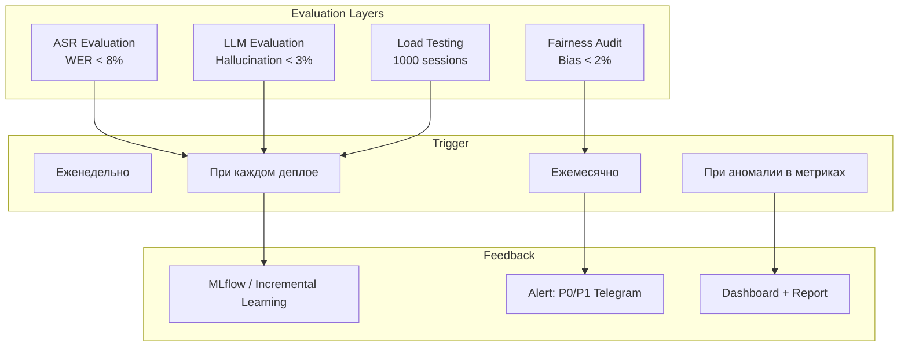

# MassRecruitHub — Evaluation Strategy

## Обзор

MassRecruitHub включает 5 AI-агентов, voice-пайплайн (ASR + TTS + LLM) и ML-модели (CatBoost пропенсити, скоринг). Каждый компонент требует отдельной стратегии оценки. Без неё мы не узнаем о дрейфе модели, пока HR-директор не увидит аномалию в дашборде.



## 1. ASR Evaluation

### Цель
WER (Word Error Rate) < 8% на телефонных разговорах с шумами КЦ. Stock Whisper-Large-V3 даёт 25–40% — нам нужно в 3–5 раз лучше.

### Тестовый набор
- **Источник**: 500 часов реальных записей телефонных интервью КЦ (с разрешения субъектов ПДн)
- **Разметка**: WhisperX (VAD + forced alignment) + ручная верификация 20% (100 ч)
- **Стратификация**:
  - Чистая речь (тихий офис): 30%
  - Шум КЦ (фоновые разговоры, звонки): 40%
  - Улица / транспорт: 15%
  - Плохая слышимость / акценты: 15%
- **Метрики**:
  - WER (основная)
  - CER (Character Error Rate) — для имён и адресов
  - Confidence score distribution — порог отбраковки

### Пайплайн

```python
import evaluate
from datasets import load_dataset

test_set = load_dataset("massrecruithub/phone-ru-test", split="test")
asr_pipeline = whisper_transcribe(model="whisper-large-v3-ru-phone")

wer = evaluate.load("wer")
cer = evaluate.load("cer")

predictions = []
references = []
for sample in test_set:
    text = asr_pipeline(sample["audio"])
    predictions.append(text)
    references.append(sample["transcript"])

print(f"WER: {wer.compute(predictions=predictions, references=references):.2%}")
print(f"CER: {cer.compute(predictions=predictions, references=references):.2%}")
```

### Пороги

| Метрика | Baseline (stock Whisper) | Target (fine-tuned) | Alert |
|---|---|---|---|
| WER (чистая речь) | 6–9% | < 5% | > 8% |
| WER (шум КЦ) | 25–40% | < 8% | > 12% |
| WER (улица/акцент) | 30–50% | < 12% | > 15% |
| CER (имена) | 15–25% | < 5% | > 8% |

### Частота
- При каждом деплое Whisper fine-tune
- Еженедельный мониторинг на production-данных (анонимизированных)

---

## 2. LLM Evaluation

### Цель
Hallucination rate Agent-Coordinator < 3%. Agent-Coordinator не должен обещать несуществующие льготы (RAG по базе знаний HR может вернуть нерелевантный документ).

### Инструменты
- **Ragas** (основной) — Faithfulness, Answer Relevancy, Context Precision
- **DeepEval** (дополнительно) — Hallucination metric, Bias metric

### Метрики

| Метрика | Описание | Target | Alert |
|---|---|---|---|
| Faithfulness | Ответ не противоречит контексту RAG | > 0.9 | < 0.85 |
| Answer Relevancy | Ответ релевантен вопросу кандидата | > 0.85 | < 0.8 |
| Context Precision | Ранжирование релевантных чанков RAG | > 0.85 | < 0.8 |
| Hallucination Rate | Доля ответов с вымышленными фактами | < 3% | > 5% |
| Tool Call Accuracy | Правильность вызова инструментов (search, schedule) | > 95% | < 90% |

### Тестовый набор

```python
test_cases = [
    {
        "question": "Какие льготы предоставляются курьерам?",
        "context_chunks": [
            "Курьеры получают ДМС после 3 месяцев",
            "График 5/2, возможен гибкий"
        ],
        "expected_answer": "ДМС после 3 месяцев, график 5/2",
        "forbidden_phrases": ["премия", "бонус", "жильё"]  # чего нет в контексте
    },
    {
        "question": "Могу ли я работать по выходным?",
        "context_chunks": [
            "График 5/2, суббота-воскресенье выходные",
            "Возможна подработка в выходные по согласованию"
        ],
        "expected_answer": "По согласованию подработка возможна",
        "forbidden_phrases": ["нет, никогда"]
    },
]
```

### Пайплайн

```python
from ragas import evaluate
from ragas.metrics import faithfulness, answer_relevancy

result = evaluate(
    dataset=test_dataset,
    metrics=[faithfulness, answer_relevancy],
)

if result["faithfulness"] < 0.85:
    trigger_alert("LLM hallucinations above threshold",
                  severity="P1", channel="telegram")
```

### Reflection-loop

После каждого цикла найма Agent-Analyst анализирует успешные и неуспешные диалоги, добавляет новые test cases в набор и дообучает LLM через few-shot промпты (incremental learning).

---

## 3. Fairness Audit

### Цель
Обеспечить долю ложных отказов (False Positives) < 2%. Модель не должна отклонять кандидатов по нерелевантным признакам (пол, возраст, акцент).

### Частота
- **Ежемесячно**: полный fairness-аудит
- **Еженедельно**: мониторинг доли отказов по сегментам
- **При аномалии**: автоматический alert HR-директору

### Метрики

| Метрика | Описание | Target | Alert |
|---|---|---|---|
| False Rejection Rate | Доля ошибочно отклонённых сильных кандидатов | < 2% | > 3% |
| Demographic Parity | Разница в rejection rate между группами | < 5 pp | > 10 pp |
| Equal Opportunity | TPR равен для всех групп | > 0.95 | < 0.9 |
| Disparate Impact | Соотношение rejection rate групп | 0.8–1.25 | < 0.6 или > 1.5 |

### Пайплайн

```python
import pandas as pd
from sklearn.metrics import confusion_matrix

def fairness_audit(df: pd.DataFrame, sensitive_col: str):
    """
    df columns: candidate_id, model_score, actual_hire, rejected, gender/age/region
    """
    groups = df[sensitive_col].unique()
    results = []

    for group in groups:
        mask = df[sensitive_col] == group
        tn, fp, fn, tp = confusion_matrix(
            mask["actual_hire"], mask["rejected"]
        ).ravel()
        fpr = fp / (fp + tn)  # False Positive Rate = false rejection
        results.append({"group": group, "fpr": fpr})

    # Disparate Impact
    max_fpr = max(r["fpr"] for r in results)
    min_fpr = min(r["fpr"] for r in results)
    di = min_fpr / max_fpr if max_fpr > 0 else 1.0

    if di < 0.8:
        trigger_alert(f"Disparate Impact {di:.2f} below threshold",
                      severity="P0", channel="telegram+email")
        trigger_fairness_review()  # human-in-the-loop

    return results, di
```

### Атрибуты для аудита

| Атрибут | Источник | Тип |
|---|---|---|
| Пол | Из резюме / имя | Бинарный |
| Возраст | Из резюме / дата рождения | Числовой (сегменты: 18–25, 25–35, 35–45, 45+) |
| Регион | Город из резюме | Категориальный |
| Акцент | Детекция через Whisper (confidence) | Числовой (0–1) |
| Канал | Откуда пришёл: HH, Avito, MAX | Категориальный |

---

## 4. Load Testing

### Цель
Подтвердить готовность к 1000 параллельных голосовых сессий на кластер из 3 нод FreeSWITCH + 2 ноды LiveKit.

### Инструменты
- **Sipp** — генерация SIP-трафика для FreeSWITCH
- **k6** — HTTP-нагрузка на API Gateway
- **Locust** — custom voice session simulator (Python)
- **Prometheus + Grafana** — сбор метрик в реальном времени

### Сценарии

| # | Сценарий | RPS | Parallel sessions | Длительность | Цель |
|---|---|---|---|---|---|
| 1 | Базовый обзвон (FreeSWITCH) | 50/s | 1000 | 30 мин | FreeSWITCH не теряет звонки |
| 2 | Voice-пайплайн (LiveKit) | 10/s | 500 | 15 мин | Latency P95 < 3 сек |
| 3 | LLM-инференс (vLLM) | 100 req/s | — | 15 мин | Throughput > 2000 tok/s |
| 4 | Полный сценарий | 25/s | 1000 | 60 мин | Система держит 60 мин |
| 5 | Spike (2x) | 50/s | 2000 | 5 мин | Graceful degradation |

### Метрики

| Метрика | Target | Alert |
|---|---|---|
| FreeSWITCH call success rate | > 99.5% | < 99% |
| LiveKit E2E latency (ASR→LLM→TTS) P95 | < 3 сек | > 5 сек |
| vLLM throughput | > 2000 tok/s | < 1000 tok/s |
| LLM latency P95 | < 1.5 сек | > 2.5 сек |
| CPU FreeSWITCH per node | < 70% | > 85% |
| Memory per node | < 80% | > 90% |
| Error rate (5xx, SIP errors) | < 0.5% | > 2% |

### Пайплайн

```bash
# 1. SIP load (FreeSWITCH)
sipp -sf freeswitch_scenario.xml -l 1000 -r 50 -m 30000 \
     -i 192.168.1.10 -p 5060 192.168.1.20:5060

# 2. Voice pipeline (LiveKit + Whisper + Silero)
locust -f voice_load_test.py --headless -u 500 -r 10 \
       --host https://livekit.massrecruithub.ru \
       --run-time 15m --csv=voice_results

# 3. LLM inference (vLLM)
python -m vllm.entrypoints.api_server \
    --model massrecruithub/yandexgpt-lora \
    --load-format safetensors \
    --tensor-parallel-size 4

# 4. Full scenario
locust -f full_pipeline_test.py --headless -u 1000 -r 25 \
       --run-time 60m --csv=full_results
```

### Отчёт

```yaml
load_test_report:
  scenario: full_pipeline
  duration: 60m
  parallel_sessions: 1000
  results:
    freeswitch_call_success: 99.7%
    livekit_e2e_latency_p95: 2.8s
    vllm_throughput: 2400 tok/s
    llm_latency_p95: 1.2s
    cpu_per_node: 65%
    error_rate: 0.3%
  verdict: PASS
  recommendations:
    - "Увеличить количество GPU с 2 до 4 для запаса по throughput"
    - "Добавить HPA: CPU > 70% → scale out"
```

### Регламент

| Этап | Когда | Кто |
|---|---|---|
| Smoke test | При каждом CI-прогоне | CI/CD |
| Load test | Перед каждым major-релизом | DevOps + QA |
| Stress test | Ежеквартально | DevOps + ML Engineer |
| Fairness audit | Ежемесячно | ML Engineer |
| ASR eval | При каждом деплое Whisper | ML Engineer |
| LLM eval | Еженедельно + при смене промпта | AI-архитектор |

## References
- `docs/raw-specification.md` — Reflection-loop, fairness-аудит, критерии приёмки
- `docs/product/KPI-METRICS.md` — AI-специфичные метрики (WER, latency, cost)
- `docs/architecture/ARCHITECTURE.md` — AI-Specific Components, Evaluation Strategy
- `docs/compliance/152-fz-audit.md` — Fairness-аудит, ложные отказы
- Ragas: https://docs.ragas.io/
- DeepEval: https://docs.confident-ai.com/
- Sipp: https://sipp.sourceforge.net/
